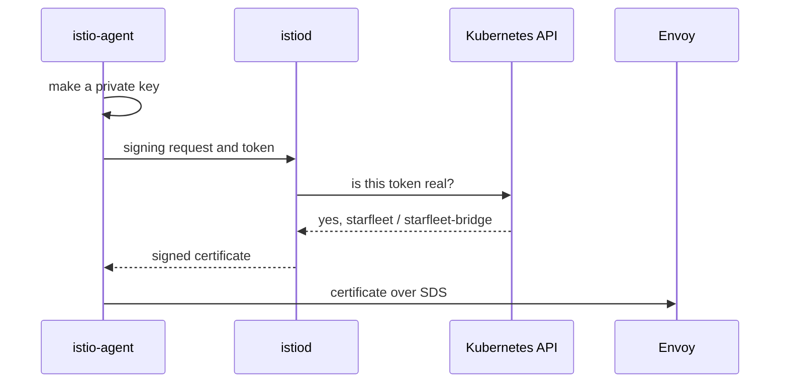

# How A Ship Gets Its Badge

Astronaut, every ship in the mesh carries an ID badge. Mission control prints it, and the ship shows it every time it talks to another ship. In Istio this badge is called the workload's **identity**.

The identity is not a label that Istio keeps in a table. It is a certificate: a small signed card that the ship's communications officer holds in memory. This part follows that card from the moment a ship launches to the moment it is ready to use. You will see where the name on the badge comes from, and why that name decides what any security rule can and cannot tell apart.

## The service account is the source

A pod (a spaceship) has a name, labels, an address and a **service account**. A service account is a Kubernetes object that names who a pod runs as. Think of it as the ship's registration papers. Only the registration papers end up on the badge.

### See it in your playground

<!-- astrona:playground:renew -->

List every ship on the planet `starfleet` with the service account it runs as:

```sh
kubectl get pods -n starfleet \
  -o custom-columns='POD:.metadata.name,SERVICE ACCOUNT:.spec.serviceAccountName'
```

```text
POD                          SERVICE ACCOUNT
bridge-v1-bc4dc4fcc-2klws    starfleet-bridge
cargo-v1-6f787f8bd5-5778s    starfleet-cargo
fortio-6bbf487db8-t2xff      default
navcom-v1-7467bbc689-8shd2   starfleet-navcom
probe-v1-7888d6c6d5-qtkwx    probe
probe-v2-58767cc46-99wxj     probe
scout-v1-85bf65868-zhgg6     starfleet-scout
scout-v2-866c98b568-gvl78    starfleet-scout
scout-v3-668c6dfc68-rt52h    starfleet-scout
shuttle-7b5db664c-pd6r5      shuttle
```

Your pod names end in different random letters. Look at the second column. The three scout ships share one set of papers, `starfleet-scout`. The two probes share `probe`. `fortio` was never given papers of its own, so Kubernetes gave it the namespace's `default` service account.

### The shape of the name

The bridge runs as `starfleet-bridge`, so its badge says:

```text
spiffe://cluster.local/ns/starfleet/sa/starfleet-bridge
```

Every badge in the mesh has the same shape:

```text
spiffe://<trust-domain>/ns/<namespace>/sa/<service-account>
```

**SPIFFE** stands for Secure Production Identity Framework For Everyone. It is an open standard for naming workloads, and `spiffe://...` is the name format it defines. Istio follows it. `ns` is short for namespace (the planet) and `sa` for service account (the registration papers). The trust domain comes at the end of this part.

### Three facts that follow from the shape

The exam likes all three, and each one comes straight from the shape of the name:

- **The pod name is not on the badge.** Restarting a ship, running ten copies or launching a new image does not change its identity.
- **Labels are not on the badge.** In a security rule, a `selector` picks *which ships the rule protects*. It never says *who is calling*.
- **Ships that share papers share one badge.** `scout-v1`, `scout-v2` and `scout-v3` all carry `.../sa/starfleet-scout`. No security rule can tell them apart. If you need to, give each one its own service account. That choice is made in the Deployment, not in a policy.

## Why the service account and nothing else

Mission control will only print a badge for a ship that can prove who it is. Of all the facts about a pod, only the service account comes with proof that someone else can check.

### The proof every ship carries

Kubernetes puts a **service account token** into each pod as a file. It is a short signed note from the Kubernetes API server that says "this pod runs as this service account on this planet". A pod cannot forge one, because it never holds the API server's signing key.

Labels have no such proof: anyone who can edit a pod can set any label. So the service account is the only thing about a pod that a badge office can trust.

Look at the token volume that Istio added to the bridge:

```sh
kubectl get pod -n starfleet -l app=bridge \
  -o jsonpath='{.items[0].spec.volumes[?(@.name=="istio-token")]}'
```

```text
{"name":"istio-token","projected":{"defaultMode":420,"sources":[{"serviceAccountToken":{"audience":"istio-ca","expirationSeconds":43200,"path":"istio-token"}}]}}
```

The `audience` is `istio-ca`: this note is made out to Istio's badge office and to nobody else. It expires after 43,200 seconds (12 hours), and Kubernetes renews it on its own.

This is also the real reason two ships with the same papers look the same. They show the same kind of proof, so they get the same name on their badge. There is nothing left to tell them apart.

## How the badge is made

Now follow the whole trip, from a ship launching to its communications officer holding a usable badge. Three parts work together here: the **istio-agent** (a small helper program inside the ship's `istio-proxy` container), **istiod** (mission control, which also runs the badge office) and the **Kubernetes API**.

### The issuing path



The istio-agent makes a private key and a signing request, then sends the request to istiod together with the token. Istiod asks the Kubernetes API to check the token. If the answer is yes, istiod builds the SPIFFE name from the planet and the papers and signs a certificate with that name. The agent then hands the certificate to Envoy, the communications officer, over **SDS** (Secret Discovery Service), a private line inside the ship.

Four details in that picture explain behaviour you will meet later:

- **The private key never leaves the ship.** Only the signing request travels, and it holds the public half of the key. There is no Kubernetes Secret with workload keys.
- **The ship cannot ask for a name.** Istiod builds the name from the checked token. A ship cannot ask for someone else's badge.
- **SDS is local.** The handover from agent to Envoy happens inside the pod. That is why a new badge needs no restart.
- **The token check is the security boundary.** Everything after it trusts that Kubernetes said yes. It happens once per certificate, not once per signal.

### See the badge being made

The shuttle's istio-agent writes a line in its log when it gets a certificate:

```sh
kubectl logs -n starfleet deploy/shuttle -c istio-proxy | grep "workload certificate"
```

```text
2026-10-09T06:11:47.048484Z	info	cache	generated new workload certificate	resourceName=default latency=33.463799ms ttl=23h59m59.951519687s
2026-10-09T06:11:47.079242Z	info	cache	returned workload certificate from cache	ttl=23h59m59.920759559s
```

The first line is the istio-agent receiving the badge from istiod. The time to live, `ttl`, is just under 24 hours. `resourceName=default` is the name Envoy uses for this ship's own certificate.

### No key on the planet

Now check that no workload key is stored in Kubernetes:

```sh
kubectl get secret -n starfleet
```

```text
No resources found in starfleet namespace.
```

Ten ships hold certificates, and not one Secret exists on the planet. The keys live only in the memory of each ship's istio-agent and Envoy.

## The trust domain

The badge name has two halves. The `/ns/.../sa/...` half is different for every ship. The **trust domain** at the front is one setting for the whole mesh. Think of it as the fleet's official seal: badges with another seal are not trusted.

The trust domain is set in `meshConfig.trustDomain` and is `cluster.local` unless someone changes it at install time. Its job is to keep the badges of different meshes apart. Two meshes that both use `cluster.local` print badges that look the same.

### Read your mesh's trust domain

Istiod keeps the mesh settings in a ConfigMap called `istio`:

```sh
kubectl -n istio-system get configmap istio -o jsonpath='{.data.mesh}' | grep -i trustdomain
```

```text
trustDomain: cluster.local
```

Every badge in this mesh starts with `spiffe://cluster.local/`. If the line is missing on another cluster, the default `cluster.local` is in force.

## Common pitfalls

> [!WARNING]
> - **Reading the identity as the pod's name.** The badge holds the planet and the service account. Every pod under one service account has the same identity.
> - **Leaving ships on `default`.** Every ship on `default` in one namespace shares a badge, like `fortio` here. Identity-based rules cannot tell them apart.
> - **Looking for the private key in a Secret or on disk.** The istio-agent makes it in memory, and it stays there.
> - **Thinking a `selector` names the caller.** A `selector` picks the ships a rule protects. Only the badge says who is calling.

> *A ship's badge is printed from its registration papers, because the service account token is the only thing about a pod that someone else can check.*
