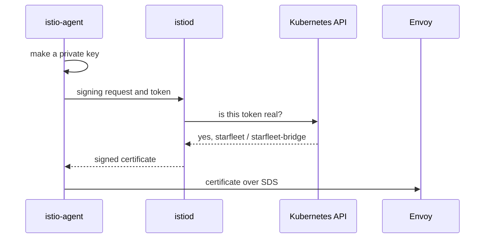

# How A Workload Gets Its Certificate

Every security rule in Istio asks one question about a request: who sent it? To answer, the receiving proxy needs a name it can trust. That name is the workload's **identity**. Istio issues it, and the workload's sidecar proxy presents it every time it connects to another workload.

The identity is not a label that Istio keeps in a table. It is a certificate: a small signed file that holds a name and a public key. The pod's sidecar proxy (Envoy) keeps it in memory. This chapter follows the certificate from the moment a pod starts to the moment Envoy can use it. Along the way you will see where the name comes from, and why that name decides what a security rule can and cannot tell apart.

## The service account is the source

A pod has a name, labels, an address and a **service account**. A service account is a Kubernetes object that names who a pod runs as. Of these four facts, only the service account ends up in the certificate.

<!-- astrona:playground:renew -->

List every pod in the namespace `starfleet` with the service account it runs as:

```sh
kubectl get pods -n starfleet \
  -o custom-columns='POD:.metadata.name,SERVICE ACCOUNT:.spec.serviceAccountName'
```

```text
POD                          SERVICE ACCOUNT
bridge-v1-bc4dc4fcc-2klws    starfleet-bridge
cargo-v1-6f787f8bd5-5778s    starfleet-cargo
fortio-6bbf487db8-t2xff      default
navcom-v1-7467bbc689-8shd2   starfleet-navcom
probe-v1-7888d6c6d5-qtkwx    probe
probe-v2-58767cc46-99wxj     probe
scout-v1-85bf65868-zhgg6     starfleet-scout
scout-v2-866c98b568-gvl78    starfleet-scout
scout-v3-668c6dfc68-rt52h    starfleet-scout
shuttle-7b5db664c-pd6r5      shuttle
```

Your pod names end in different random letters, so look at the second column. The three `scout` pods share one service account, `starfleet-scout`. The two `probe` pods share `probe`. `fortio` was never given a service account of its own, so Kubernetes gave it the namespace's `default` service account.

The `bridge` pod runs as `starfleet-bridge`, so its certificate says:

```text
spiffe://cluster.local/ns/starfleet/sa/starfleet-bridge
```

Every identity in the mesh has the same shape:

```text
spiffe://<trust-domain>/ns/<namespace>/sa/<service-account>
```

**SPIFFE** stands for Secure Production Identity Framework For Everyone. It is an open standard for naming workloads, and `spiffe://...` is the name format it defines. Istio follows it. `ns` is short for namespace and `sa` for service account. The trust domain at the front gets its own section at the end of this chapter.

The shape alone explains three facts the exam likes. First, the pod name is not in the identity, so restarting a pod, running ten copies or deploying a new image does not change it. Second, labels are not in the identity either. In a security rule, a `selector` picks *which workloads the rule protects*; it never says *who is calling*.

The third fact has the biggest effect. Workloads that share a service account share one identity. `scout-v1`, `scout-v2` and `scout-v3` all have `.../sa/starfleet-scout`, and no security rule can tell them apart. If you need to, give each one its own service account. You make that choice in the Deployment, not in a policy.

## Why the service account and nothing else

Why the service account and not the labels? The reason is proof. `istiod` only issues a certificate to a pod that can prove who it is, and of all the facts about a pod, only the service account comes with proof that someone else can check.

Kubernetes puts a **service account token** into each pod as a file. It is a short signed token from the Kubernetes API server that says "this pod runs as this service account in this namespace". A pod cannot forge one, because it never holds the API server's signing key. Labels have no such proof: anyone who can edit a pod can set any label.

So the service account is the only thing about a pod that a certificate authority (CA) can trust. A certificate authority is the service that checks requests and signs certificates; in Istio, `istiod` does this job. Look at the token volume that Istio added to the `bridge` pod:

```sh
kubectl get pod -n starfleet -l app=bridge \
  -o jsonpath='{.items[0].spec.volumes[?(@.name=="istio-token")]}'
```

```text
{"name":"istio-token","projected":{"defaultMode":420,"sources":[{"serviceAccountToken":{"audience":"istio-ca","expirationSeconds":43200,"path":"istio-token"}}]}}
```

The `audience` is `istio-ca`, so this token is valid only for Istio's certificate authority. It expires after 43,200 seconds (12 hours), and Kubernetes renews it on its own.

This token is also the real reason two pods with the same service account get the same identity. They show the same kind of proof, so they get the same name in their certificate. There is nothing left to tell them apart.

## How the certificate is issued

With the proof in place, you can follow the whole path from a pod starting to its Envoy proxy holding a usable certificate. Three components work together here. The **istio-agent** is a small helper program inside the pod's `istio-proxy` container. **istiod** is the control plane, which also acts as the certificate authority. The **Kubernetes API** checks the token.



The diagram shows the order of the steps. The istio-agent makes a private key and a signing request, then sends the request to istiod together with the token. Istiod asks the Kubernetes API to check the token. If the answer is yes, istiod builds the SPIFFE name from the namespace and the service account and signs a certificate with that name. The istio-agent then hands the certificate to Envoy over **SDS** (Secret Discovery Service), a local connection inside the pod.

Four details in that path explain behaviour you will meet later. The private key never leaves the pod: only the signing request travels, and it holds the public half of the key. The pod also cannot ask for a name, because istiod builds the name from the checked token. So a pod can never get another workload's identity.

The other two details are about timing. The handover over SDS happens inside the pod, which is why a new certificate needs no restart. And the token check is the security boundary: everything after it trusts that Kubernetes said yes, and it happens once per certificate, not once per request.

The `shuttle` pod's istio-agent writes a line in its log when it gets a certificate:

```sh
kubectl logs -n starfleet deploy/shuttle -c istio-proxy | grep "workload certificate"
```

```text
2026-10-09T06:11:47.048484Z info    cache   generated new workload certificate  resourceName=default latency=33.463799ms ttl=23h59m59.951519687s
2026-10-09T06:11:47.079242Z info    cache   returned workload certificate from cache    ttl=23h59m59.920759559s
```

The first line shows the istio-agent receiving the certificate from istiod. The time to live, `ttl`, is just under 24 hours. `resourceName=default` is the name Envoy uses for this workload's own certificate.

If the key never leaves the pod, Kubernetes stores no copy. Check that no Secret exists in the namespace:

```sh
kubectl get secret -n starfleet
```

```text
No resources found in starfleet namespace.
```

Ten pods hold certificates, and not one Secret exists in the namespace. The keys live only in the memory of each pod's istio-agent and Envoy.

## The trust domain

So far you have looked at the back half of the identity. The `/ns/.../sa/...` half is different for every workload. The **trust domain** at the front is one setting for the whole mesh, and a proxy does not trust identities from another trust domain.

The trust domain is set in `meshConfig.trustDomain` and is `cluster.local` unless someone changes it at install time. Its job is to keep the identities of different meshes apart, because two meshes that both use `cluster.local` issue identities that look the same. Istiod keeps the mesh settings in a ConfigMap called `istio`, so you can read the value there:

```sh
kubectl -n istio-system get configmap istio -o jsonpath='{.data.mesh}' | grep -i trustdomain
```

```text
trustDomain: cluster.local
```

Every identity in this mesh starts with `spiffe://cluster.local/`. If the line is missing on another cluster, the default `cluster.local` is in force.

You now know where a workload's identity comes from. Its service account becomes its name, because the service account token is the only thing about a pod that someone else can check. Istiod signs that name into a certificate, and the key stays in the pod's memory. What you have not seen yet is the certificate itself: what the proxy really holds, and where in the certificate the name is written.

## Common pitfalls

> [!WARNING]
> - **Reading the identity as the pod's name.** The identity holds the namespace and the service account. Every pod under one service account has the same identity.
> - **Leaving workloads on `default`.** Every workload on `default` in one namespace shares an identity, like `fortio` here. Identity-based rules cannot tell them apart.
> - **Looking for the private key in a Secret or on disk.** The istio-agent makes it in memory, and it stays there.
> - **Thinking a `selector` names the caller.** A `selector` picks the workloads a rule protects. Only the identity says who is calling.
