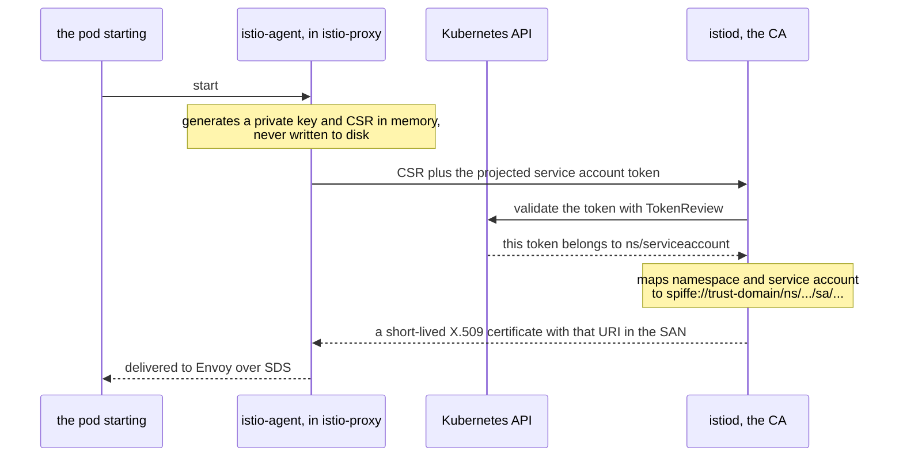

# Part 1 — How a workload gets its identity

> Prerequisite: [the module landing page](./course.md). Next: [Part 2 — Reading the certificate a proxy holds](./course-02-reading-the-certificate.md).

A workload's mesh identity is not a label Istio keeps in a database. It is a certificate, issued on demand, to a process that proved who it was. This part follows that issuance from pod start to a key in the proxy's memory, because the shape of the identity string — and every rule about what can and cannot be distinguished by policy — falls directly out of how it is obtained.

## The service account is the source

A pod has a name, a set of labels, an IP address and a service account. Only one of those becomes its mesh identity, and it is the service account.

`booking-service-v1` in the playground sets `serviceAccountName: booking-sa`, so its identity is:

```text
spiffe://cluster.local/ns/identity-demo/sa/booking-sa
```

The general form is fixed:

```text
spiffe://<trust-domain>/ns/<namespace>/sa/<service-account>
```

**SPIFFE** — Secure Production Identity Framework For Everyone — is an open standard for naming workloads, and `spiffe://…` is the URI form it defines. Istio implements it, which is why the format is the same shape you will see in other meshes.

Three consequences follow directly from the form, and all three show up in exam questions:

- The pod name is absent. Restarting a pod, scaling a Deployment to ten replicas, or rolling out a new image changes nothing about identity.
- Labels are absent. A `selector` in a policy picks *which workloads a policy applies to*; it never decides *who the caller is*.
- Two Deployments sharing one service account are indistinguishable to any policy. If you need to tell them apart, you need two service accounts — that is a design decision, made when you write the Deployment, not something a policy can recover later.

> [!TIP]
> **Try it — which service account each pod runs as**
>
> ```sh
> kubectl -n identity-demo get pods \
>   -o custom-columns='POD:.metadata.name,SA:.spec.serviceAccountName'
> ```
>
> Expect something like:
>
> ```text
> POD                                       SA
> booking-service-v1-7c9f8d6b4-kq2wv        booking-sa
> notification-service-v1-5d8c7b9f6-x4m2p   default
> tester-6b4d9c8f7-h8trn                    default
> ```
>
> Pod names are random suffixes and will differ on your cluster. The `SA` column is what matters: `notification-service-v1` and `tester` were never given a service account, so Kubernetes assigned them `default` — and to the mesh they are therefore the *same* identity, `cluster.local/ns/identity-demo/sa/default`.

## Why the service account and not something else

The choice is not arbitrary, and the reason is the mechanism. To be issued a certificate, a workload has to *prove* its claim to the CA, and a Kubernetes service account is the only thing about a pod that comes with a cryptographic proof attached.

Kubernetes projects a **service account token** into every pod as a file. It is a JWT signed by the API server, naming the pod's namespace and service account, with a short lifetime and an audience the mesh asks for. A pod cannot forge one for a service account it does not run as, because it never holds the API server's signing key.

Pod labels have no such proof. Anything can set a label; nothing vouches for it. The pod name is assigned by the API server but is not carried in any credential the pod holds. So the service account is not just a convenient naming choice — it is the only pod attribute that can be verified by a third party, which is exactly what a CA needs.

That is also the real reason two pods sharing a service account are indistinguishable. It is not a limitation of the policy language. They present the same proof, so they get the same certificate, so there is nothing left to tell apart.

## The issuance path

Here is the whole sequence, from a pod being scheduled to its proxy holding a usable certificate:



The private key never leaves the pod and is never written down. What travels is a signing request and a token Kubernetes can vouch for — which is why the identity cannot be forged by copying a file.

Four details in that flow are worth holding onto, because each explains a behaviour you will meet later:

- **The private key never leaves the pod.** It is generated in `istio-agent`'s memory, and only the CSR — which carries the public key — goes to istiod. There is no Kubernetes Secret holding workload keys, which is why you cannot find one and should not go looking.
- **The identity is derived, not requested.** The CSR does not get to say what identity it wants. istiod computes the SPIFFE URI from the validated token. A workload cannot ask for someone else's identity, because the request is not where the identity comes from.
- **SDS is a local socket, not a network call.** The Secret Discovery Service exchange between `istio-agent` and Envoy happens inside the pod. That is what makes certificate rotation invisible and restart-free — the thing that changes is a message on a socket, not a file, a Secret, or a pod spec.
- **Step 3 is the security boundary.** Everything downstream trusts that the TokenReview said yes. This is the point where "who are you" is settled, and it happens once per certificate rather than once per request.

As an analogy: the projected token is like turning up at a pass office with a letter from your employer, and the certificate is the building pass you are given in exchange. The letter proves who you are once, at the desk; the pass is what you show at every door afterwards. Where it breaks down: a building pass is usually valid for a year, and this one expires in a day — which turns out to matter, and is [Part 3](./course-03-principals-rotation-trust-domain.md)'s subject.

## The trust domain, and where it comes from

The identity string has two halves. The `/ns/<namespace>/sa/<service-account>` half is derived per workload. The `<trust-domain>` half is a single mesh-wide setting, applied to every identity istiod issues.

It defaults to `cluster.local` and lives in `meshConfig.trustDomain`. Its job is to keep identities from different meshes apart: two clusters that both use `cluster.local` produce colliding identity strings, which matters the moment you join them or federate policy between them.

> [!TIP]
> **Try it — read the mesh's trust domain**
>
> ```sh
> kubectl -n istio-system get configmap istio -o jsonpath='{.data.mesh}' | grep -i trustdomain
> ```
>
> Expect something like:
>
> ```text
> trustDomain: cluster.local
> ```
>
> If the field is absent from the ConfigMap entirely, the default `cluster.local` is in force — Istio only writes out what was explicitly set. Either way, this value is the prefix on every identity in the mesh, including ones issued before you read it.

> *A workload's identity is derived from the only thing about it that carries a proof — its service account token — which is why policy can never tell apart two pods that share one.*

## Common pitfalls

> [!WARNING]
> **Looking for the private key on disk.** It is generated in memory by the agent and stays there. There is no file to back up or copy.
>
> **Reading the identity as the pod's name.** It encodes the *namespace and service account*, so every pod under one service account shares one identity.
>
> **Assuming the default service account is harmless.** Workloads left on `default` are indistinguishable from each other, which makes identity-based policy useless later.
>
> **Expecting the certificate to be long-lived.** It is short-lived and renewed automatically; anything built on a fixed certificate lifetime will break.

## Reference

- [Istio security concepts](https://istio.io/latest/docs/concepts/security/) — the identity and certificate-management sections describe this flow from Istio's own side.
- [SPIFFE concepts](https://spiffe.io/docs/latest/spiffe-about/spiffe-concepts/) — what a SPIFFE ID is and why the URI has that shape, independent of Istio.
- [Kubernetes service account tokens](https://kubernetes.io/docs/concepts/security/service-accounts/) — what a projected token contains and how TokenReview validates it.
