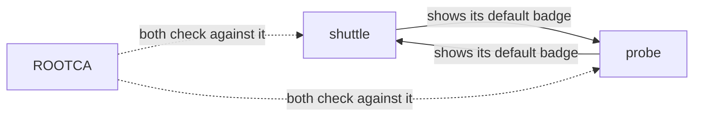
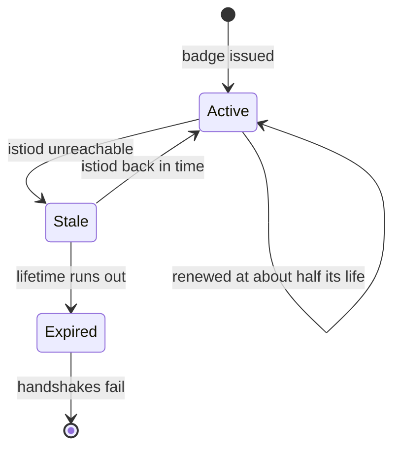

# Read The Badge A Ship Carries

Astronaut, a badge you have never looked at is a badge you are guessing about. When a security rule turns away a signal that should get through, the fastest fix is to read the caller's real badge. This part shows you how: ask the communications officer which certificates it holds, decode the card, and read the name printed on it.

## Ask the communications officer: `istioctl proxy-config`

Most Istio commands ask mission control what it *plans* to send. `istioctl proxy-config` asks one running proxy (one ship's communications officer) what it *holds right now*. When the two differ, the proxy is the one that decides.

### One command, five questions

The shape is always the same:

```text
istioctl proxy-config <what> <pod or deploy/name> -n <namespace> [-o json]
```

| `<what>` | The question it answers | You use it to check |
| --- | --- | --- |
| `listener` | Which radio channels do I listen on, and with which rules? | mTLS requirements, security rules |
| `route` | Where does an HTTP signal go? | routing rules |
| `cluster` | Which destinations do I know? | known services |
| `endpoint` | Which pod addresses stand behind a destination? | healthy pods |
| `secret` | Which certificates do I hold? | the ship's badge |

This part uses `secret`. Instead of a pod name you can write `deploy/<name>`, and `istioctl` picks one pod of that Deployment for you.

## Every ship holds two certificates

Ask a ship's proxy for its certificates and you get two rows, not one. They do opposite jobs, so learn to tell them apart.

### See it in your playground

<!-- astrona:playground:renew -->

List the certificates the bridge's proxy holds:

```sh
istioctl proxy-config secret deploy/bridge-v1 -n starfleet
```

```text
RESOURCE NAME     TYPE           STATUS     VALID CERT     SERIAL NUMBER                        NOT AFTER                NOT BEFORE
default           Cert Chain     ACTIVE     true           feb8ade5170abdf1d66767017c630610     2026-10-10T06:11:47Z     2026-10-09T06:09:47Z
ROOTCA            CA             ACTIVE     true           4871477d9761cb8539c400719a25c7ca     2036-10-06T06:11:35Z     2026-10-09T06:11:35Z
```

`default` is the bridge's own badge: the card it shows to other ships. `ROOTCA` is the fleet's seal, the root certificate of the badge office. The bridge uses it to check the badges *other* ships show. Look at `NOT AFTER`: the badge runs out in about a day, the seal in ten years.

### Both ships show, both ships check

The two rows are the "mutual" in mutual TLS (mTLS): a secret handshake where both ships show their badges before they talk.



Each ship shows its own `default` certificate, and each ship checks the other one against the same `ROOTCA`. A browser and a website only check in one direction; inside the mesh, both sides check.

The badge is short-lived because ships show it all the time, so a stolen one should stop working soon. The seal is long-lived because changing it means every ship must trust a new seal at once.

## Read the name on the badge

The table does not show the name on the badge, and the name is what you came for. It sits in the certificate's **SAN** (Subject Alternative Name), the field where a certificate lists the names it belongs to. To read it, take the certificate out of the proxy and decode it.

### Take the card out

`-o json` returns everything the proxy holds. The badge sits inside it as base64 text, a way of writing binary data as letters. The command below picks the `default` entry with `jq`, decodes it with `base64`, and saves it as `bridge.pem`:

```sh
istioctl proxy-config secret deploy/bridge-v1 -n starfleet -o json \
  | jq -r '.dynamicActiveSecrets[] | select(.name=="default") | .secret.tlsCertificate.certificateChain.inlineBytes' \
  | base64 --decode > bridge.pem
```

The command prints nothing. `bridge.pem` is now a normal certificate file on your machine, and `openssl` can read it. The file holds the bridge's badge first and the fleet's seal after it; `openssl x509` reads only the first one.

### Read it with `openssl`

Print the SAN, the subject and the issuer:

```sh
openssl x509 -in bridge.pem -noout -ext subjectAltName -subject -issuer
```

```text
X509v3 Subject Alternative Name: critical
    URI:spiffe://cluster.local/ns/starfleet/sa/starfleet-bridge
subject=
issuer=O=cluster.local
```

There is the badge: `spiffe://cluster.local/ns/starfleet/sa/starfleet-bridge`. Istiod printed it from the bridge's service account, and the bridge shows it on every connection.

Two more details are worth a second look:

- **The subject is empty.** Website certificates put a name in the subject. Mesh certificates leave it blank and keep the name only in the SAN. If you look for the identity in the subject, you find nothing.
- **The SAN is `critical`.** A program that checks this certificate must understand the SAN, or reject the certificate. So nothing can quietly ignore the name.

The issuer `O=cluster.local` is istiod's own badge office. If a mesh uses an outside certificate authority, this line changes. Comparing it across ships is a quick way to spot ships with badges from another office.

## Compare badges across the fleet

One badge proves the method. Several side by side prove the rule from the start of this module: the name comes from the service account, not from the ship.

### A helper to read any badge

Paste this helper once in your terminal. It runs the same steps as above in one go and prints the SAN of the ship you name:

```sh
show_badge() {
  istioctl proxy-config secret "$1" -n "${2:-starfleet}" -o json \
    | jq -r '.dynamicActiveSecrets[] | select(.name=="default") | .secret.tlsCertificate.certificateChain.inlineBytes' \
    | base64 --decode | openssl x509 -noout -ext subjectAltName
}
for ship in deploy/scout-v1 deploy/scout-v2 deploy/fortio deploy/shuttle; do echo "$ship"; show_badge $ship; done
```

```text
deploy/scout-v1
X509v3 Subject Alternative Name: critical
    URI:spiffe://cluster.local/ns/starfleet/sa/starfleet-scout
deploy/scout-v2
X509v3 Subject Alternative Name: critical
    URI:spiffe://cluster.local/ns/starfleet/sa/starfleet-scout
deploy/fortio
X509v3 Subject Alternative Name: critical
    URI:spiffe://cluster.local/ns/starfleet/sa/default
deploy/shuttle
X509v3 Subject Alternative Name: critical
    URI:spiffe://cluster.local/ns/starfleet/sa/shuttle
```

`scout-v1` and `scout-v2` are different Deployments with different images, and they carry the very same badge. `fortio` carries the `default` badge, which any other ship on this planet without its own service account would share.

### A ship with no badge

The planet `outpost` has no sidecar injection. Its one ship, the `drifter`, flies with no communications officer. Ask for its certificates anyway:

```sh
istioctl proxy-config secret deploy/drifter -n outpost
```

```text
Error: failed to execute command on drifter-57fdbc6c95-9wsv4.outpost sidecar: failure running port forward process: Get "http://localhost:60945/config_dump?mask=dynamic_active_secrets,dynamic_warming_secrets": EOF
```

(Shortened: `istioctl` also prints two long port-forward log lines first.) There is no proxy to answer. No proxy means no istio-agent, so no badge was ever made. The drifter has no identity at all, and it can only send plain text.

## Badge lifetime and rotation

Workload badges are short-lived on purpose. The default lifetime is **24 hours**. The istio-agent swaps each badge for a fresh one long before it runs out. This swap is called **certificate rotation**.

### Read the lifetime

Read the dates and the serial number of the bridge's badge:

```sh
openssl x509 -in bridge.pem -noout -dates -serial
```

```text
notBefore=Oct  9 06:09:47 2026 GMT
notAfter=Oct 10 06:11:47 2026 GMT
serial=FEB8ADE5170ABDF1D66767017C630610
```

The two dates are about 24 hours apart. Yours show the time your playground started. `notBefore` sits two minutes before the badge was made, so a ship whose clock runs a little behind still accepts it.

### How rotation works



The istio-agent renews the badge after about half its lifetime, so after roughly 12 hours. If istiod is down at that moment, the ship keeps flying on its old badge and keeps trying. Only an outage longer than the remaining time lets the badge expire.

Three facts follow from that picture:

- **Rotation is invisible.** The new badge reaches Envoy over the same SDS line inside the ship. No restart, no dropped connection. The serial number changes; the name does not.
- **An istiod outage is quiet for hours, then total.** Ships keep working on their current badges, then fail when those expire. So "everything broke overnight" points at mission control.
- **A stale badge is a symptom.** If a proxy holds an old certificate, check its connection to istiod first. The certificate itself is not the problem.

### See a new card with the same name

You cannot wait 12 hours for a rotation, but you can launch the shuttle again. A new ship gets a new badge card from the same registration papers:

```sh
kubectl rollout restart deploy/shuttle -n starfleet
kubectl rollout status deploy/shuttle -n starfleet
istioctl proxy-config secret deploy/shuttle -n starfleet
```

```text
deployment.apps/shuttle restarted
Waiting for deployment "shuttle" rollout to finish: 1 old replicas are pending termination...
deployment "shuttle" successfully rolled out
RESOURCE NAME     TYPE           STATUS     VALID CERT     SERIAL NUMBER                        NOT AFTER                NOT BEFORE
default           Cert Chain     ACTIVE     true           d794a600b377dcdebdd99a3605f190ef     2026-10-10T06:14:17Z     2026-10-09T06:12:17Z
ROOTCA            CA             ACTIVE     true           4871477d9761cb8539c400719a25c7ca     2036-10-06T06:11:35Z     2026-10-09T06:11:35Z
```

(The rollout lines are shortened.) The `default` serial number is new. Run `show_badge deploy/shuttle` and the name is still `spiffe://cluster.local/ns/starfleet/sa/shuttle`. The `ROOTCA` row did not change at all: the fleet's seal stays the same.

## Common pitfalls

> [!WARNING]
> - **Mixing up `default` and `ROOTCA`.** `default` is the ship's own badge. `ROOTCA` is the seal it checks other ships against.
> - **Looking for the identity in the subject.** Mesh certificates leave the subject empty. The name is in the SAN.
> - **Reading the wrong ship.** Each ship has its own badge. To debug a caller, read the caller's badge, not the receiver's.
> - **Taking "has a certificate" for "must use it".** Holding a badge means a ship *can* do the handshake. Whether a ship *must* is set by a separate rule.
> - **Blaming expiry for an outage.** Rotation starts hours before expiry. A stale certificate means the proxy lost istiod.

> *`istioctl proxy-config secret` shows what a ship really holds: its own badge, and the seal it checks everyone else against.*
