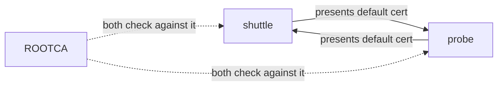
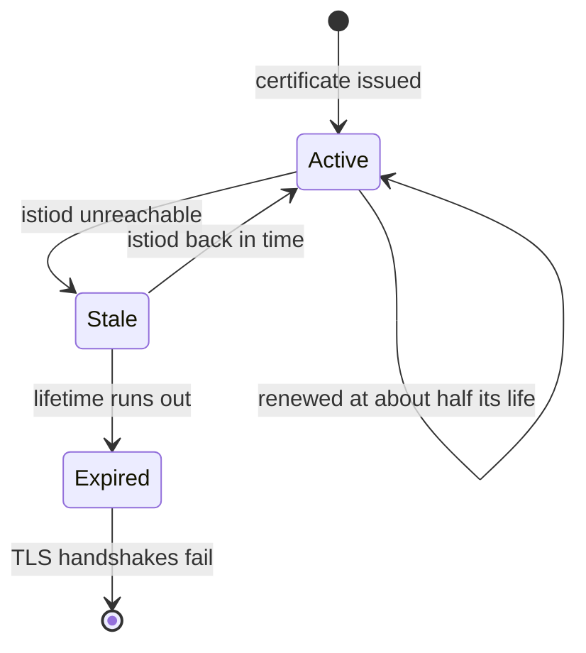

# Read A Workload's Certificate

When a security rule rejects a request that should be allowed, the fastest fix is to read the caller's real certificate. If you have never looked at one, you are only guessing what it says.

This chapter shows you how to read it. You ask the sidecar proxy which certificates it holds, take the certificate out, and decode the name in it. Then you compare several workloads side by side and see how a certificate is renewed.

## Ask the proxy with `istioctl proxy-config`

Most Istio commands ask `istiod`, the control plane, what it *plans* to send. `istioctl proxy-config` is different: it asks one running sidecar proxy (Envoy) what it *holds right now*. When the two differ, the proxy is the one that decides. The shape is always the same:

```text
istioctl proxy-config <what> <pod or deploy/name> -n <namespace> [-o json]
```

The `<what>` part picks the question you ask the proxy:

| `<what>` | The question it answers | You use it to check |
| --- | --- | --- |
| `listener` | Which ports do I listen on, and with which rules? | mTLS requirements, security rules |
| `route` | Where does an HTTP request go? | routing rules |
| `cluster` | Which destinations do I know? | known services |
| `endpoint` | Which pod addresses stand behind a destination? | healthy pods |
| `secret` | Which certificates do I hold? | the workload's certificate |

This chapter uses `secret`. Instead of a pod name you can write `deploy/<name>`, and `istioctl` picks one pod of that Deployment for you.

## Every proxy holds two certificates

Ask a proxy for its certificates and you get two rows, not one. They do opposite jobs, so it pays to tell them apart from the start.

<!-- astrona:playground:renew -->

List the certificates the `bridge` proxy holds:

```sh
istioctl proxy-config secret deploy/bridge-v1 -n starfleet
```

```text
RESOURCE NAME     TYPE           STATUS     VALID CERT     SERIAL NUMBER                        NOT AFTER                NOT BEFORE
default           Cert Chain     ACTIVE     true           feb8ade5170abdf1d66767017c630610     2026-10-10T06:11:47Z     2026-10-09T06:09:47Z
ROOTCA            CA             ACTIVE     true           4871477d9761cb8539c400719a25c7ca     2036-10-06T06:11:35Z     2026-10-09T06:11:35Z
```

`default` is the `bridge` workload's own certificate: the one it presents to other workloads. `ROOTCA` is the root certificate of the mesh's certificate authority (CA), the service that signs every workload certificate. The `bridge` proxy uses it to check the certificates *other* workloads present. Look at `NOT AFTER`: the workload certificate expires in about a day, the root certificate in ten years.

Together, the two rows are the "mutual" in mutual TLS (mTLS). In mTLS, both sides present a certificate, so the connection is encrypted and both identities are verified.



The diagram shows each proxy presenting its own `default` certificate, and each proxy checking the other one against the same `ROOTCA`. A browser and a website only check in one direction; inside the mesh, both sides check.

The workload certificate is short-lived because proxies present it all the time, so a stolen one should stop working soon. The root certificate is long-lived because changing it means every proxy must trust a new root at once.

## Read the name in the certificate

The table does not show the name in the certificate, and the name is what you came for. It sits in the certificate's **SAN** (Subject Alternative Name), the field where a certificate lists the names it belongs to. To read it, you take the certificate out of the proxy and decode it.

`-o json` returns everything the proxy holds. The certificate sits inside it as base64 text, a way of writing binary data as letters. The command below picks the `default` entry with `jq`, decodes it with `base64`, and saves it as `bridge.pem`:

```sh
istioctl proxy-config secret deploy/bridge-v1 -n starfleet -o json \
  | jq -r '.dynamicActiveSecrets[] | select(.name=="default") | .secret.tlsCertificate.certificateChain.inlineBytes' \
  | base64 --decode > bridge.pem
```

The command prints nothing. `bridge.pem` is now a normal certificate file on your machine, and `openssl` can read it. The file holds the `bridge` workload certificate first and the root certificate after it; `openssl x509` reads only the first one. Print its SAN, subject and issuer:

```sh
openssl x509 -in bridge.pem -noout -ext subjectAltName -subject -issuer
```

```text
X509v3 Subject Alternative Name: critical
    URI:spiffe://cluster.local/ns/starfleet/sa/starfleet-bridge
subject=
issuer=O=cluster.local
```

There is the identity: `spiffe://cluster.local/ns/starfleet/sa/starfleet-bridge`. Istiod built it from the `bridge` service account, and the `bridge` proxy presents it on every connection.

Two more details in that output are worth a second look. The subject is empty. Website certificates put a name in the subject, but mesh certificates leave it blank and keep the name only in the SAN, so if you look for the identity in the subject, you find nothing. The SAN is also marked `critical`. That means a program that checks this certificate must understand the SAN or reject the certificate, so nothing can quietly ignore the name.

The issuer `O=cluster.local` is istiod's own certificate authority. If a mesh uses an outside certificate authority, this line changes. Comparing it across workloads is a quick way to spot workloads with certificates from another certificate authority.

## Compare identities across workloads

One certificate proves the method. Several side by side prove the rule behind it: the name comes from the service account, not from the pod. Paste this helper once in your terminal. It runs the same steps in one go and prints the SAN of the workload you name:

```sh
show_badge() {
  istioctl proxy-config secret "$1" -n "${2:-starfleet}" -o json \
    | jq -r '.dynamicActiveSecrets[] | select(.name=="default") | .secret.tlsCertificate.certificateChain.inlineBytes' \
    | base64 --decode | openssl x509 -noout -ext subjectAltName
}
for ship in deploy/scout-v1 deploy/scout-v2 deploy/fortio deploy/shuttle; do echo "$ship"; show_badge $ship; done
```

```text
deploy/scout-v1
X509v3 Subject Alternative Name: critical
    URI:spiffe://cluster.local/ns/starfleet/sa/starfleet-scout
deploy/scout-v2
X509v3 Subject Alternative Name: critical
    URI:spiffe://cluster.local/ns/starfleet/sa/starfleet-scout
deploy/fortio
X509v3 Subject Alternative Name: critical
    URI:spiffe://cluster.local/ns/starfleet/sa/default
deploy/shuttle
X509v3 Subject Alternative Name: critical
    URI:spiffe://cluster.local/ns/starfleet/sa/shuttle
```

`scout-v1` and `scout-v2` are different Deployments with different images, and they have the very same identity. `fortio` has the `default` identity, which any other workload in this namespace without its own service account would share.

The opposite case is a pod with no certificate at all. The namespace `outpost` has no sidecar injection, so its one pod, the `drifter`, runs without a sidecar proxy. Ask for its certificates anyway:

```sh
istioctl proxy-config secret deploy/drifter -n outpost
```

```text
Error: failed to execute command on drifter-57fdbc6c95-9wsv4.outpost sidecar: failure running port forward process: Get "http://localhost:60945/config_dump?mask=dynamic_active_secrets,dynamic_warming_secrets": EOF
```

(Shortened: `istioctl` also prints two long port-forward log lines first.) There is no proxy to answer. No proxy means no istio-agent, so no certificate was ever issued. The `drifter` pod has no identity at all, and it can only send plain text.

## Certificate lifetime and rotation

Workload certificates are short-lived on purpose: the default lifetime is **24 hours**. The istio-agent, a small helper program inside the pod's `istio-proxy` container, replaces each certificate with a new one long before it expires. This is called **certificate rotation**. Start by reading the dates and the serial number of the `bridge` certificate:

```sh
openssl x509 -in bridge.pem -noout -dates -serial
```

```text
notBefore=Oct  9 06:09:47 2026 GMT
notAfter=Oct 10 06:11:47 2026 GMT
serial=FEB8ADE5170ABDF1D66767017C630610
```

The two dates are about 24 hours apart, and yours show the time your playground started. `notBefore` sits two minutes before the certificate was issued, so a proxy whose clock runs a little behind still accepts it. What happens between those two dates follows a fixed cycle:



The diagram shows the states a certificate moves through. The istio-agent renews the certificate after about half its lifetime, so after roughly 12 hours. If istiod is down at that moment, the proxy keeps working with its old certificate and the istio-agent keeps trying. Only an outage longer than the remaining time lets the certificate expire.

That cycle has three effects. Rotation is invisible: the new certificate reaches Envoy over the same local SDS (Secret Discovery Service) connection inside the pod, with no restart and no dropped connection. The serial number changes; the name does not.

The other two effects are about failures. An istiod outage is quiet for hours, then total: proxies keep working on their current certificates, then fail when those expire. So "everything broke overnight" points at istiod. And a stale certificate is a symptom, not the problem. If a proxy holds an old certificate, check its connection to istiod first.

You cannot wait 12 hours for a rotation, but you can restart the `shuttle` Deployment. A new pod gets a new certificate from the same service account:

```sh
kubectl rollout restart deploy/shuttle -n starfleet
kubectl rollout status deploy/shuttle -n starfleet
istioctl proxy-config secret deploy/shuttle -n starfleet
```

```text
deployment.apps/shuttle restarted
Waiting for deployment "shuttle" rollout to finish: 1 old replicas are pending termination...
deployment "shuttle" successfully rolled out
RESOURCE NAME     TYPE           STATUS     VALID CERT     SERIAL NUMBER                        NOT AFTER                NOT BEFORE
default           Cert Chain     ACTIVE     true           d794a600b377dcdebdd99a3605f190ef     2026-10-10T06:14:17Z     2026-10-09T06:12:17Z
ROOTCA            CA             ACTIVE     true           4871477d9761cb8539c400719a25c7ca     2036-10-06T06:11:35Z     2026-10-09T06:11:35Z
```

(The rollout lines are shortened.) The `default` serial number is new. Run `show_badge deploy/shuttle` and the name is still `spiffe://cluster.local/ns/starfleet/sa/shuttle`. The `ROOTCA` row did not change at all: the root certificate stays the same.

You can now read what any proxy really holds: its own certificate, with the identity in the SAN, and the root certificate it checks everyone else against. You also know that the certificate changes every few hours while the name stays fixed. One question is still open. A proxy holds a name, but how does the workload on the other end use that name to allow or deny a request?

## Common pitfalls

> [!WARNING]
> - **Mixing up `default` and `ROOTCA`.** `default` is the workload's own certificate. `ROOTCA` is the root certificate it checks other workloads against.
> - **Looking for the identity in the subject.** Mesh certificates leave the subject empty. The name is in the SAN.
> - **Reading the wrong workload.** Each workload has its own certificate. To debug a caller, read the caller's certificate, not the receiver's.
> - **Taking "has a certificate" for "must use it".** Holding a certificate means a proxy *can* use mTLS. Whether it *must* is set by a separate rule.
> - **Blaming expiry for an outage.** Rotation starts hours before expiry. A stale certificate means the proxy lost its connection to istiod.
