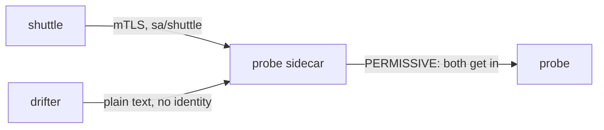
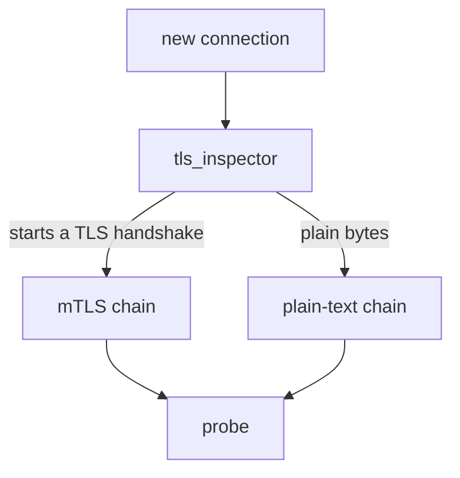

# Two Callers, One Default

Before you lock anything down, you need to know what the mesh does today. If you skip this step, you cannot tell whether a later policy changed anything. Two clients will send a request to the `probe`: the `shuttle`, which has a sidecar proxy, and the `drifter`, which does not. Both get an answer.

This chapter explains why both get in, and how to tell which of the two requests was protected. It starts with what mTLS adds to a connection, then looks at the two defaults that make it happen without any configuration, and ends inside the sidecar proxy, where one port accepts two kinds of connection.

## A certificate for every workload

Every workload in the mesh has a **certificate**: a small file that says who the workload is, signed by someone everyone trusts. In Istio, the signer is `istiod`, Istio's control plane. It acts as a **certificate authority** (CA): the service that signs every certificate in the mesh.

The certificate is what makes mTLS possible. **mTLS** (mutual Transport Layer Security) means both sides present a certificate when they open a connection. Plain TLS, the kind your browser uses, only checks the server's certificate. In mTLS *both* sides present one, which is the "mutual" part. After this exchange, called the TLS handshake, the connection is encrypted, so nobody listening on the network can read it.

The name written in each certificate is a **SPIFFE ID**. SPIFFE is a standard way to write a workload's name. The ID is built from the workload's namespace and its Kubernetes service account:

```text
spiffe://cluster.local/ns/starfleet/sa/shuttle
         └ trust domain  └ namespace └ service account
```

The identity belongs to the service account, not to one pod. Every pod that runs as `shuttle` carries the same name.

## Auto mTLS and the default mode

Nobody configured mTLS in your playground, yet the `shuttle` already uses it. Two defaults work together to make that happen, one on each side of the connection.

On the sending side, **auto mTLS** is a setting that is on by default. When the `shuttle`'s sidecar proxy sends a request, it checks whether the receiving workload has a sidecar that accepts mTLS. If it does, the sidecar uses mTLS by itself. You write nothing.

The receiving workload has a mode too. With no policy anywhere, every workload is **`PERMISSIVE`**: it accepts mTLS, *and* it accepts plain text from callers that cannot use mTLS. No object in the cluster says `PERMISSIVE`. It is simply what happens when nothing is set.



The diagram shows the `probe`'s sidecar proxy receiving both requests: the `shuttle`'s over mTLS with an identity, the `drifter`'s as plain text with none, and both passed on to the `probe` under `PERMISSIVE`.

## Both callers get in

<!-- astrona:playground:renew -->

Now check the two defaults on the real workloads. First confirm that no policy exists, then send one request from each client to the `probe`:

```sh
kubectl get peerauthentication -A
from_shuttle $PROBE_URL
from_drifter $PROBE_URL
```

```text
No resources found
shuttle: 200
drifter: 200  exit=0
```

Two answers, and no policy object to explain them. That is `PERMISSIVE` doing its job. It is also the state a security review rejects, because mTLS is optional rather than required.

The status code looks the same for both callers, so you need another way to tell them apart. When a request arrives over mTLS, the `probe`'s sidecar proxy adds the header `X-Forwarded-Client-Cert`, which carries the caller's SPIFFE ID. The `probe` echoes its headers back, so ask it from both clients:

```sh
kubectl exec -n starfleet deploy/shuttle -- curl -s http://probe:8000/headers | grep -A2 -i client-cert
kubectl exec -n outpost deploy/drifter -- curl -s http://probe.starfleet:8000/headers | grep -c -i client-cert
```

```text
    "X-Forwarded-Client-Cert": [
      "By=spiffe://cluster.local/ns/starfleet/sa/probe;Hash=5873bb3241d664a206325566eb1c1a96b2430e8dc00051146f675444d6fd9fe1;Subject=\"\";URI=spiffe://cluster.local/ns/starfleet/sa/shuttle"
    ],
0
```

The header has two names in it. `By=` is the `probe`'s own identity, the workload that received the request. `URI=` is the caller's identity: the `shuttle`. The `drifter`'s request arrived with no header at all, which means plain text and no identity. Both got `200`, but only one of them was protected.

## How one port accepts two kinds of connection

A port is just a number. So how can the `probe`'s sidecar accept both a TLS handshake and a plain HTTP request on the same port? The answer is a quick peek at the first bytes of each connection.

Envoy, the program inside every sidecar, receives each new connection on an **inbound listener**: the part of Envoy that accepts incoming connections on a port. The listener first runs a small check called `tls_inspector`. It reads the first bytes without using them up, and decides whether they look like the start of a TLS handshake. The listener then picks one of its **filter chains**. A filter chain is a set of steps for one kind of connection: one chain handles mTLS and one handles plain text.



The diagram shows `tls_inspector` sending each connection to the mTLS chain or the plain-text chain, and both chains ending at the `probe`. Under `PERMISSIVE`, the listener has both chains, so either kind of connection has somewhere to go. That is the whole trick: `PERMISSIVE` is not a decision made for each request. It is two chains existing side by side, and changing the mode changes which chains exist.

You now know what the mesh does with no policy at all. The sending sidecar uses mTLS whenever it can, and the receiving sidecar still accepts plain text from callers that cannot. The `X-Forwarded-Client-Cert` header, not the status code, shows which request carried an identity. The open question is how to remove that second half, so that plain text is no longer accepted.

## Common pitfalls

> [!WARNING]
> - **Reading `PERMISSIVE` as a warning mode.** It accepts plain text silently and forever. Nothing ever escalates on its own.
> - **Taking `200` as proof of mTLS.** Both callers get `200`. Only the `X-Forwarded-Client-Cert` header shows that a request carried an identity.
> - **Testing from a pod without a sidecar and concluding mTLS is broken.** The drifter has no certificate to present. Its plain text is the expected result.
> - **Thinking the identity belongs to a pod.** It belongs to the service account. Two Deployments that share a service account share one identity.
