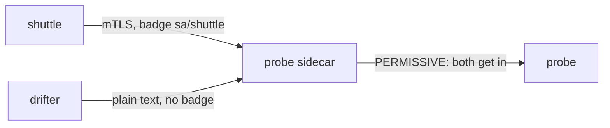
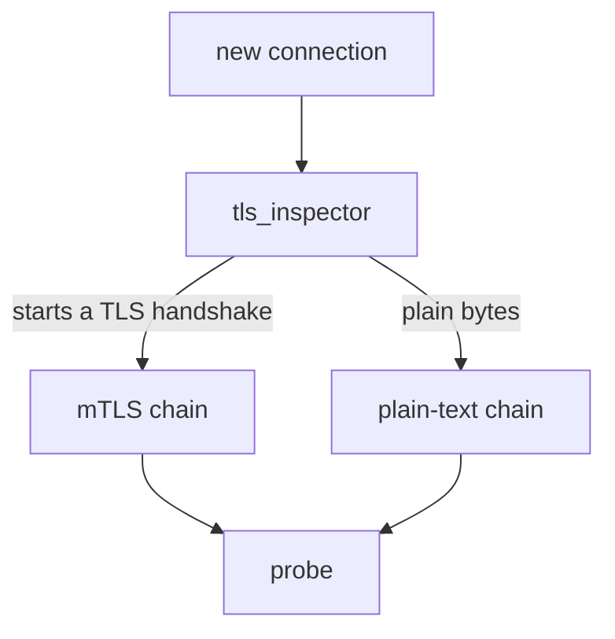

# Two Callers, One Default

Astronaut, before you lock anything down, look at what the mesh does today. Two ships will signal the probe: the shuttle, which has a communications officer on board, and the drifter, which does not. Both get an answer. This part shows why, and how to tell which of the two signals was protected.

## A badge for every ship

Before any test, it helps to know what "mTLS" actually adds. This section explains the badge, the handshake and the name written on the badge.

### The badge and the handshake

Every ship in the mesh carries an ID badge. In technical terms it is a **certificate**: a small file that says who the ship is, signed by someone everyone trusts. In Istio, the signer is `istiod`, mission control. It acts as a **certificate authority** (CA): the badge office at mission control, which signs every badge.

**mTLS** (mutual Transport Layer Security) is the secret handshake both ships check before they talk. Plain TLS, the kind your browser uses, only checks the server's badge. In mTLS *both* sides show a badge, which is the "mutual" part. After the handshake, the signal is encrypted, so nobody listening on the network can read it.

### The name on the badge

The name printed on each badge is a **SPIFFE ID**. SPIFFE is a standard way to write a workload's name. The ID is built from the ship's namespace and its service account, the ship's registration papers:

```text
spiffe://cluster.local/ns/starfleet/sa/shuttle
         └ trust domain  └ namespace └ service account
```

The badge belongs to the service account, not to one pod. Every pod that runs as `shuttle` carries the same name.

## Auto mTLS and the default mode

Nobody configured mTLS in your playground, yet the shuttle already uses it. Two defaults work together to make that happen, one on each side of the signal.

### The sending side: auto mTLS

**Auto mTLS** is a setting that is on by default. When the shuttle's communications officer sends a signal, it checks whether the receiving ship has a sidecar that accepts mTLS. If it does, the officer does the handshake by itself. You write nothing.

### The receiving side: PERMISSIVE

The receiving ship has a mode too. With no policy anywhere, every ship is **`PERMISSIVE`**: it accepts the handshake, *and* it accepts plain text from ships that cannot do it. No object in the cluster says `PERMISSIVE`. It is simply what happens when nothing is set.



The probe's communications officer receives both signals. The shuttle's arrives over mTLS with a badge; the drifter's arrives as plain text with none. Under `PERMISSIVE`, both are passed on to the probe.

## See it in your playground

Now check the two defaults on the real fleet. You will see that both callers get in, and then find the one detail that tells them apart.

<!-- astrona:playground:renew -->

### Both callers get in

First, confirm that no policy exists. Then send one signal from each ship to the probe:

```sh
kubectl get peerauthentication -A
from_shuttle $PROBE_URL
from_drifter $PROBE_URL
```

```text
No resources found
shuttle: 200
drifter: 200  exit=0
```

Two answers, and no policy object to explain them. That is `PERMISSIVE` doing its job. It is also the state a security review rejects, because the handshake is optional rather than required.

### Only one carried a badge

The status code looks the same, so ask the probe what it received. When a signal arrives over mTLS, the probe's communications officer adds the header `X-Forwarded-Client-Cert`. It carries the caller's SPIFFE ID. Ask from both ships:

```sh
kubectl exec -n starfleet deploy/shuttle -- curl -s http://probe:8000/headers | grep -A2 -i client-cert
kubectl exec -n outpost deploy/drifter -- curl -s http://probe.starfleet:8000/headers | grep -c -i client-cert
```

```text
    "X-Forwarded-Client-Cert": [
      "By=spiffe://cluster.local/ns/starfleet/sa/probe;Hash=5873bb3241d664a206325566eb1c1a96b2430e8dc00051146f675444d6fd9fe1;Subject=\"\";URI=spiffe://cluster.local/ns/starfleet/sa/shuttle"
    ],
0
```

The header has two names in it. `By=` is the probe's own badge, the ship that received the signal. `URI=` is the caller's badge: the shuttle.

The shuttle's signal carried its badge, `sa/shuttle`. The drifter's signal arrived with no header at all: plain text, no identity. Both got `200`, but only one of them was protected.

## How one port accepts two kinds of signal

A port is just a number. So how can the probe's sidecar accept both a TLS handshake and a plain HTTP request on the same port? The answer is a quick peek at the first bytes of each connection.

### The peek, then the choice

Envoy, the program inside every sidecar, receives each new connection on an **inbound listener**: the radio receiver for incoming signals. The listener first runs a small check called `tls_inspector`. It reads the first bytes without using them up, and decides whether they look like the start of a TLS handshake.

The listener then picks one of its **filter chains**. A filter chain is a set of steps for one kind of connection. One chain handles mTLS and one handles plain text.



Under `PERMISSIVE`, the listener has both chains, so either kind of connection has somewhere to go. That is the whole trick: `PERMISSIVE` is not a decision made for each signal. It is two chains existing side by side. Changing the mode changes which chains exist.

## Common pitfalls

> [!WARNING]
> - **Reading `PERMISSIVE` as a warning mode.** It accepts plain text silently and forever. Nothing ever escalates on its own.
> - **Taking `200` as proof of mTLS.** Both callers get `200`. Only the `X-Forwarded-Client-Cert` header shows that a signal carried a badge.
> - **Testing from a ship without a sidecar and concluding mTLS is broken.** The drifter has no badge to show. Its plain text is the expected result.
> - **Thinking the badge belongs to a pod.** It belongs to the service account. Two Deployments that share a service account share one identity.

> *By default the mesh does the handshake whenever it can, and still lets in anyone who cannot. The rest of this module is about removing that second half.*
