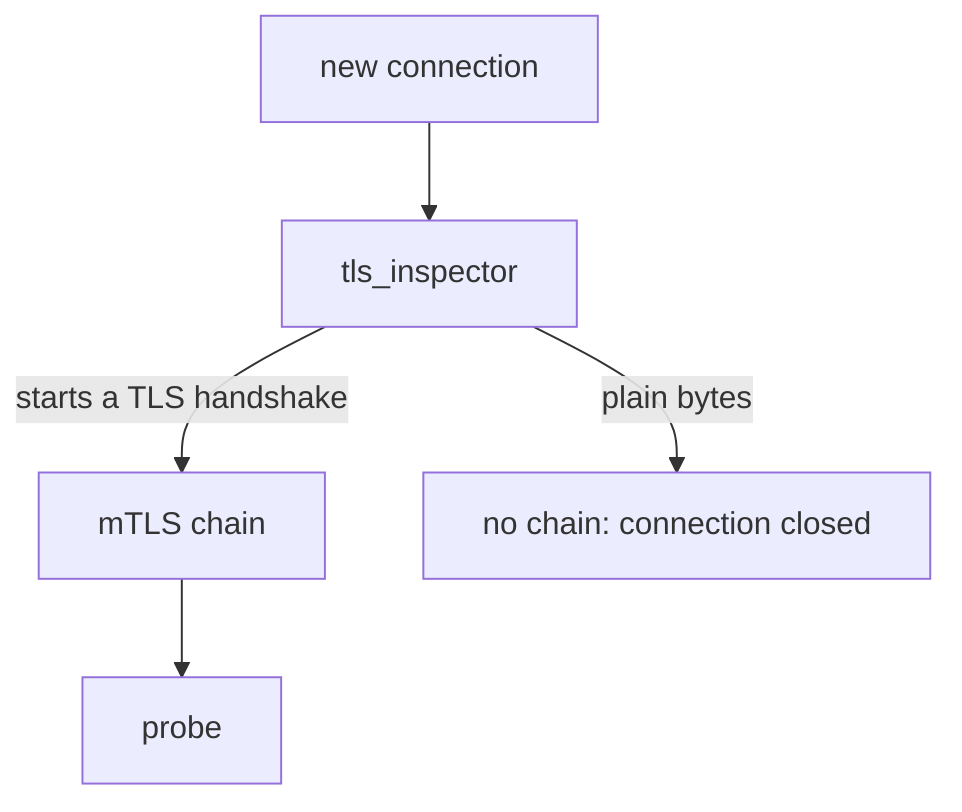

# Require The Handshake With STRICT

Astronaut, right now the handshake is optional. In this part you make it required for a whole planet, and you watch what the drifter gets when it knocks without a badge. That failure has a shape you must learn to spot, because it looks nothing like a normal "access denied".

## The four modes

A `PeerAuthentication` is the rule on a ship's airlock: it says who must do the handshake before docking. It only works on the **receiving** ships. Its one important field is `mtls.mode`, and it has four values.

### What each mode means

| Mode | The receiving ship… |
| --- | --- |
| `PERMISSIVE` | accepts mTLS **and** plain text (handshake welcome, not required). This is the default. |
| `STRICT` | accepts mTLS only (handshake required). Plain-text connections are refused. |
| `DISABLE` | does not use mTLS at all (no handshake). It only accepts plain text. |
| `UNSET` | has no opinion. It takes the mode from the next wider policy. |

### UNSET is not "off"

`UNSET` is easy to misread. A policy that leaves out the mode, or writes `UNSET`, does not decide anything. The decision moves outward, to a wider policy, and in the end to the built-in default, `PERMISSIVE`.

### DISABLE is not the opposite of STRICT

`DISABLE` means the ship will not do the handshake at all. It exists for ships that truly cannot speak mTLS. It is not a gentle way to relax security: it removes the badge check *and* the encryption for every caller.

## Lock the planet

Now make the handshake required for every ship on the planet `starfleet`. A policy named `default` in a namespace, with no `selector`, covers every workload in that namespace.

<!-- astrona:playground:renew -->

### Write the policy

Save this as `peerauthentication-starfleet-strict.yaml`:

```yaml
apiVersion: security.istio.io/v1
kind: PeerAuthentication
metadata:
  name: default
  namespace: starfleet
spec:
  mtls:
    mode: STRICT
```

Apply it:

```sh
kubectl apply -f peerauthentication-starfleet-strict.yaml
```

```text
peerauthentication.security.istio.io/default created
```

### Then check the result

Send a signal from the shuttle to the probe, and from the drifter to the probe and to the scout:

```sh
from_shuttle $PROBE_URL
from_drifter $PROBE_URL
from_drifter $SCOUT_URL
```

```text
shuttle: 200
drifter: 000  exit=56
drifter: 000  exit=56
```

The shuttle still gets in. Its communications officer was already doing the handshake, so nothing changed for it. The drifter is refused by both the probe and the scout, because the policy covers every ship on the planet.

Mission control pushes the new policy to the ships within seconds, with no restart. If the drifter still gets `200`, wait up to a minute and send the signal again.

## What the drifter actually sees

The drifter got no error page, no `403` and no message. It got nothing at all. This section explains the two numbers it printed, and the one place where the refusal does not show up.

### No status code: 000 and exit 56

`000` is `curl`'s way of saying "no HTTP answer arrived". The exit code says why: `56` means "failure receiving network data", which is what `curl` reports when the other side resets the connection. The probe's communications officer hung up before any HTTP was spoken.

### A short line in the receiver's flight log

Read the last lines of the probe's flight log (the access log of its sidecar):

```sh
kubectl logs -n starfleet deploy/probe-v1 -c istio-proxy --tail=3
```

```text
[2026-10-09T06:48:23.748Z] "GET /get HTTP/1.1" 200 - via_upstream - "-" 0 661 1 1 "-" "curl/8.11.1" "aa74c934-a7fb-410a-826a-e34c6d5af17b" "probe.starfleet:8000" "10.244.0.13:8080" inbound|8080|| 127.0.0.6:43491 10.244.0.13:8080 10.244.0.12:53198 outbound_.8000_._.probe.starfleet.svc.cluster.local default
[2026-10-09T06:48:34.040Z] "GET /get HTTP/1.1" 200 - via_upstream - "-" 0 661 0 0 "-" "curl/8.11.1" "d9b68dca-5761-48aa-aff1-dfc8d170b5e1" "probe.starfleet:8000" "10.244.0.13:8080" inbound|8080|| 127.0.0.6:53209 10.244.0.13:8080 10.244.0.12:40062 outbound_.8000_._.probe.starfleet.svc.cluster.local default
[2026-10-09T06:48:34.107Z] "- - -" 0 NR filter_chain_not_found - "-" 0 0 0 - "-" "-" "-" "-" "-" - - 10.244.0.13:8080 10.244.0.15:46778 - -
```

The first two lines are the shuttle's signals: a full request, `GET /get`, answered with `200`. The last line is the drifter's. It has no method, no path and no status (`"- - -" 0`), because no request was ever read. The flag `NR` and the reason `filter_chain_not_found` say what happened: the probe's communications officer found no way to handle a plain-text connection, so it closed it.

The probe runs as two pods, `probe-v1` and `probe-v2`, and each signal lands on one of them. If the shuttle's line is missing, read the other pod's log.

## Why there is no 403

The refusal happens below HTTP, and the reason is the listener inside the probe's sidecar. Knowing where it happens tells you which object to blame.

### One chain instead of two

Under `PERMISSIVE`, the sidecar's inbound listener has two filter chains: one for mTLS and one for plain text. `STRICT` removes the plain-text chain.



A plain-text connection now matches no chain, so the listener closes it. That is the `filter_chain_not_found` in the probe's flight log. No request was ever read, so there is nothing that could get an HTTP status code.

### Two failures that look different

Learn these two signatures side by side. Mixing them up sends you hunting in the wrong object:

```text
 403  "RBAC: access denied"   the connection was accepted, the request was read,
                              and an authorization rule refused it
                              → look at AuthorizationPolicy

 000  connection reset (56)   the connection was refused before any request;
                              the caller could not do the handshake
                              → look at PeerAuthentication
```

### Undo it

Remove the policy, so the planet is back to the default:

```sh
kubectl delete -f peerauthentication-starfleet-strict.yaml
```

Keep the file: you will apply it again later in this module.

> [!TIP]
> When a caller gets `000` or exit code `56` and the receiver's flight log shows `NR filter_chain_not_found`, think "transport" first: a `STRICT` policy, or a caller that has no sidecar. When it gets `403`, think "authorization rule". This one habit saves a lot of time in the exam.

## Common pitfalls

> [!WARNING]
> - **Expecting an HTTP error from `STRICT`.** The connection is reset, so the caller gets `000` and exit code `56`, never a status code.
> - **Searching the receiver's flight log for a request line.** A refused plain-text connection never became a request. Look for a line with `"- - -" 0 NR filter_chain_not_found` instead.
> - **Reading `UNSET` as "no mTLS".** It means "ask the wider policy". The default it falls back to is `PERMISSIVE`.
> - **Using `DISABLE` to fix a broken caller.** It switches off the badge check and the encryption for everyone. Use it only for a ship that cannot do mTLS at all.

> *`STRICT` keeps only the mTLS chain on the receiving ship, so a caller without a badge is dropped before it can even ask a question.*
