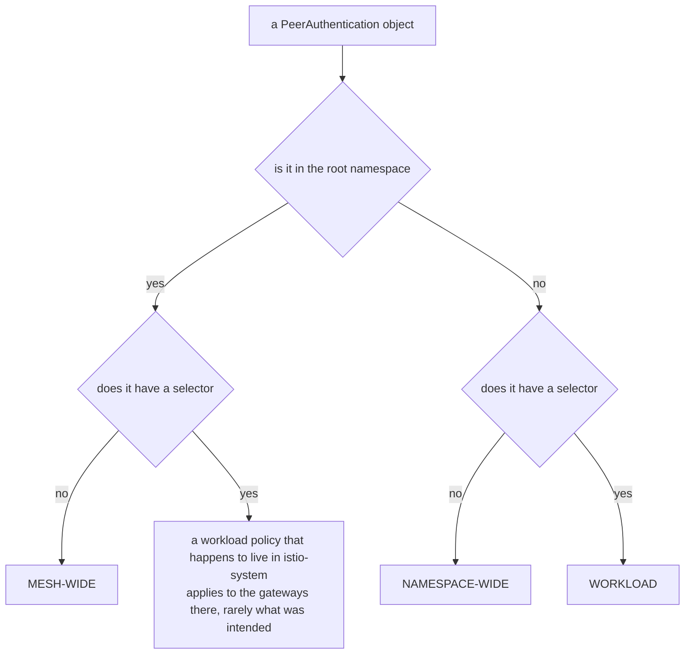
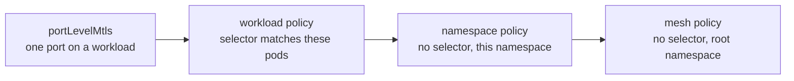

# Part 2 — The three scopes and how precedence resolves

> Prerequisite: [Part 1 — Modes, and what they do to the inbound listener](./course-01-modes-and-the-inbound-listener.md). Next: [Part 3 — Proving what is in effect](./course-03-proving-what-is-in-effect.md).

The mode is the easy half. This part is the hard half: the same three lines of YAML are a mesh-wide policy, a namespace policy or a workload policy depending on two things that are not fields, and when several of them exist you need a rule for which one decides.

## Scope is not a field

The scope of a `PeerAuthentication` is decided by the namespace the object is created in, and whether it has a `selector`.

**Mesh-wide** — created in the **root namespace**, normally `istio-system`, with no `selector`:

```yaml
apiVersion: security.istio.io/v1
kind: PeerAuthentication
metadata:
  name: default
  namespace: istio-system
spec:
  mtls:
    mode: STRICT
```

**Namespace-wide** — created in the target namespace, with no `selector`:

```yaml
metadata:
  name: default
  namespace: mtls-demo
spec:
  mtls:
    mode: PERMISSIVE
```

**Workload** — created in the target namespace, with a `selector` matching pod labels:

```yaml
metadata:
  name: notification-strict
  namespace: mtls-demo
spec:
  selector:
    matchLabels:
      app: notification-service
  mtls:
    mode: STRICT
```

Read those three again and notice how little distinguishes them:



Two questions decide the scope, and the surprising branch is the top right: a selector in the root namespace does not narrow a mesh-wide policy, it creates a workload policy over `istio-system`.

Both wrong turns on that diagram apply cleanly and produce no error. A mesh-wide policy dropped into an application namespace becomes an ordinary namespace policy and silently covers far less than intended. A namespace policy that picks up a `selector` becomes a workload policy and silently covers far less again.

The root namespace is itself configurable — `meshConfig.rootNamespace`, defaulting to `istio-system`. On a cluster you did not install, confirming it is one command and worth doing before concluding a "mesh-wide" policy is broken:

```sh
kubectl -n istio-system get configmap istio -o jsonpath='{.data.mesh}' | grep -i rootnamespace
```

An empty result means the default is in force.

## Narrowest wins

When several policies could apply to one workload, exactly one decides. The rule is **narrowest wins**, and the full ordering has four levels rather than three:



Narrowest wins. The leftmost thing that applies to a given port is the one in effect, and nothing merges — a narrower policy replaces the wider one for what it covers.

This is a **selection**, not a merge. The winning level supplies the mode; the wider ones are not consulted for that workload at all. There is no combining, no intersection, no "most restrictive wins" — a `PERMISSIVE` namespace policy genuinely overrides a `STRICT` mesh policy, which surprises people who expect security settings to only ratchet tighter.

The one thing that *does* traverse levels is `UNSET` from [Part 1](./course-01-modes-and-the-inbound-listener.md). A policy that matches but leaves the mode unset does not decide; the search continues outward. That is how `portLevelMtls` can set one port without disturbing the rest of the workload.

Two policies at the same level on the same workload is the one case the rule does not settle, and the honest answer is: do not do it. Istio picks one — in practice the older object — and the result is stable but not something to rely on or to reason about in an exam.

## Overriding downward, one level at a time

With the mesh-wide `STRICT` from Part 1 in place, a namespace can opt out. Apply a `PERMISSIVE` policy in `mtls-demo` and the namespace wins — plaintext works again in that one namespace and nowhere else.

> [!TIP]
> **Try it — a namespace exception to the mesh policy**
>
> ```sh
> kubectl apply -f - <<'YAML'
> apiVersion: security.istio.io/v1
> kind: PeerAuthentication
> metadata:
>   name: default
>   namespace: mtls-demo
> spec:
>   mtls:
>     mode: PERMISSIVE
> YAML
>
> kubectl -n outside exec deploy/outside-client -- \
>   curl -s -o /dev/null -w 'outside: %{http_code}\n' --max-time 5 -X POST http://notification-service.mtls-demo/notify
> ```
>
> Expect something like:
>
> ```text
> outside: 200
> ```
>
> The mesh policy is untouched and still says `STRICT`; it simply no longer decides anything in `mtls-demo`. Remove this object later with `kubectl -n mtls-demo delete peerauthentication default` and the mesh rule takes over again.

One scope narrower, the same mechanism works on a single workload. A policy in `mtls-demo` with `selector.matchLabels.app: notification-service` applies to those pods only, so `notification-service` becomes strict while `booking-service` — same namespace, same `PERMISSIVE` namespace policy — keeps accepting plaintext.

> [!TIP]
> **Try it — one workload strict, its neighbour not**
>
> ```sh
> kubectl apply -f - <<'YAML'
> apiVersion: security.istio.io/v1
> kind: PeerAuthentication
> metadata:
>   name: notification-strict
>   namespace: mtls-demo
> spec:
>   selector:
>     matchLabels:
>       app: notification-service
>   mtls:
>     mode: STRICT
> YAML
>
> kubectl -n outside exec deploy/outside-client -- sh -c \
>   'curl -s -o /dev/null -w "notification: %{http_code}\n" --max-time 5 -X POST http://notification-service.mtls-demo/notify;
>    curl -s -o /dev/null -w "booking:      %{http_code}\n" --max-time 5 -X POST http://booking-service.mtls-demo/book'
> ```
>
> Expect something like:
>
> ```text
> notification: 000
> booking:      200
> ```
>
> Three policies now exist at three scopes, and the effective mode for any given pod is whichever one is narrowest. Two workloads in one namespace, with one shared namespace policy, behaving differently — that is the precedence rule producing something you can see.

## `portLevelMtls`: narrower than a workload

The fourth level carves out a single port on an otherwise-decided workload:

```yaml
spec:
  selector:
    matchLabels:
      app: notification-service
  mtls:
    mode: STRICT
  portLevelMtls:
    9090:
      mode: PERMISSIVE
```

The object contradicts itself on purpose: the workload-level mode is `STRICT`, and `portLevelMtls` overrides it for port `9090` only. Narrowest wins, and a port is narrower than a workload.

Two mechanical details decide whether it works at all:

- **The number is the container port**, not the `Service` port that fronts it. The policy is programmed onto the workload's inbound listener, which only knows the ports the pod actually listens on.
- **A port the workload does not serve produces no listener to attach to.** The object applies, the API accepts it, and nothing happens — which is indistinguishable from success until the caller you were protecting next runs. This is the same class of silent failure as a `selector` that matches nothing.

Its normal use is an exception for something that genuinely cannot do mTLS — a metrics scraper outside the mesh, a legacy health checker — and that is exactly the case [Module 3](../module-03/course.md) works through on a live namespace.

> *Scope is decided by namespace plus the presence of a selector, and the narrowest matching level supplies the mode outright — it is a selection, not a merge.*

## Common pitfalls

> [!WARNING]
> **Adding a selector to a mesh-wide policy to narrow it.** That does not narrow anything — it becomes a workload policy scoped to the root namespace.
>
> **Expecting scopes to merge.** The narrowest applicable policy replaces the wider one; fields are not combined.
>
> **Forgetting `portLevelMtls` exists.** It is narrower than a workload policy and will quietly override it for the port it names.
>
> **Assuming the root namespace is `istio-system` everywhere.** It is configurable, and a policy placed in the wrong one is mesh-wide nowhere.

## Reference

- [PeerAuthentication reference](https://istio.io/latest/docs/reference/config/security/peer_authentication/) — the precedence statement and the `portLevelMtls` map, in Istio's own words.
- [Istio authentication policy task](https://istio.io/latest/docs/tasks/security/authentication/authn-policy/) — worked examples of each scope, including the namespace-overrides-mesh case.
- [Global mesh options](https://istio.io/latest/docs/reference/config/istio.mesh.v1alpha1/) — `rootNamespace` and the other `meshConfig` fields referenced here.
