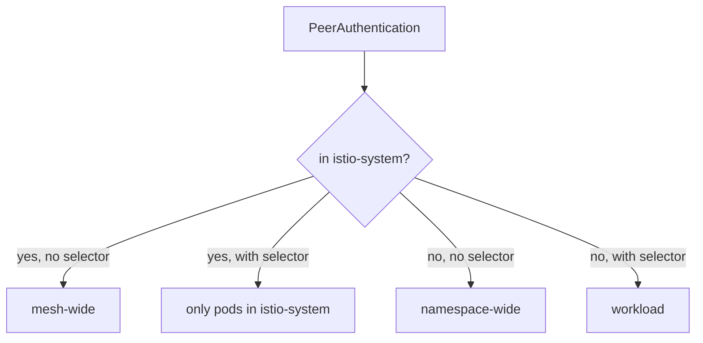
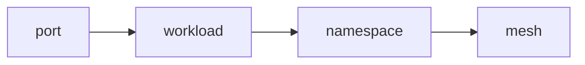

# Three Scopes, Narrowest Wins

A `PeerAuthentication` sets whether a workload accepts plain text, mTLS or both on inbound connections. The same few lines of YAML can be a policy for the whole mesh, for one namespace, or for a few pods, and nothing in the YAML says which. A policy saved in the wrong place still applies without an error, so it quietly covers more, or less, than you meant.

This chapter gives you the two facts that decide a policy's scope, and the one rule that picks a winner when several policies cover the same pod. Then you try both on the playground: first a strict namespace with one exception, then a strict mesh with one namespace that opts out.

## Scope is not a field

A `PeerAuthentication` has no "scope" field. Two things decide how far it reaches: the namespace the object lives in, and whether it has a `selector`, the field that picks pods by their labels. Together they give three scopes:

| Scope | Where it lives | `selector` |
| --- | --- | --- |
| **Mesh-wide** | the root namespace, `istio-system` (where `istiod` runs) | none |
| **Namespace-wide** | the namespace it covers | none |
| **Workload** | the namespace of the pods | yes, matching pod labels |

The name `default` is only a habit for mesh-wide and namespace-wide policies. Istio does not check it. What Istio does check is the pair of questions in this diagram:



The diagram shows the two questions and the four answers. The surprising one is the second arrow: a `selector` on a policy in `istio-system` does not narrow the mesh-wide rule. It creates a workload policy for pods that live in `istio-system` itself.

Both wrong turns apply without any error. A "mesh-wide" policy saved in an app namespace quietly covers only that namespace. A namespace policy that picks up a `selector` quietly covers only the matching pods. The root namespace can be changed at install time with the `meshConfig.rootNamespace` setting, but it is `istio-system` unless someone changed it.

## Narrowest wins

Knowing the scope of each policy is only half the answer, because several policies can cover the same pod. When they do, exactly one of them decides. The rule is short: **the narrowest one wins**. A policy for one workload beats a policy for its namespace, and a policy for the namespace beats a policy for the whole mesh.



The diagram shows the order Istio checks, from narrowest to widest. For a given port on a given pod, Istio uses the leftmost level that sets a mode. A port-level setting lives inside a workload policy and is narrower still.

This is a choice, not a merge. The winning policy decides alone, and the wider ones are not consulted for that pod at all. So there is no "most restrictive wins": a `PERMISSIVE` namespace policy really does override a `STRICT` mesh policy. That surprises people who expect security settings to only get tighter. The only thing that passes a decision outward is `UNSET`: a policy that matches but sets no mode lets the next wider one decide.

Do not put two policies at the same level on the same pods, for example two namespace-wide policies in one namespace. Istio picks one of them, but you should never rely on which.

## An exception for one workload

The most common real-world shape is a strict namespace with one workload that still has a caller without a sidecar. You build that shape now: the namespace set to `STRICT`, and the `probe` given an exception.

<!-- astrona:playground:renew -->

The commands below need the `starfleet` namespace policy with `mode: STRICT` applied. Apply the file you saved for it:

```sh
kubectl apply -f peerauthentication-starfleet-strict.yaml
```

Now write the exception. It lives in the same namespace, but its `selector` picks only the `probe` pods. Save this as `peerauthentication-probe-permissive.yaml`:

```yaml
apiVersion: security.istio.io/v1
kind: PeerAuthentication
metadata:
  name: probe
  namespace: starfleet
spec:
  selector:
    matchLabels:
      app: probe
  mtls:
    mode: PERMISSIVE
```

Apply it:

```sh
kubectl apply -f peerauthentication-probe-permissive.yaml
```

Then check the result by sending the `drifter` to the `probe` and to the `scout`:

```sh
from_drifter $PROBE_URL
from_drifter $SCOUT_URL
```

```text
drifter: 200  exit=0
drifter: 000  exit=56
```

Two workloads in one namespace, one shared namespace policy, and two different answers. The `probe` is covered by something narrower, the workload policy, so the namespace policy no longer decides for it. The `scout` has no workload policy, so the namespace policy still decides there.

## The whole mesh, and a namespace that opts out

The same rule works one level wider. A mesh-wide policy covers every namespace, and a namespace policy can still overrule it for its own namespace. This is how a real migration runs: strict for everyone, then exceptions for namespaces that are not ready yet, removed one by one.

Start by removing the two policies on `starfleet`, so only the mesh-wide one will be in play:

```sh
kubectl delete -f peerauthentication-probe-permissive.yaml -f peerauthentication-starfleet-strict.yaml
```

A mesh-wide policy is the same YAML as a namespace policy, saved in `istio-system`. Save this as `peerauthentication-mesh-strict.yaml`:

```yaml
apiVersion: security.istio.io/v1
kind: PeerAuthentication
metadata:
  name: default
  namespace: istio-system
spec:
  mtls:
    mode: STRICT
```

Apply it:

```sh
kubectl apply -f peerauthentication-mesh-strict.yaml
```

Then check the result:

```sh
from_drifter $PROBE_URL
```

```text
drifter: 000  exit=56
```

No policy exists in `starfleet` now, yet the `probe` refuses the `drifter`. The mesh-wide policy in `istio-system` decided.

Now let `starfleet` opt out. Save this as `peerauthentication-starfleet-permissive.yaml`:

```yaml
apiVersion: security.istio.io/v1
kind: PeerAuthentication
metadata:
  name: default
  namespace: starfleet
spec:
  mtls:
    mode: PERMISSIVE
```

Apply it:

```sh
kubectl apply -f peerauthentication-starfleet-permissive.yaml
```

Then send the same request:

```sh
from_drifter $PROBE_URL
```

```text
drifter: 200  exit=0
```

The mesh-wide policy still says `STRICT`. It simply no longer decides anything on `starfleet`, because the namespace policy is narrower. To finish, remove both policies, so the mesh is back to the default:

```sh
kubectl delete -f peerauthentication-starfleet-permissive.yaml -f peerauthentication-mesh-strict.yaml
```

You can now place a policy at any of the three scopes and predict its effect. Where the object lives and whether it has a `selector` decide its scope, and the narrowest policy that covers a pod decides its mode alone. So far, though, you judged every result by a status code. When a result surprises you, you still need a way to see which policy the pod actually follows.

## Common pitfalls

> [!WARNING]
> - **Saving a mesh-wide policy in the wrong namespace.** Only the root namespace (`istio-system`) makes a policy mesh-wide. Anywhere else, the same YAML is a namespace policy.
> - **Adding a `selector` to narrow a mesh-wide policy.** It does not narrow it. It becomes a workload policy for pods in `istio-system`.
> - **Expecting policies to merge.** The narrowest one decides alone. A `PERMISSIVE` namespace policy beats a `STRICT` mesh policy.
> - **Two policies at the same level for the same pods.** Istio quietly picks one. Keep one namespace-wide policy per namespace, and one workload policy per set of pods.

## Your mission: Enforce mTLS At Three Scopes

You can now place a `PeerAuthentication` at mesh, namespace and workload scope, and predict which one wins. Now prove it in a graded lab: build a strict mesh, a namespace that opts out, and one sensitive workload in that namespace that still requires mTLS. This lab uses its own small app, with the namespaces `mtls-demo` and `outside`.

The lab runs in its own cluster, so first pause your playground. Nothing in it is lost:

```sh
astrona stop ats-015-playground-010-02
```

Then start the lab:

```sh
astrona run --git git@github.com:astrona-io/ATS015.git -c sections/section-010/module-02/labs/lab-01
```

Read the task in [`question.md`](./labs/lab-01/question.md) and solve it on your own first. When you think you are done, send it for grading:

```sh
astrona submit -c sections/section-010/module-02/labs/lab-01
```

When the lab is done, remove it and start your playground again:

```sh
astrona destroy ats-015-lab-010-02
astrona start ats-015-playground-010-02
```
