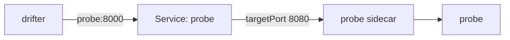

# An Exception For One Port

Sometimes a workload must stay strict for almost every caller, but one port has to stay open to an old caller. Think of a health checker or a metrics collector that runs outside the mesh and only ever calls one port. A workload `PeerAuthentication` (a policy that sets the mTLS mode for the pods its `selector` matches) is too wide for that. In this part you open exactly one port, and you learn the one detail that makes this field fail silently.

## The narrowest level of all

A workload policy can carry a map called `portLevelMtls`. It sets a mode for single ports, and it overrides the policy's own mode for those ports only. It is the narrowest level there is: a port beats a workload, a workload beats a namespace, a namespace beats the mesh.

### What it looks like

```yaml
spec:
  selector:
    matchLabels:
      app: probe
  mtls:
    mode: STRICT
  portLevelMtls:
    8080:
      mode: PERMISSIVE
```

The object looks like it contradicts itself, and it does so on purpose. The pod as a whole is `STRICT`, and port `8080` alone is `PERMISSIVE`.

### It needs a selector

`portLevelMtls` only works in a workload policy, so the policy must have a `selector`. A port number only makes sense for a known set of pods. If you leave the `selector` out, `kubectl apply` refuses the object straight away:

```text
The PeerAuthentication "noselector" is invalid: spec: Invalid value: portLevelMtls requires selector
```

## The container port, not the Service port

This is the detail that trips almost everyone. The probe has two port numbers, and only one of them works here.

### Two numbers for one port

The probe's Service listens on port `8000`, and sends each request on to port `8080` on the pod (`targetPort: 8080`). Callers use `8000`. The pod itself only ever sees `8080`.



The Service port is the port callers use. The policy is enforced by the sidecar's inbound listener, and that listener only knows the port the pod actually listens on, `8080`. So the key in `portLevelMtls` is always the **container port**.

## Open port 8080

Now try it in your playground. You make the namespace strict, open one port on the probe, and check that the rest of the namespace stays strict.

<!-- astrona:playground:renew -->

### Write the exception

The commands below need the `starfleet` namespace policy with `mode: STRICT` applied. Apply the file you saved for it:

```sh
kubectl apply -f peerauthentication-starfleet-strict.yaml
```

Save this as `peerauthentication-probe-port-level.yaml`:

```yaml
apiVersion: security.istio.io/v1
kind: PeerAuthentication
metadata:
  name: probe
  namespace: starfleet
spec:
  selector:
    matchLabels:
      app: probe
  mtls:
    mode: STRICT
  portLevelMtls:
    8080:
      mode: PERMISSIVE
```

Apply it:

```sh
kubectl apply -f peerauthentication-probe-port-level.yaml
```

### Then check the result

```sh
from_drifter $PROBE_URL
from_drifter $SCOUT_URL
from_shuttle $PROBE_URL
```

```text
drifter: 200  exit=0
drifter: 000  exit=56
shuttle: 200
```

The drifter reaches the probe again, through port `8080`. The scout still refuses it, because the namespace policy decides there. The shuttle keeps using mTLS, as before.

## The Service-port mistake

Now make the classic mistake on purpose, so you recognise it later. Use the port callers use, `8000`, as the key.

### Use the wrong key

Save this as `peerauthentication-probe-port-8000.yaml`:

```yaml
apiVersion: security.istio.io/v1
kind: PeerAuthentication
metadata:
  name: probe
  namespace: starfleet
spec:
  selector:
    matchLabels:
      app: probe
  mtls:
    mode: STRICT
  portLevelMtls:
    8000:
      mode: PERMISSIVE
```

It has the same name, `probe`, so it replaces the policy you applied before. Apply it:

```sh
kubectl apply -f peerauthentication-probe-port-8000.yaml
```

```text
peerauthentication.security.istio.io/probe configured
```

Then send the drifter's request again:

```sh
from_drifter $PROBE_URL
```

```text
drifter: 000  exit=56
```

The policy was accepted without a warning, and even `istioctl analyze -n starfleet` reports no issues. It does nothing useful. The pod does not listen on `8000`, so there is no listener chain for that port to change. Port `8080` falls back to the policy's own mode, `STRICT`, and the drifter is refused.

### Clean up

Remove both policies, so the namespace is back to the default:

```sh
kubectl delete -f peerauthentication-probe-port-8000.yaml -f peerauthentication-starfleet-strict.yaml
```

## Common pitfalls

> [!WARNING]
> - **Using the Service port as the key.** `portLevelMtls` takes the container port (`targetPort`). A Service port that the pod does not listen on is accepted and silently ignored.
> - **Leaving out the `selector`.** Port-level settings only work in a workload policy. Without a `selector`, `kubectl apply` fails with `portLevelMtls requires selector`.
> - **Opening a whole workload when one port would do.** A workload-level `PERMISSIVE` opens every port on the pod. `portLevelMtls` opens only the one the old caller needs.
> - **Checking only the port you opened.** Also send a request to another workload in the same namespace, to prove the rest is still strict.

> *`portLevelMtls` is the narrowest level there is, and it speaks the pod's language: the container port, never the Service port.*

## Your mission: Open One Port With portLevelMtls

You can now open a single container port on an otherwise strict workload. Now prove it in a graded lab: the whole mesh is `STRICT`, and the drifter must reach the probe through one open port while every other workload keeps refusing it.

The lab runs in its own cluster, so first pause your playground. Nothing in it is lost:

```sh
astrona stop ats-015-playground-010-02
```

Then start the lab:

```sh
astrona run --git git@github.com:astrona-io/ATS015.git -c sections/section-010/module-02/labs/lab-02
```

Read the task in [`question.md`](./labs/lab-02/question.md) and solve it on your own first. When you think you are done, send it for grading:

```sh
astrona submit -c sections/section-010/module-02/labs/lab-02
```

When the lab is done, remove it and start your playground again:

```sh
astrona destroy ats-015-lab-010-02-02
astrona start ats-015-playground-010-02
```
