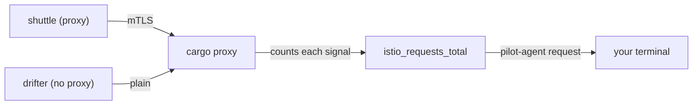

# Count The Plain Signals

Astronaut, the first step of a migration changes nothing at all. It answers one question with evidence: **is any ship still sending plain signals to this planet?** If you guess the answer, every later step rests on a guess.

This part shows where the answer lives, how to read it, how to find the caller behind it, and what the answer can never tell you.

## Where the count lives

Every communications officer keeps a tally of the signals it handles. This section explains what that tally records, and why you read it on the ship that receives the signals.

### A tally on the receiving ship

Every Istio sidecar proxy counts the requests it handles. The counter is called `istio_requests_total`. It carries a label that answers the migration's question directly:

```text
connection_security_policy="mutual_tls"   the signal arrived with the mTLS handshake
connection_security_policy="none"         the signal arrived plain
```

The label tells you how a signal **arrived**. Only the proxy that received the connection knows that. So you read the counter on the ship being called, here `cargo`, not on the caller. You are looking for callers you have forgotten about, and you cannot ask a ship you do not know exists.

### How you read it without a monitoring system

The counter lives inside the proxy, in memory. No monitoring system is needed to read it.



The shuttle's communications officer sends with the mTLS handshake. The drifter has no communications officer, so its signal arrives plain. The `cargo` proxy counts both, with the right label, and `pilot-agent` (the helper process inside the `istio-proxy` container) hands you the numbers when you ask.

## See it in your playground

Counters only count what has already happened. So first you send some signals from both callers, then you read the tally.

<!-- astrona:playground:renew -->

### Send signals from both ships

Send 10 signals from the shuttle (inside the fleet) and 10 from the drifter (outside it) to `cargo`:

```sh
for i in $(seq 1 10); do
  kubectl -n starfleet exec deploy/shuttle -- curl -s -o /dev/null -w 'shuttle %{http_code}\n' http://cargo:9080/details/0
done | sort | uniq -c
for i in $(seq 1 10); do
  kubectl -n outpost exec deploy/drifter -- curl -s -o /dev/null -w 'drifter %{http_code}\n' http://cargo.starfleet:9080/details/0
done | sort | uniq -c
```

```text
  10 shuttle 200
  10 drifter 200
```

Both callers get `200`. In `PERMISSIVE` mode, `cargo` accepts both kinds of signal, so nothing looks wrong yet.

### Read the tally

Define the `plain_signals` helper and run it. It asks the `cargo` proxy for its counters, keeps the lines `cargo` wrote as the receiver (`reporter="destination"`), and adds up the signals for each value of `connection_security_policy`:

```sh
plain_signals() {
  kubectl -n starfleet exec deploy/cargo-v1 -c istio-proxy -- \
    pilot-agent request GET stats/prometheus \
    | grep '^istio_requests_total' | grep 'reporter="destination"' \
    | sed -n 's/.*connection_security_policy="\([^"]*\)".* \([0-9]*\)$/\1 \2/p' \
    | awk '{sum[$1]+=$2} END {for (k in sum) print k, sum[k]}'
}
plain_signals
```

```text
2026/10/09 07:13:11 INFO GOMEMLIMIT is already set, skipping package=github.com/KimMachineGun/automemlimit/memlimit GOMEMLIMIT=1073741824
mutual_tls 10
none 10
```

The first line is an information message from `pilot-agent` itself. You can ignore it; it shows up every time you run the helper. The two lines can also come out in the other order.

The line that matters is `none`. It is there, so at least one caller would break the instant `starfleet` went `STRICT`. That is the whole check, and it is evidence, not belief.

Note the `-c istio-proxy`. The command runs in the sidecar container, not in the app, because the sidecar holds the counter.

## Find which caller it is

The `none` label says that plain signals arrived. It does not say who sent them. Two places name the caller: the counter's other labels, and the receiving ship's flight log.

### Read the source labels

The same counter carries labels about the sender. Keep only the plain lines and show where they came from:

```sh
kubectl -n starfleet exec deploy/cargo-v1 -c istio-proxy -- \
  pilot-agent request GET stats/prometheus | grep '^istio_requests_total' \
  | grep 'connection_security_policy="none"' \
  | grep -o 'source_workload="[^"]*"\|source_workload_namespace="[^"]*"' | sort -u
```

```text
2026/10/09 07:13:12 INFO GOMEMLIMIT is already set, skipping package=github.com/KimMachineGun/automemlimit/memlimit GOMEMLIMIT=1073741824
source_workload_namespace="unknown"
source_workload="unknown"
```

A ship with no communications officer cannot introduce itself, so the source is `unknown`. That is useful in itself. `unknown` together with `none` means the caller is outside the fleet. A real ship name together with `none` means a ship inside the fleet whose own communications officer was told to send plain signals, for example by a `DestinationRule`. That case comes back when you switch to `STRICT`.

### Read the flight log

The access log is the ship's black box flight log: one line per signal. On the receiving side, each line ends with the caller's address and the name the caller asked for in the handshake. Send one signal from each caller, wait a few seconds, then read the last two lines of `cargo`'s log, and the drifter's address:

```sh
kubectl -n starfleet exec deploy/shuttle -- curl -s -o /dev/null http://cargo:9080/details/0
kubectl -n outpost exec deploy/drifter -- curl -s -o /dev/null http://cargo.starfleet:9080/details/0
sleep 5
kubectl -n starfleet logs deploy/cargo-v1 -c istio-proxy --tail=2
kubectl -n outpost get pods -l app=drifter -o wide
```

```text
[2026-10-09T07:13:18.919Z] "GET /details/0 HTTP/1.1" 200 - via_upstream - "-" 0 178 1 0 "-" "curl/8.11.1" "d555de3b-8569-430f-ba26-c8299a1c54ed" "cargo:9080" "10.244.0.6:9080" inbound|9080|| 127.0.0.6:42643 10.244.0.6:9080 10.244.0.12:44606 outbound_.9080_._.cargo.starfleet.svc.cluster.local default
[2026-10-09T07:13:18.983Z] "GET /details/0 HTTP/1.1" 200 - via_upstream - "-" 0 178 0 0 "-" "curl/8.11.1" "744e0cf4-e3af-4986-a816-d8295da900b7" "cargo.starfleet:9080" "10.244.0.6:9080" inbound|9080|| 127.0.0.6:51771 10.244.0.6:9080 10.244.0.15:50492 - default
NAME                       READY   STATUS    RESTARTS   AGE   IP            NODE                                            NOMINATED NODE   READINESS GATES
drifter-57fdbc6c95-48s56   1/1     Running   0          90s   10.244.0.15   astro-ats-015-playground-010-03-control-plane   <none>           <none>
```

The proxy writes its log in small batches, not line by line. That is why the command waits five seconds: read the log too early, and the last two lines can be older signals.

The shuttle's line carries a handshake name (`outbound_.9080_._.cargo...`). The drifter's line has `-` there: no handshake, so no name. The caller's address in that line, `10.244.0.15`, is the drifter pod's address. Now you know exactly who to move.

## What a counter cannot prove

A counter is a record of the past. The migration decision is about the future. Three limits follow, and each one has broken real migrations.

- **No count is not proof.** An hourly job, a nightly backup or a monthly report does not show up in a counter you read one minute after your test. Measure for longer than your slowest regular caller runs. If you do not know that interval, a week is an honest default.
- **Counters only go up.** The `none` lines you saw stay in the total. After you move a caller, check that the count **stopped going up**, not that it is zero.
- **A restart wipes them.** The counter lives in the proxy's memory. If `cargo` restarts during your measuring window, the history is gone.

Think of the tally as the ship's log of signals received, not as a list of everyone who will ever call. In a cluster with Prometheus (a monitoring system that collects these counters over time), you read the same label there. It survives restarts and covers many ships at once. The playground has no Prometheus, so this module reads the proxy directly.

> *Only the receiving ship's `connection_security_policy` shows that plain signals still arrive, and a counter proves what happened, never what is about to happen.*

## Common pitfalls

> [!WARNING]
> - **Reading the counter on the caller.** The label describes how a signal arrived, so read it on the receiving ship's proxy.
> - **Forgetting `-c istio-proxy`.** The counter lives in the sidecar container. Without it, `kubectl exec` runs in the app container, which has no `pilot-agent`.
> - **Taking "no `none`" as proof.** A caller that did not run during your window leaves no trace.
> - **Expecting the count to reach zero.** Counters only go up while the pod lives. Compare two readings instead.
