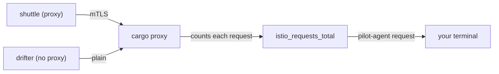

# Count Plain-Text Requests To A Workload

The first step of a migration changes nothing at all. It answers one question with evidence: **does any client still send plain-text requests to this namespace?** If you guess the answer, every later step rests on a guess.

This chapter shows where the answer lives and how to read it. Then it finds the client behind the answer, and it ends with what the answer can never tell you.

## A counter on the receiving proxy

Every sidecar proxy (Envoy) counts the requests it handles. A sidecar proxy is the proxy container Istio adds to each pod; all inbound and outbound traffic of the pod passes through it. The counter is called `istio_requests_total`, and it carries a label that answers the migration's question directly:

```text
connection_security_policy="mutual_tls"   the request arrived over mTLS
connection_security_policy="none"         the request arrived as plain text
```

The label tells you how a request **arrived**: with mTLS (mutual TLS, where both sides present a certificate) or as plain text. Only the proxy that received the connection knows that. So you read the counter on the workload being called, here `cargo`, not on the client. You are looking for clients you have forgotten about, and you cannot ask a client you do not know exists.

The counter lives inside the proxy, in memory, so you need no monitoring system to read it. The picture below shows how the numbers get from the `cargo` proxy to your terminal:



The `shuttle` pod's sidecar proxy sends its requests with mTLS. The `drifter` pod has no sidecar proxy, so its requests arrive as plain text. The `cargo` proxy counts both, with the right label, and `pilot-agent` (the helper process inside the `istio-proxy` container) returns the numbers when you ask.

## Read the counter in your playground

A counter only counts what has already happened. So you first send some requests from both clients, and then you read the counter.

<!-- astrona:playground:renew -->

Send 10 requests from `shuttle` (inside the mesh) and 10 from `drifter` (outside it) to `cargo`:

```sh
for i in $(seq 1 10); do
  kubectl -n starfleet exec deploy/shuttle -- curl -s -o /dev/null -w 'shuttle %{http_code}\n' http://cargo:9080/details/0
done | sort | uniq -c
for i in $(seq 1 10); do
  kubectl -n outpost exec deploy/drifter -- curl -s -o /dev/null -w 'drifter %{http_code}\n' http://cargo.starfleet:9080/details/0
done | sort | uniq -c
```

```text
  10 shuttle 200
  10 drifter 200
```

Both clients get `200`. In `PERMISSIVE` mode, the `cargo` proxy accepts both mTLS and plain text, so nothing looks wrong yet.

Now define the `plain_signals` helper and run it. It asks the `cargo` proxy for its counters and keeps the lines `cargo` wrote as the receiver (`reporter="destination"`). Then it adds up the requests for each value of `connection_security_policy`:

```sh
plain_signals() {
  kubectl -n starfleet exec deploy/cargo-v1 -c istio-proxy -- \
    pilot-agent request GET stats/prometheus \
    | grep '^istio_requests_total' | grep 'reporter="destination"' \
    | sed -n 's/.*connection_security_policy="\([^"]*\)".* \([0-9]*\)$/\1 \2/p' \
    | awk '{sum[$1]+=$2} END {for (k in sum) print k, sum[k]}'
}
plain_signals
```

```text
2026/10/09 07:13:11 INFO GOMEMLIMIT is already set, skipping package=github.com/KimMachineGun/automemlimit/memlimit GOMEMLIMIT=1073741824
mutual_tls 10
none 10
```

The first line is an information message from `pilot-agent` itself. You can ignore it; it shows up every time you run the helper. The two count lines can also come out in the other order.

The line that matters is `none`. It is there, so at least one client would break the instant `starfleet` went `STRICT`. That is the whole check, and it rests on evidence, not belief. Note the `-c istio-proxy` in the helper: the command runs in the sidecar container, not in the app, because the sidecar holds the counter.

## Find which client it is

The `none` label says that plain-text requests arrived, but it does not say who sent them. Two places name the client: the counter's other labels, and the receiving proxy's access log.

Start with the labels. The same counter carries labels about the sender, so keep only the plain-text lines and show where they came from:

```sh
kubectl -n starfleet exec deploy/cargo-v1 -c istio-proxy -- \
  pilot-agent request GET stats/prometheus | grep '^istio_requests_total' \
  | grep 'connection_security_policy="none"' \
  | grep -o 'source_workload="[^"]*"\|source_workload_namespace="[^"]*"' | sort -u
```

```text
2026/10/09 07:13:12 INFO GOMEMLIMIT is already set, skipping package=github.com/KimMachineGun/automemlimit/memlimit GOMEMLIMIT=1073741824
source_workload_namespace="unknown"
source_workload="unknown"
```

A client with no sidecar proxy sends no workload metadata, so the source is `unknown`. That is useful in itself. `unknown` together with `none` means the client is outside the mesh. A real workload name together with `none` means something else: a client inside the mesh whose own sidecar proxy was told to send plain text, for example by a `DestinationRule`. That case matters again when you switch to `STRICT`.

The labels tell you the client is outside the mesh, but not which pod it is. The access log fills that gap. It is the proxy's record of traffic, with one line per request. On the receiving side, each line ends with the client's address and the server name the client asked for in the TLS handshake. Send one request from each client and wait a few seconds. Then read the last two lines of `cargo`'s log, and the `drifter` pod's address:

```sh
kubectl -n starfleet exec deploy/shuttle -- curl -s -o /dev/null http://cargo:9080/details/0
kubectl -n outpost exec deploy/drifter -- curl -s -o /dev/null http://cargo.starfleet:9080/details/0
sleep 5
kubectl -n starfleet logs deploy/cargo-v1 -c istio-proxy --tail=2
kubectl -n outpost get pods -l app=drifter -o wide
```

```text
[2026-10-09T07:13:18.919Z] "GET /details/0 HTTP/1.1" 200 - via_upstream - "-" 0 178 1 0 "-" "curl/8.11.1" "d555de3b-8569-430f-ba26-c8299a1c54ed" "cargo:9080" "10.244.0.6:9080" inbound|9080|| 127.0.0.6:42643 10.244.0.6:9080 10.244.0.12:44606 outbound_.9080_._.cargo.starfleet.svc.cluster.local default
[2026-10-09T07:13:18.983Z] "GET /details/0 HTTP/1.1" 200 - via_upstream - "-" 0 178 0 0 "-" "curl/8.11.1" "744e0cf4-e3af-4986-a816-d8295da900b7" "cargo.starfleet:9080" "10.244.0.6:9080" inbound|9080|| 127.0.0.6:51771 10.244.0.6:9080 10.244.0.15:50492 - default
NAME                       READY   STATUS    RESTARTS   AGE   IP            NODE                                            NOMINATED NODE   READINESS GATES
drifter-57fdbc6c95-48s56   1/1     Running   0          90s   10.244.0.15   astro-ats-015-playground-010-03-control-plane   <none>           <none>
```

The command waits five seconds because the proxy writes its log in small batches, not line by line. Read the log too early, and the last two lines can be older requests.

The `shuttle` line carries a server name from the TLS handshake (`outbound_.9080_._.cargo...`). The `drifter` line has `-` there: no TLS handshake, so no server name. The client address in that line, `10.244.0.15`, is the `drifter` pod's address. Now you know exactly which client to move.

## What a counter cannot prove

A counter is a record of the past, but the migration decision is about the future. Three limits follow from that, and each one has broken real migrations.

First, no count is not proof. An hourly job, a nightly backup or a monthly report does not show up in a counter you read one minute after your test. Measure for longer than your slowest regular client runs. If you do not know that interval, a week is an honest default.

Second, counters only go up. The `none` lines you saw stay in the total, so after you move a client, check that the count **stopped going up**, not that it is zero. Third, a restart wipes them. The counter lives in the proxy's memory, so if `cargo` restarts during your measuring window, the history is gone.

> [!TIP]
> In a cluster with Prometheus (a monitoring system that collects these counters over time), read the same `connection_security_policy` label there. It survives restarts and covers many workloads at once. The playground has no Prometheus, so this module reads the proxy directly.

You can now tell, with evidence, whether plain-text requests still reach a workload, and which client sends them. In the playground, the answer is the `drifter` pod in `outpost`. You also know that the counter only describes the past. The open question is what to do before you change anything, so that a mistake can be undone in seconds.

## Common pitfalls

> [!WARNING]
> - **Reading the counter on the client.** The label describes how a request arrived, so read it on the receiving workload's proxy.
> - **Forgetting `-c istio-proxy`.** The counter lives in the sidecar container. Without it, `kubectl exec` runs in the app container, which has no `pilot-agent`.
> - **Taking "no `none`" as proof.** A client that did not run during your window leaves no trace.
> - **Expecting the count to reach zero.** Counters only go up while the pod lives. Compare two readings instead.
