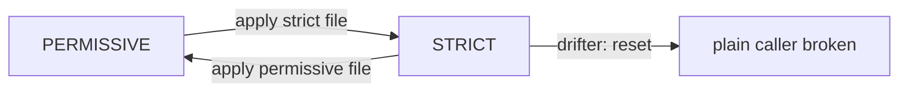

# Write Down Where You Stand

Astronaut, you now know that plain signals still reach `starfleet`. Before you change anything, you write down the mode the planet is already in. This step changes no behaviour at all, and it is still worth doing.

This part writes that file, runs a short `STRICT` drill to see exactly who breaks, and rolls back with the file you just wrote. It ends with the safe order for adding and removing these rules.

## The handshake rule for a planet

A `PeerAuthentication` is the handshake rule for the ships that **receive** signals. It tells each receiving communications officer which signals to let in. This section shows the rule for the whole planet, and why you write down a mode that is already in force.

### Three modes

The `mtls.mode` field takes one of three values:

```text
 PERMISSIVE   accept signals with the mTLS handshake AND plain signals (the default)
 STRICT       accept only signals with the mTLS handshake
 DISABLE      accept only plain signals
```

A policy named `default` in a namespace, with no `selector`, covers every ship on that planet. With no policy at all, the mode is `PERMISSIVE`. That is why the drifter's plain signals got through.

### Write it down

<!-- astrona:playground:renew -->

Save this as `peerauthentication-starfleet-permissive.yaml`:

```yaml
apiVersion: security.istio.io/v1
kind: PeerAuthentication
metadata:
  name: default
  namespace: starfleet
spec:
  mtls:
    mode: PERMISSIVE
```

Apply it:

```sh
kubectl apply -f peerauthentication-starfleet-permissive.yaml
```

Then check the result:

```sh
kubectl get peerauthentication -n starfleet
```

```text
NAME      MODE         AGE
default   PERMISSIVE   0s
```

Nothing changed for any ship. Both callers still get `200`, because the mode is the same one the planet had before.

### Why write down what is already true

There are two reasons, and the second one matters most on a bad night.

- **Anyone can now see the choice.** "No policy" and "deliberately `PERMISSIVE`" behave the same, but they mean different things. Writing it down turns an inherited default into a decision someone made.
- **It is your rollback.** The switch to `STRICT` is a one-line change to this same object. If it goes wrong, you restore service with `kubectl apply` of a file you already have. You do not write YAML under pressure while callers fail.

## A STRICT drill

A drill is a short, planned test: you switch on purpose, watch what breaks, and switch back. It shows you the failure before it can surprise you in a real migration.

### Switch the planet to STRICT

Save this as `peerauthentication-starfleet-strict.yaml`:

```yaml
apiVersion: security.istio.io/v1
kind: PeerAuthentication
metadata:
  name: default
  namespace: starfleet
spec:
  mtls:
    mode: STRICT
```

Apply it:

```sh
kubectl apply -f peerauthentication-starfleet-strict.yaml
```

### See who breaks

New orders can take up to about a minute to reach live traffic, because connections that are already open keep the old rule for a while. Wait a minute, then send one signal from each caller:

```sh
kubectl -n starfleet exec deploy/shuttle -- curl -s -o /dev/null -w 'shuttle: %{http_code}\n' http://cargo:9080/details/0
kubectl -n outpost exec deploy/drifter -- curl -s -o /dev/null -w 'drifter: %{http_code}\n' --max-time 5 http://cargo.starfleet:9080/details/0
```

```text
shuttle: 200
drifter: 000
command terminated with exit code 56
```

The shuttle still gets `200`: its communications officer does the handshake. The drifter gets `000` and curl exit code 56, which means "connection reset". The `cargo` proxy closed the connection as soon as it saw a plain signal. The drifter never got an HTTP answer at all, so it is not a `403` or a `503`.

If the drifter still gets `200`, the new orders have not reached its connection yet. Wait a little longer and send the signal again.

Note where this error shows up: in the drifter's output, the caller's side. In a real cluster, that is often another team's logs, and they may not know the mesh changed.

### Roll back

Apply the file you wrote first:

```sh
kubectl apply -f peerauthentication-starfleet-permissive.yaml
```

```text
peerauthentication.security.istio.io/default configured
```

Wait about ten seconds, then send a signal from the drifter again:

```sh
kubectl -n outpost exec deploy/drifter -- curl -s -o /dev/null -w 'drifter: %{http_code}\n' --max-time 5 http://cargo.starfleet:9080/details/0
```

```text
drifter: 200
```

The drifter works again within seconds. In our run, a signal sent right after the `apply` still got `000`, and the one ten seconds later got `200`. Neither the break nor the fix needed a restart. `istiod` (mission control) radios the new orders to every proxy in flight, so both directions take seconds, at most about a minute.



The drill in one picture: `STRICT` breaks the plain caller at once, and the `PERMISSIVE` file brings it back just as fast.

## The safe order

Security mistakes do not show up as slow pages. They lock callers out: the connection is cut, or the caller gets `401` or `403`. So add rules in an order that never blocks traffic you still need.

### Adding STRICT

1. **`PERMISSIVE` first.** Write it down, as you did above. It accepts both kinds of signal.
2. **Check every caller.** Every caller must have a sidecar and use mTLS. The `connection_security_policy` counter on the receiving ship tells you when no plain signals arrive any more. A caller that can never do the handshake can keep one port open with `portLevelMtls`, in a policy that has a `selector`; its key is the container port (`8080` for the probe), not the Service port (`8000`).
3. **Then `STRICT`.** Only now does the switch break nobody.

### Removing it again

To undo, go the other way round. **Switch `STRICT` back to `PERMISSIVE` before you remove a sidecar from any caller.** If you remove the caller's sidecar first, it sends plain signals to a `STRICT` planet and gets a connection reset until you switch back.

> *Write down the mode you are in before you change it: that file is the plan for both the switch and the way back.*

## Common pitfalls

> [!WARNING]
> - **Treating "no policy" as a decision.** It behaves like `PERMISSIVE`, but nobody chose it. Write the `default` policy down.
> - **Looking for a `403`.** A `STRICT` refusal is a connection reset (`000`, curl exit code 56), not an HTTP error.
> - **Writing the rollback file during the outage.** Have the `PERMISSIVE` file saved and applied before you switch.
> - **Undoing in the wrong order.** Switch back to `PERMISSIVE` first, then remove sidecars from callers.
