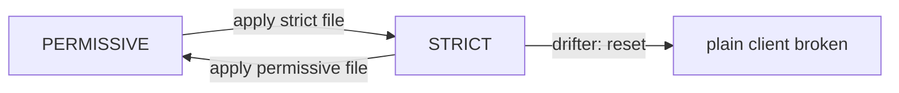

# Write Down The Current mTLS Mode

The `cargo` proxy counter shows that plain-text requests still reach `starfleet`. Before you change anything, you write down the mode the namespace is already in. This step changes no behaviour at all, and it is still worth doing.

This part writes that file, runs a short `STRICT` test to see exactly which client breaks, and rolls back with the file you just wrote. It ends with the safe order for adding and removing these policies.

## The mTLS policy for a namespace

A `PeerAuthentication` sets whether a workload accepts plain text, mTLS (mutual TLS, where both sides present a certificate) or both on **inbound** connections. The receiving sidecar proxy enforces it. This section shows the policy for the whole namespace, and why you write down a mode that is already in force.

### Three modes

The `mtls.mode` field takes one of three values:

```text
 PERMISSIVE   accept mTLS connections AND plain-text connections (the default)
 STRICT       accept only mTLS connections
 DISABLE      accept only plain-text connections
```

A policy named `default` in a namespace, with no `selector`, covers every workload in that namespace. With no policy at all, the mode is `PERMISSIVE`. That is why the plain-text requests from `drifter` got through.

### Write it down

<!-- astrona:playground:renew -->

Save this as `peerauthentication-starfleet-permissive.yaml`:

```yaml
apiVersion: security.istio.io/v1
kind: PeerAuthentication
metadata:
  name: default
  namespace: starfleet
spec:
  mtls:
    mode: PERMISSIVE
```

Apply it:

```sh
kubectl apply -f peerauthentication-starfleet-permissive.yaml
```

Then check the result:

```sh
kubectl get peerauthentication -n starfleet
```

```text
NAME      MODE         AGE
default   PERMISSIVE   0s
```

Nothing changed for any workload. Both clients still get `200`, because the mode is the same one the namespace had before.

### Why write down what is already true

There are two reasons, and the second one matters most during an outage.

- **Anyone can now see the choice.** "No policy" and "deliberately `PERMISSIVE`" behave the same, but they mean different things. Writing it down turns an inherited default into a decision someone made.
- **It is your rollback.** The switch to `STRICT` is a one-line change to this same object. If it goes wrong, you restore service with `kubectl apply` of a file you already have. You do not write YAML under pressure while clients fail.

## A short STRICT test

Here you switch to `STRICT` on purpose, watch what breaks, and switch back. The test shows you the failure before it can surprise you in a real migration.

### Switch the namespace to STRICT

Save this as `peerauthentication-starfleet-strict.yaml`:

```yaml
apiVersion: security.istio.io/v1
kind: PeerAuthentication
metadata:
  name: default
  namespace: starfleet
spec:
  mtls:
    mode: STRICT
```

Apply it:

```sh
kubectl apply -f peerauthentication-starfleet-strict.yaml
```

### See which client breaks

New configuration can take up to about a minute to reach live traffic, because connections that are already open keep the old policy for a while. Wait a minute, then send one request from each client:

```sh
kubectl -n starfleet exec deploy/shuttle -- curl -s -o /dev/null -w 'shuttle: %{http_code}\n' http://cargo:9080/details/0
kubectl -n outpost exec deploy/drifter -- curl -s -o /dev/null -w 'drifter: %{http_code}\n' --max-time 5 http://cargo.starfleet:9080/details/0
```

```text
shuttle: 200
drifter: 000
command terminated with exit code 56
```

`shuttle` still gets `200`: its sidecar proxy uses mTLS. `drifter` gets `000` and curl exit code 56, which means "connection reset". The `cargo` proxy closed the connection as soon as it saw plain text. `drifter` never got an HTTP response at all, so it is not a `403` or a `503`.

If `drifter` still gets `200`, the new configuration has not reached its connection yet. Wait a little longer and send the request again.

Note where this error shows up: in the output of `drifter`, the client side. In a real cluster, that is often another team's logs, and they may not know the mesh changed.

### Roll back

Apply the file you wrote first:

```sh
kubectl apply -f peerauthentication-starfleet-permissive.yaml
```

```text
peerauthentication.security.istio.io/default configured
```

Wait about ten seconds, then send a request from `drifter` again:

```sh
kubectl -n outpost exec deploy/drifter -- curl -s -o /dev/null -w 'drifter: %{http_code}\n' --max-time 5 http://cargo.starfleet:9080/details/0
```

```text
drifter: 200
```

`drifter` works again within seconds. In our run, a request sent right after the `apply` still got `000`, and the one ten seconds later got `200`. Neither the break nor the fix needed a restart. `istiod`, Istio's control plane, pushes the new configuration to every running proxy over xDS, so both directions take seconds, at most about a minute.



The test in one picture: `STRICT` breaks the plain-text client at once, and the `PERMISSIVE` file brings it back just as fast.

## The safe order

Security mistakes do not show up as slow pages. They lock clients out: the connection is cut, or the client gets `401` or `403`. So add policies in an order that never blocks traffic you still need.

### Adding STRICT

1. **`PERMISSIVE` first.** Write it down, as you did above. It accepts both mTLS and plain text.
2. **Check every client.** Every client must have a sidecar and use mTLS. The `connection_security_policy` counter on the receiving proxy tells you when no plain-text requests arrive any more. A client that can never use mTLS can keep one port open with `portLevelMtls`, in a policy that has a `selector`; its key is the container port (`8080` for the probe), not the Service port (`8000`).
3. **Then `STRICT`.** Only now does the switch break nobody.

### Removing it again

To undo, go the other way round. **Switch `STRICT` back to `PERMISSIVE` before you remove a sidecar from any client.** If you remove the client's sidecar first, it sends plain text to a `STRICT` namespace and gets a connection reset until you switch back.

> *Write down the mode you are in before you change it: that file is the plan for both the switch and the way back.*

## Common pitfalls

> [!WARNING]
> - **Treating "no policy" as a decision.** It behaves like `PERMISSIVE`, but nobody chose it. Write the `default` policy down.
> - **Looking for a `403`.** A `STRICT` refusal is a connection reset (`000`, curl exit code 56), not an HTTP error.
> - **Writing the rollback file during the outage.** Have the `PERMISSIVE` file saved and applied before you switch.
> - **Undoing in the wrong order.** Switch back to `PERMISSIVE` first, then remove sidecars from clients.
