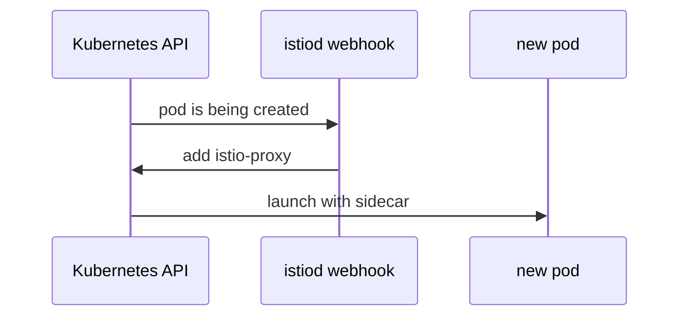

# Inject A Sidecar Into A Plain-Text Client

The `cargo` proxy counter shows plain-text requests, and the access log names the sender: the `drifter` pod in the `outpost` namespace. It cannot use mTLS (mutual TLS, where both sides present a certificate) because it has no sidecar proxy. This chapter adds one.

It is the step with the real work in it. In a real cluster, it is also the only step that disrupts anything, because pods have to be restarted. To see why, you first need to know when a pod gets its sidecar proxy.

## How a pod gets its sidecar proxy

Sidecar injection is how the `istio-proxy` container gets into a pod. It is done by a **mutating admission webhook**: a service that Kubernetes calls while it creates an object, and that may change the object before Kubernetes stores it. If the namespace carries the label `istio-injection=enabled`, the webhook adds the `istio-proxy` container to the pod spec before the pod starts.



The diagram shows the order of events. The Kubernetes API server asks the webhook, which runs inside `istiod`, about every new pod in a labelled namespace. The webhook answers with the changed pod spec, and only then does the API server store the pod so it can start.

The timing is what surprises almost everyone. The webhook runs **only when a pod is created**, and it has no way to reach a pod that is already running. A running pod's list of containers cannot change. So labelling a namespace changes nothing for the pods already running there; only the next pod created there gets a sidecar proxy.

That makes the **restart** the real migration step. `kubectl rollout restart` replaces the pods of a Deployment one by one, and the webhook injects the sidecar into each new pod as Kubernetes creates it.

## Move the drifter into the mesh

You can see both halves of that rule in the playground. First you label the `outpost` namespace and see that nothing changes, and then you restart `drifter`.

<!-- astrona:playground:renew -->

Switch injection on for `outpost`, then list its pods with their containers and init containers:

```sh
kubectl label namespace outpost istio-injection=enabled
kubectl -n outpost get pods -o custom-columns='POD:.metadata.name,CONTAINERS:.spec.containers[*].name,INIT:.spec.initContainers[*].name'
```

```text
namespace/outpost labeled
POD                        CONTAINERS   INIT
drifter-57f4b7dc54-24fm7   drifter      <none>
```

The pod has one container and no init containers. The label is there, but the `drifter` pod was created before it, so it still runs without a sidecar.

Now restart the Deployment, wait for it, and list the containers again:

```sh
kubectl -n outpost rollout restart deployment drifter
kubectl -n outpost rollout status deployment drifter
kubectl -n outpost get pods -o custom-columns='POD:.metadata.name,CONTAINERS:.spec.containers[*].name,INIT:.spec.initContainers[*].name'
```

```text
deployment.apps/drifter restarted
Waiting for deployment "drifter" rollout to finish: 1 old replicas are pending termination...
Waiting for deployment "drifter" rollout to finish: 1 old replicas are pending termination...
deployment "drifter" successfully rolled out
POD                        CONTAINERS   INIT
drifter-56479465c8-s7hcz   drifter      istio-init,istio-proxy
```

The new pod has a new name, and `istio-proxy` is now in it. Look where it sits: in the `INIT` column, not next to `drifter`. On this cluster, Istio 1.30 adds the proxy as a **native sidecar**: a special init container that starts before the app and keeps running beside it for the pod's whole life. `kubectl get pods` shows the `drifter` pod as `2/2` either way. The pod now has a sidecar proxy, so its requests to `cargo` use mTLS.

> [!TIP]
> If you list only `.spec.containers`, you see one container and may think the injection failed. Always check the init containers too, or simply the `READY` column.

Two more facts follow from the way injection works. A pod that no controller owns does not come back. A bare `Pod`, with no Deployment or StatefulSet behind it, has nothing to recreate it: `rollout restart` does not apply, and deleting it just removes it. Find those pods before the maintenance window, not during it.

The new pod also keeps the same identity. A workload's identity (its SPIFFE ID, the name in its certificate) comes from its namespace and service account, for example `spiffe://cluster.local/ns/outpost/sa/default` for `drifter`. The new pod gets a new certificate with the same identity, so policies written for it keep working.

## Measure again

The `drifter` pod has its sidecar, but you still need evidence that its requests now use mTLS. The counter still holds the old `none` requests, because counters only go up. So the question is not "is it zero?" but "did it stop going up?".

If `plain_signals` is not defined in this terminal, paste it first. Then read the counter, send 5 requests from `drifter`, and read the counter again:

```sh
plain_signals() {
  kubectl -n starfleet exec deploy/cargo-v1 -c istio-proxy -- \
    pilot-agent request GET stats/prometheus \
    | grep '^istio_requests_total' | grep 'reporter="destination"' \
    | sed -n 's/.*connection_security_policy="\([^"]*\)".* \([0-9]*\)$/\1 \2/p' \
    | awk '{sum[$1]+=$2} END {for (k in sum) print k, sum[k]}'
}
plain_signals
for i in $(seq 1 5); do
  kubectl -n outpost exec deploy/drifter -- curl -s -o /dev/null -w 'drifter %{http_code}\n' http://cargo.starfleet:9080/details/0
done | sort | uniq -c
plain_signals
```

```text
2026/10/09 07:16:25 INFO GOMEMLIMIT is already set, skipping package=github.com/KimMachineGun/automemlimit/memlimit GOMEMLIMIT=1073741824
mutual_tls 12
none 17
   5 drifter 200
2026/10/09 07:16:25 INFO GOMEMLIMIT is already set, skipping package=github.com/KimMachineGun/automemlimit/memlimit GOMEMLIMIT=1073741824
mutual_tls 17
none 17
```

Your numbers depend on how many requests you sent before, so look at the change between the two readings. The `none` number did not move. The `mutual_tls` number went up by 5, because the new requests from `drifter` arrive with mTLS. Only when nothing **new** arrives as `none` is the namespace ready for the switch.

`kubectl exec deploy/drifter` picks one pod of the Deployment. If you run it while the old pod is still shutting down, it can pick the old one, and the request goes out as plain text. So wait until `rollout status` reports success before you measure.

The last plain-text client is now in the mesh. A namespace label told the injection webhook what to do for the next pod, and the restart created that pod, so the restart, not the label, was the migration. The counter proves that no new plain-text requests arrive. What is left is the switch itself, and the one client setting that can still break a request after it.

## Common pitfalls

> [!WARNING]
> - **Expecting the label to work at once.** Injection happens when a pod is created. Nothing changes until the pods are restarted.
> - **Restarting a pod that no controller owns.** A deleted bare pod is gone. Check for a Deployment or StatefulSet first.
> - **Checking for zero.** The old `none` requests stay in the counter. Check that the number stopped going up.
> - **Testing against the old pod.** During a rollout, `kubectl exec deploy/...` can still reach the pod without a sidecar. Wait for `rollout status`.
