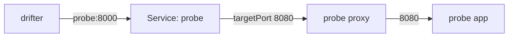

# Keep One Port Open

Astronaut, some callers will never learn the mTLS handshake. Think of an old monitoring tool outside the mesh, a health checker, or a load balancer with no certificate to show. You cannot bring them into the fleet, but you still want every other signal to use the handshake.

For those callers, a `PeerAuthentication` can keep **one port** open to plain signals while the rest of the ship accepts mTLS only. This part writes that exception, and shows the one detail almost everyone gets wrong: which port number to use.

## A port exception

A port exception is a narrow rule inside a narrow rule. This section shows the object, and which of its numbers the proxy actually uses.

### The object

A port exception lives in the `portLevelMtls` map of a `PeerAuthentication`:

```yaml
spec:
  selector:
    matchLabels:
      app: probe
  mtls:
    mode: STRICT          # the whole ship: mTLS only
  portLevelMtls:
    8080:
      mode: PERMISSIVE    # except this one port
```

The object seems to contradict itself, on purpose. The rule is simple: **the narrowest setting wins.** A port is narrower than a ship, a ship (`selector`) is narrower than a planet (namespace), and a planet is narrower than the whole mesh.

`portLevelMtls` only works together with a `selector`. A port number only means something on a known set of ships, so a namespace-wide policy cannot carry port exceptions.

### Which port: the container port

The policy is built into the ship's **inbound listener**: the place where its communications officer catches incoming signals. The proxy catches signals on the ports the container really listens on. It knows nothing about the Service port in front of it.



The drifter calls the beacon `probe` on port `8000`. The Service passes the signal on to port `8080` in the pod, and that is where the probe's proxy catches it. So the key in `portLevelMtls` is `8080`, the **container port**. A key of `8000` names a port the proxy never sees.

A wrong key is not an error. The object is accepted and stored, and it does nothing. The ship stays `STRICT` on every port, and the caller you wanted to protect breaks, often hours later and with nothing that points at the cause.

## See it in your playground

Here you write the exception the wrong way first, so you recognise the failure, and then the right way. The `starfleet` default policy can stay on `PERMISSIVE`: the probe's own policy is narrower, so it wins for the probe.

<!-- astrona:playground:renew -->

### The wrong port

Save this as `peerauthentication-probe-service-port.yaml`:

```yaml
apiVersion: security.istio.io/v1
kind: PeerAuthentication
metadata:
  name: probe
  namespace: starfleet
spec:
  selector:
    matchLabels:
      app: probe
  mtls:
    mode: STRICT
  portLevelMtls:
    8000:
      mode: PERMISSIVE
```

Apply it:

```sh
kubectl apply -f peerauthentication-probe-service-port.yaml
```

Then check the result. Send a plain signal from the drifter to the probe:

```sh
kubectl -n outpost exec deploy/drifter -- curl -s -o /dev/null -w 'drifter: %{http_code}\n' --max-time 5 http://probe.starfleet:8000/get
```

<!-- OUTPUT PENDING: drifter: 000, then "command terminated with exit code 56" (connection reset) -->

The object was accepted without a word, and the drifter still gets a connection reset. The exception for port `8000` attached to nothing, so the probe is `STRICT` on its real port.

### The right port

Save this as `peerauthentication-probe.yaml`. It has the same name, so it replaces the wrong one:

```yaml
apiVersion: security.istio.io/v1
kind: PeerAuthentication
metadata:
  name: probe
  namespace: starfleet
spec:
  selector:
    matchLabels:
      app: probe
  mtls:
    mode: STRICT
  portLevelMtls:
    8080:
      mode: PERMISSIVE
```

Apply it:

```sh
kubectl apply -f peerauthentication-probe.yaml
```

Then check the result:

```sh
kubectl -n outpost exec deploy/drifter -- curl -s -o /dev/null -w 'drifter: %{http_code}\n' --max-time 5 http://probe.starfleet:8000/get
```

<!-- OUTPUT PENDING: drifter: 200 -->

Now the drifter gets `200`. The probe's proxy found port `8080` in its inbound listener and let plain signals in there.

The probe has only one port, so here the exception opens the whole probe. On a ship with an app port and a separate metrics port, only the metrics port would stay open, and the app port would stay `STRICT`.

### Remove the exception

An exception is meant to be temporary. Remove it before you go on, so it does not outlive the reason for it:

```sh
kubectl delete -f peerauthentication-probe.yaml
```

<!-- OUTPUT PENDING: peerauthentication.security.istio.io "probe" deleted -->

> *`portLevelMtls` takes the port the container listens on, because that is the only port the proxy ever sees.*

## Common pitfalls

> [!WARNING]
> - **Using the Service port.** `portLevelMtls` takes the container port (the Service's `targetPort`). A wrong port is accepted and silently does nothing.
> - **Leaving out the `selector`.** Port exceptions only work on a policy that selects workloads.
> - **Trusting the object instead of a signal.** `kubectl apply` succeeds for a useless exception too. Send a real plain signal to the port and check you get `200`.
> - **Leaving an exception in place.** A narrow `PERMISSIVE` written for one old caller outlives the caller unless someone removes it.

## Your mission: Keep One Port Open For The Drifter

You can now write a port exception and spot one that points at the wrong port. Now prove it in a graded mission: a `STRICT` planet has a port exception that does nothing, and you have to make it work without opening anything else.

The mission runs in its own training solar system, so first pause your playground. Nothing in it is lost:

```sh
astrona stop ats-015-playground-010-03
```

Then start the mission:

```sh
astrona run --git git@github.com:astrona-io/ATS015.git -c sections/section-010/module-03/labs/lab-02
```

The task is on the next page. Solve it on your own first. When you think you are done, send it for grading:

```sh
astrona submit -c sections/section-010/module-03/labs/lab-02
```

When the mission is done, remove it and wake your playground up again:

```sh
astrona destroy ats-015-lab-010-03-02
astrona start ats-015-playground-010-03
```
