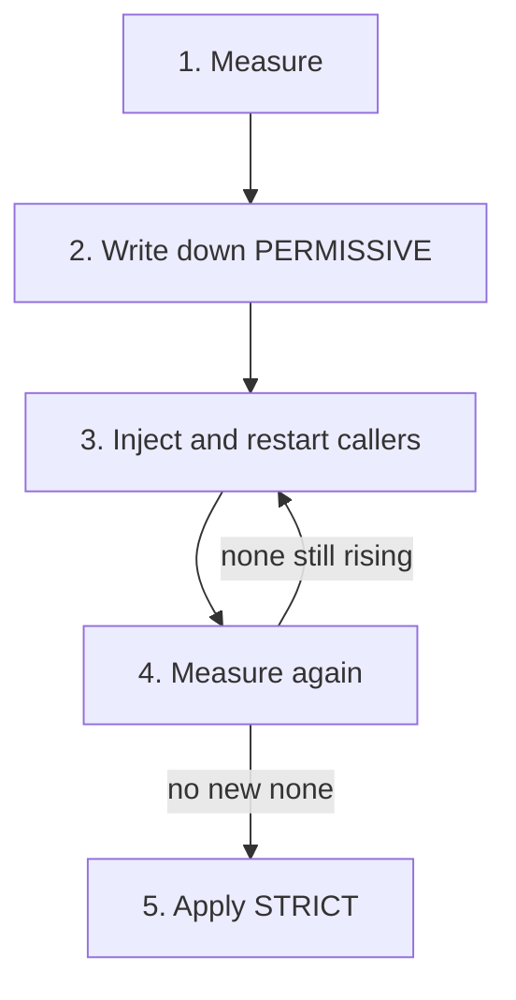

# Switch The Namespace To STRICT mTLS

The counting is done, the mode is written down, and the `drifter` pod has its sidecar proxy. This part is the ten-second change that all the work before was for. It also shows the one setting that can still break a client after the switch, and the rollback that makes the risk acceptable.

The commands below expect the `drifter` pod in `outpost` to run with a sidecar (`2/2`). If it still shows `1/1`, label `outpost` with `istio-injection=enabled` and restart `drifter` first.

## The switch

The switch is one `PeerAuthentication` for the whole namespace. A `PeerAuthentication` sets whether a workload accepts plain text, mTLS (mutual TLS, where both sides present a certificate) or both on inbound connections. This section applies it, proves it with real requests, and then proves it again on the proxy itself.

### Apply STRICT

<!-- astrona:playground:renew -->

Save this as `peerauthentication-starfleet-strict.yaml`:

```yaml
apiVersion: security.istio.io/v1
kind: PeerAuthentication
metadata:
  name: default
  namespace: starfleet
spec:
  mtls:
    mode: STRICT
```

Apply it:

```sh
kubectl apply -f peerauthentication-starfleet-strict.yaml
```

Then check the result. Wait about a minute, so the new configuration reaches every open connection, then send one request from each client:

```sh
kubectl -n starfleet exec deploy/shuttle -- curl -s -o /dev/null -w 'shuttle: %{http_code}\n' http://cargo:9080/details/0
kubectl -n outpost exec deploy/drifter -- curl -s -o /dev/null -w 'drifter: %{http_code}\n' --max-time 5 http://cargo.starfleet:9080/details/0
```

```text
shuttle: 200
drifter: 200
```

Both get `200`, because both now use mTLS. That is the whole point of moving the clients **before** the switch. Without the new sidecar in the `drifter` pod, the second line would print `000`, and curl would exit with code 56 (connection reset).

Note what this change is not: not a restart, not a redeploy. `istiod`, Istio's control plane, pushes the new configuration to every running proxy over xDS within seconds, and open connections pick it up within about a minute. The break and the fix are equally fast, which is what makes a rollback real.

### Proof on the proxy

Two successful requests prove that these two clients work. They do not prove which policy the `cargo` proxy is following. `istioctl x describe pod` asks `istiod` which configuration applies to one pod:

```sh
CARGO_POD=$(kubectl -n starfleet get pod -l app=cargo -o jsonpath='{.items[0].metadata.name}')
istioctl x describe pod "$CARGO_POD" -n starfleet
```

```text
Pod: cargo-v1-6f787f8bd5-9nqwb
   Pod Revision: default
   Pod Ports: 9080 (cargo)
--------------------
Service: cargo
   Port: http 9080/HTTP targets pod port 9080
--------------------
Effective PeerAuthentication:
   Workload mTLS mode: STRICT
Applied PeerAuthentication:
   default.starfleet
Skipping Gateway information (no ingress gateway pods)
```

The effective mode is `STRICT`, and it comes from the `default` policy in the `starfleet` namespace. Check it every time: two successful requests look the same whether `STRICT` is in force or not.

## The client side can still break you

`PeerAuthentication` sets what a **receiving** proxy accepts. What a **sending** proxy does is set on the client side. Inside the mesh, Istio picks mTLS for you ("auto mTLS"), so you rarely write it. A `DestinationRule` can change that, and that is the trap.

### Tell shuttle to send plain text

A `DestinationRule` sets the traffic policy that client proxies use for one Service host, for example load balancing and TLS. Its `tls.mode` tells every client proxy how to connect to that host: `ISTIO_MUTUAL` means Istio's mTLS, `DISABLE` means plain text.

Save this as `destinationrule-cargo-tls-disable.yaml`:

```yaml
apiVersion: networking.istio.io/v1
kind: DestinationRule
metadata:
  name: cargo
  namespace: starfleet
spec:
  host: cargo
  trafficPolicy:
    tls:
      mode: DISABLE
```

Apply it:

```sh
kubectl apply -f destinationrule-cargo-tls-disable.yaml
```

Then check the result. Wait about thirty seconds, send a request from `shuttle`, and read the access log of the `shuttle` proxy a few seconds later:

```sh
kubectl -n starfleet exec deploy/shuttle -- curl -s -o /dev/null -w 'shuttle: %{http_code}\n' http://cargo:9080/details/0
sleep 5
kubectl -n starfleet logs deploy/shuttle -c istio-proxy --tail=1
```

```text
shuttle: 503
[2026-10-09T07:18:09.595Z] "GET /details/0 HTTP/1.1" 503 UC upstream_reset_before_response_started{connection_termination} - "-" 0 95 3 - "-" "curl/8.11.1" "b8c468d6-f989-467f-b438-aca9773b3215" "cargo:9080" "10.244.0.6:9080" outbound|9080||cargo.starfleet.svc.cluster.local 10.244.0.12:49614 10.96.253.89:9080 10.244.0.12:57296 - default
```

Both workloads are in the mesh, both pods are healthy, and both have valid certificates. Still `shuttle` gets `503`. Its own sidecar proxy sent the request as plain text, as the `DestinationRule` told it to, and the `cargo` proxy (now `STRICT`) closed the connection. The response flag **`UC`** in the `shuttle` access log means "upstream connection terminated".

This looks different from the `drifter` failure. A client with no sidecar sees a bare connection reset. A client with a sidecar gets a `503` from its own proxy.

Measuring before the switch catches this case too. While the namespace is still `PERMISSIVE`, these plain-text requests get through, and the `cargo` counter shows them as `none` with a **named** source (`source_workload="shuttle"`), not `unknown`. After the switch, they never reach the `cargo` app, so they do not show up in its counter at all.

### Remove the trap

Delete the `DestinationRule`. The `shuttle` proxy goes back to auto mTLS:

```sh
kubectl delete -f destinationrule-cargo-tls-disable.yaml
```

```text
destinationrule.networking.istio.io "cargo" deleted from starfleet namespace
```

Wait about ten seconds, then send a request from `shuttle` again:

```sh
kubectl -n starfleet exec deploy/shuttle -- curl -s -o /dev/null -w 'shuttle: %{http_code}\n' http://cargo:9080/details/0
```

```text
shuttle: 200
```

In our run, a request sent right after the delete still got `503`. The one ten seconds later got `200`.

When a switch to `STRICT` breaks exactly one client while the others work, look first for a `DestinationRule` with `tls.mode: DISABLE` on that client's route.

### Two errors and what they mean

| What the client sees | Usual cause |
| --- | --- |
| Connection reset: `000`, curl exit code 56 | The server is `STRICT`, and the client has no sidecar |
| `503` with the flag `UC` in the client's access log | The server is `STRICT`, and a client `DestinationRule` has `tls.mode: DISABLE` |

## The rollback plan

The rollback is to apply the `PERMISSIVE` version of the same `default` policy. It restores service in seconds, for the same reason the switch breaks things in seconds. Two habits make it a real plan:

- **Have the file, not the intention.** Keep `peerauthentication-starfleet-permissive.yaml` saved, next to the `STRICT` file, before you switch.
- **Decide the trigger in advance.** "Connection resets in any client's logs" is a rollback trigger. "It feels wrong" is not. A trigger written down beforehand stops a twenty-minute debate during an outage.

To undo the whole migration later, go in the reverse order: switch `STRICT` back to `PERMISSIVE` first, and only then remove sidecars from clients.

## The procedure, compressed



The five steps, with the loop that matters: you only move on to `STRICT` when no new plain-text requests arrive.

1. **Measure.** `connection_security_policy` on the receiving proxy, over a window longer than your slowest regular client.
2. **Write down.** The current `PERMISSIVE` mode, as a file. It is also your rollback.
3. **Inject.** Label the namespace, then restart. The restart is the disruptive step.
4. **Measure again.** No **new** `none` requests.
5. **Switch.** Apply `STRICT`, test real requests, check the proxy, and keep the rollback file at hand.

Steps 1 and 4 are the ones people skip under time pressure, and they are the only ones that separate this from guessing.

> *`istiod` pushes the switch as new configuration, so it breaks in seconds and recovers in seconds. A rollback trigger written down in advance is worth more than confidence.*

## Common pitfalls

> [!WARNING]
> - **Switching without measuring.** The failures land in the clients' logs as connection resets, often in a team that does not know the mesh changed.
> - **Forgetting clients that are not apps.** Monitoring tools, health checkers, backup jobs, and anything in a namespace that was never added to the mesh.
> - **Leaving a client `DestinationRule` with `tls.mode: DISABLE`.** The server requires mTLS, the client proxy sends plain text, and every request fails with `503 UC` even though both workloads have sidecars.
> - **Trusting traffic alone.** Two successful requests do not show which policy applies. Check the pod with `istioctl x describe pod`.

## Your mission: Migrate A Namespace To STRICT mTLS

You can now measure, move a client into the mesh and switch a namespace to `STRICT` without breaking anyone. The graded lab asks you to prove it: a namespace with one client still outside the mesh must end up `STRICT`, with every client still working.

This lab uses its own small app: a `notification-service` in namespace `migrate-demo`, a `tester` client, and an `outside-client` in namespace `outside` that still sends plain-text requests.

The lab runs in its own cluster, so first pause your playground. Nothing in it is lost:

```sh
astrona stop ats-015-playground-010-03
```

Then start the lab:

```sh
astrona run --git git@github.com:astrona-io/ATS015.git -c sections/section-010/module-03/labs/lab-01
```

Read the task in [`question.md`](./labs/lab-01/question.md) and solve it on your own first. When you think you are done, send it for grading:

```sh
astrona submit -c sections/section-010/module-03/labs/lab-01
```

When the lab is done, remove it and start your playground again:

```sh
astrona destroy ats-015-lab-010-03
astrona start ats-015-playground-010-03
```
