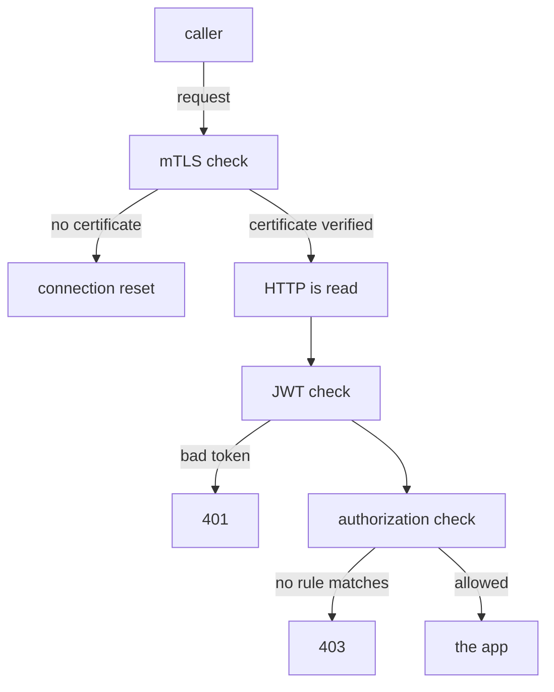

# Where Authorization Is Enforced

Before you write a single rule, you need to know where the check runs and who sets it up. Almost every confusing thing about `AuthorizationPolicy` follows from one fact. The check runs in the sidecar proxy of the pod that **receives** the request, and it runs only after the mTLS handshake has worked.

A sidecar proxy (Envoy) is a proxy container that Istio adds to each pod; all inbound and outbound traffic of the pod passes through it. This chapter follows a request through that proxy. It shows that a workload with no policy lets every request in, and it tells you where to look when a request is denied.

## The path a request takes

A request that arrives at a workload passes several checks, always in the same order. Each check belongs to a different Istio object. Once you know the order, you know which object to blame when something fails. Here is what happens inside the receiving pod's proxy:



The diagram shows four stages in the receiving proxy. The mTLS check is `PeerAuthentication`, the JWT check is `RequestAuthentication`, and the authorization check is `AuthorizationPolicy`. A request stopped at an early stage never reaches a later one. For requests from outside the cluster, the ingress gateway's own proxy runs the same checks at the edge of the mesh.

That order has three results, and the exam tests all three. First, the authorization check only sees requests that mTLS already accepted. A `STRICT` rejection happens at the first stage, before any HTTP request exists, so the proxy reads no rule at all. A cut connection and a `403` therefore point at different objects.

Second, the caller's identity comes from mTLS. A `principals` rule compares the identity in the caller's certificate, and with no mTLS there is no certificate to compare. Third, token facts come from the JWT check. A JWT (JSON Web Token) is a signed token that carries facts about the end user, and rules on a JWT need a `RequestAuthentication` to run first.

## Who configures the check

You never configure the check inside the proxy by hand. The control plane, `istiod`, does it for you. The way it does this explains how fast a change takes effect, and why a policy can exist without doing anything.

`istiod` reads every `AuthorizationPolicy` and works out which pods each one selects. It then turns the matching rules into configuration for those pods' proxies. Inside Envoy, the check is a filter called **RBAC**, short for role-based access control.

So the `selector` decides which pods get the policy. A policy whose selector matches no pod is still a valid object, and `kubectl get` shows it. But `istiod` never sends it to any proxy.

The decision is also local. The proxy does not ask `istiod` about each request. It checks the request against the configuration it already holds, which is why a new policy works within seconds and adds no measurable time per request.

One limit comes with this design. HTTP fields like `methods` and `paths` only work on ports that the proxy reads as HTTP. On a plain TCP port, the proxy can only check connection facts such as identity, namespace, address and port.

## No policy means every request gets in

If no `AuthorizationPolicy` selects a workload, its proxy has no RBAC rules. Every request that passes mTLS goes straight to the app. That is not a hole in the mesh: Istio stays out of the way until you ask it to act. It is the same choice as `PERMISSIVE` being the default for mTLS.

<!-- astrona:playground:renew -->

You can see this in your playground with the three helper functions from the landing page. First check that no policy exists yet, in any namespace:

```sh
kubectl get authorizationpolicy -A
```

```text
No resources found
```

Now send requests to the `probe` from both clients inside the mesh:

```sh
from_shuttle http://probe:8000/get
from_fortio http://probe:8000/get
```

```text
200 200 200 <- http://probe:8000/get
Code 200
```

Both get in. The `shuttle` and `fortio` pods have different identities, and mTLS verified both. But no RBAC filter checked either identity, because there is no policy to check it against.

The `drifter` tells a different story. It runs in the `outpost` namespace with no sidecar, so it has no certificate to present:

```sh
from_drifter http://probe.starfleet:8000/get
```

```text
drifter: 000
command terminated with exit code 56
```

`000` means no HTTP response came back at all. The `STRICT` `PeerAuthentication` cut the connection at the first stage. That is the mTLS check at work, not authorization, so a cut connection is never an `AuthorizationPolicy` problem.

## Where a denial is visible

Because the check runs at the receiving workload, the caller learns almost nothing when it is denied. It gets `403` and the body `RBAC: access denied`. It does not learn which policy denied it, or which rule it failed.

The evidence lives with the workload that denied the request, in three places. The **access log** of its `istio-proxy` container records the request, the `403` and the policy that decided. Its **proxy configuration** holds the RBAC rules it really received. And `kubectl get authorizationpolicy -A` lists every policy that could select it.

> [!TIP]
> Send the test request from the caller, then look for the reason on the receiver. Searching the caller's log for an authorization problem is the most common way to lose twenty minutes on the exam.

You now know where authorization happens: in the receiving pod's proxy, after mTLS and after the proxy reads the HTTP request. That is why a cut connection and a `403` are failures of different objects, and why the reason is always on the receiver. What you have not done yet is write a policy and watch a workload go from open to closed.

## Common pitfalls

> [!WARNING]
> - **Debugging authorization when the problem is mTLS.** A cut connection (`000`, curl exit code `56`) never reached the authorization check. Check for a status code before you blame a policy.
> - **Expecting a `principals` rule to work without mTLS.** The RBAC filter can only use the identity that mTLS verified.
> - **Assuming a policy applies because it exists.** It applies only to the pods its `selector` matches, checked by those pods' own proxies.
> - **Looking at the caller for the reason.** The caller only sees `403`. The access log of the receiving workload says why.
