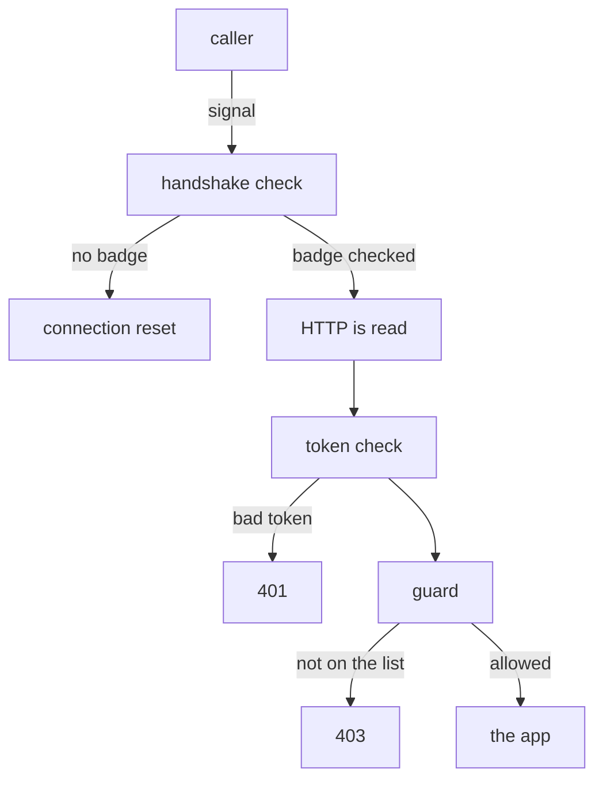

# The Guard At The Airlock

Astronaut, before you write a single rule, find out where the guard stands and who gives the guard orders. Almost every confusing thing about `AuthorizationPolicy` follows from one fact. The check runs in the communications officer (the sidecar proxy) of the ship that **receives** the signal, and it runs only after the secret handshake has worked.

This part shows that path, proves that a ship with no policy lets everyone in, and shows where to look when the guard says no.

## The path a signal takes

A signal that arrives at a ship passes several checks, always in the same order. Each check belongs to a different Istio object. Knowing the order tells you which object to blame when something fails.

### Four checks, in a fixed order

Here is what happens inside the receiving ship's proxy:



The diagram shows four stages. The handshake check is `PeerAuthentication`, the token check is `RequestAuthentication`, and the guard is `AuthorizationPolicy`. A signal stopped at an early stage never reaches a later one.

### What the order means for you

Three facts follow from that order, and the exam tests all three:

- **The guard only sees signals the handshake already accepted.** A `STRICT` rejection happens at the first stage. No rule is read, because there is no request yet. So a cut connection and a `403` point at different objects.
- **The caller's identity comes from the handshake.** A `principals` rule compares the name on the caller's ID badge (its certificate). With no handshake there is no badge, and the rule has nothing to compare.
- **Token facts come from the token check.** Rules on an end user's boarding pass (a JWT) need a `RequestAuthentication` to run first.

## Who gives the guard orders

You never configure the guard inside the proxy by hand. Mission control (`istiod`) does it for you, and the way it does it explains how fast a change works and why a policy can exist without doing anything.

### From policy to filter

`istiod` reads every `AuthorizationPolicy`, works out which pods each one selects, and turns the matching rules into orders for those pods' proxies. Inside Envoy (the program in the sidecar), the guard is a filter called **RBAC**, short for role-based access control. Think of it as the printed list the guard holds.

Two facts follow:

- **The `selector` decides which ships get the list.** A policy whose selector matches no pod is a valid object, and `kubectl get` shows it. But no proxy ever receives it.
- **The decision is local.** The proxy does not ask `istiod` for each signal. It checks the signal against the list it already holds. That is why a new policy works within seconds and costs no measurable time per signal.

HTTP fields like `methods` and `paths` only work on ports the proxy reads as HTTP. On a plain TCP port, only connection facts such as identity, namespace, address and port can be checked.

## No policy means everyone gets in

If no `AuthorizationPolicy` selects a ship, the guard has no list. Every signal that passes the handshake goes straight to the app. That is not a hole in the mesh: Istio stays out of the way until you ask. It is the same choice as `PERMISSIVE` being the default for mTLS.

### See it in your playground

<!-- astrona:playground:renew -->

The commands below need the three helpers from the module's landing page. First check that no policy exists yet, anywhere:

```sh
kubectl get authorizationpolicy -A
```

```text
No resources found
```

Now send signals to the probe from both clients inside the mesh:

```sh
from_shuttle http://probe:8000/get
from_fortio http://probe:8000/get
```

```text
200 200 200 <- http://probe:8000/get
Code 200
```

Both get in. The shuttle and fortio carry different ID badges, and the handshake checked both. But no guard read either badge, because there is no list to read it against.

### A signal the guard never sees

Now try the drifter. It has no communications officer and no ID badge:

```sh
from_drifter http://probe.starfleet:8000/get
```

```text
drifter: 000
command terminated with exit code 56
```

`000` means no HTTP answer came back at all. The `STRICT` `PeerAuthentication` cut the connection at the first stage. That is the handshake check at work, not the guard. Keep this picture in mind: a cut connection is never an `AuthorizationPolicy` problem.

## Where a denial is visible

Because the guard stands at the receiving ship, the caller learns almost nothing when it is turned away. It gets `403` and the body `RBAC: access denied`. It does not learn which policy refused it, or which rule it failed.

The evidence lives with the ship that refused:

- its **flight log** (the access log of its `istio-proxy`), which records the signal, the `403` and the policy that decided;
- its **proxy's orders**, which hold the lists it really received;
- `kubectl get authorizationpolicy -A`, which shows every policy that could select it.

> [!TIP]
> Send the test signal from the caller, then look for the reason on the receiver. Searching the caller's log for an authorization problem is the most common way to lose twenty minutes on the exam.

## Common pitfalls

> [!WARNING]
> - **Debugging authorization when the problem is the handshake.** A cut connection (`000`, curl exit code `56`) never reached the guard. Check for a status code before you blame a policy.
> - **Expecting a `principals` rule to work without mTLS.** The guard can only use the badge that the handshake checked.
> - **Assuming a policy applies because it exists.** It applies only to the pods its `selector` matches, checked by those pods' own proxies.
> - **Looking at the caller for the reason.** The caller only sees `403`. The flight log of the receiving ship says why.

> *The guard stands at the receiving ship's airlock, after the handshake and after HTTP is read. That is why a cut connection and a `403` are different objects' failures, and why the reason is always on the receiver.*
