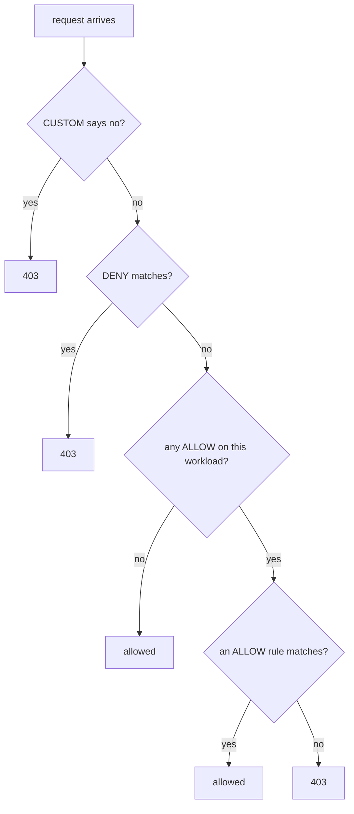

# Deny By Default With An Allow-Nothing Policy

Right now every workload with a valid certificate can call every other workload. Your first real step is to close the whole namespace, so that no request gets in until you allow it. One small object does it, and it teaches the most important sentence in this module.

## The allow-nothing policy

The first step in any lockdown is a policy that allows nothing. You apply it first and see what it does, then read why it works.

### Close the namespace

<!-- astrona:playground:renew -->

Save this as `authorizationpolicy-allow-nothing.yaml`:

```yaml
apiVersion: security.istio.io/v1
kind: AuthorizationPolicy
metadata:
  name: allow-nothing
  namespace: starfleet
spec: {}
```

Apply it:

```sh
kubectl apply -f authorizationpolicy-allow-nothing.yaml
```

Then check the result. Send requests to the `probe` and to the `bridge`, and read one full response:

```sh
from_shuttle http://probe:8000/get
from_shuttle http://bridge:9080/productpage
kubectl exec -n starfleet deploy/shuttle -- curl -s http://probe:8000/get
```

```text
403 403 403 <- http://probe:8000/get
403 403 403 <- http://bridge:9080/productpage
RBAC: access denied
```

Every request is denied. Look at the shape of this failure: a complete HTTP response with a short body that explains itself. That is the RBAC filter in the receiving proxy at work. It looks nothing like the cut connection (`000`) that the mTLS check gives a pod without a certificate.

If you see a mix like `200 403 403`, you tested too soon. On our test system the `probe` showed mixed results for about 30 seconds. Wait up to a minute and send the requests again.

### Read the access log of the receiver

The reason is written in the access log of the workload that denied the request, the `probe`. The proxy writes its log in small batches, so wait a few seconds after the request before you read it:

```sh
kubectl logs -n starfleet -l app=probe -c istio-proxy --tail=1
```

```text
[2026-10-09T07:35:21.074Z] "GET /get HTTP/1.1" 403 - rbac_access_denied_matched_policy[none] - "-" 0 19 0 - "-" "curl/8.11.1" "f0c4f8d8-31ca-41b5-95b0-7c8a44a0abce" "probe:8000" "-" inbound|8080|| - 10.244.0.13:8080 10.244.0.12:51248 outbound_.8000_._.probe.starfleet.svc.cluster.local default
[2026-10-09T07:35:21.361Z] "GET /get HTTP/1.1" 403 - rbac_access_denied_matched_policy[none] - "-" 0 19 0 - "-" "curl/8.11.1" "faea01ad-77af-46cd-a583-be6e4a1ca041" "probe:8000" "-" inbound|8080|| - 10.244.0.14:8080 10.244.0.12:41684 outbound_.8000_._.probe.starfleet.svc.cluster.local default
```

There are two `probe` pods (v1 and v2), so `--tail=1` prints the last line of each. `rbac_access_denied_matched_policy[none]` means: the RBAC filter denied the request, and **no** `ALLOW` rule matched it. The word `none` is the clue. No rule in any policy matched the request.

### Three empty fields

The policy has an empty `spec`, so it relies on three defaults at once. Reading them one by one is the whole trick:

| Field left out | Default | Effect here |
| --- | --- | --- |
| `action` | `ALLOW` | this is an allow policy |
| `selector` | every workload in the namespace | it covers every workload in `starfleet` |
| `rules` | an empty list | no request can match it |

Put together: an allow policy that covers every workload and allows nothing. Every workload in the namespace is now selected by an `ALLOW` policy. Every request must match one of its rules, and there are no rules.

## The rule worth remembering

The allow-nothing policy closed the namespace because of one rule. Learn it word for word, because exam questions are built around it.

### The first ALLOW closes the door

**Default-deny is created by the first `ALLOW` policy that selects a workload.**

Before that policy exists, the workload lets every request in, because its proxy has no RBAC rules. After it exists, the workload lets in only what a rule allows. And at the start, no rule allows anything.

So adding an `ALLOW` policy is what makes a workload strict. It is not a key that opens an otherwise closed door.

### Which policy wins

The proxy checks the policies in a fixed order for each request. There are four kinds of policy, set by `action`: `ALLOW`, `DENY`, `CUSTOM` (ask an external authorization service) and `AUDIT` (only write it in the log). The order looks like this:



The diagram shows the order of the checks, read from the top. This module writes only `ALLOW` policies, so the last two questions do the work. A workload with only `DENY` policies still lets in every request they do not name, because the "any ALLOW on this workload?" question still answers "no".

## `spec: {}` and `rules: [{}]` are opposites

Two policies that look almost the same do opposite things. Mixing them up is one of the most common mistakes on the exam, so see both work.

### An empty rule matches everything

Keep `allow-nothing` in place and add a second policy with one empty rule. Save this as `authorizationpolicy-allow-all.yaml`:

```yaml
apiVersion: security.istio.io/v1
kind: AuthorizationPolicy
metadata:
  name: allow-all
  namespace: starfleet
spec:
  action: ALLOW
  rules:
  - {}
```

Apply it:

```sh
kubectl apply -f authorizationpolicy-allow-all.yaml
```

Then check the result:

```sh
from_shuttle http://probe:8000/get
from_shuttle http://bridge:9080/productpage
```

```text
200 200 200 <- http://probe:8000/get
200 200 200 <- http://bridge:9080/productpage
```

Everything is open again, even with `allow-nothing` still applied. A rule with no conditions matches every request, and one matching rule in any `ALLOW` policy is enough.

### Close the namespace again

Remove the open policy, so only the allow-nothing policy is left:

```sh
kubectl delete -f authorizationpolicy-allow-all.yaml
```

Here are the shapes side by side:

| Spec | Effect |
| --- | --- |
| `spec: {}` | allow nothing: a policy with no rules |
| `rules: [{}]` | allow everything: one rule with no conditions |
| `action: DENY` with `rules: [{}]` | deny everything, even when `ALLOW` policies exist, because `DENY` is checked first |

## One namespace, not the whole mesh

`allow-nothing` closed one namespace, because a policy with no `selector` covers every workload **in its own namespace**. Where you put the policy decides how far it reaches.

### Where the policy lives decides its reach

The wider scope follows the same pattern as `PeerAuthentication`:

```text
   namespace = root namespace (istio-system)  +  no selector   ->  the whole mesh
   any other namespace                        +  no selector   ->  that namespace
   any namespace                              +  selector      ->  the matching pods
```

The same empty `spec` in `istio-system` closes the entire mesh, including any gateways. That is a quick way to take down a whole cluster, so check the namespace twice before you apply a policy with no selector.

One difference matters. For `PeerAuthentication`, the most specific policy wins and the others are ignored. For `AuthorizationPolicy`, every policy that selects a workload counts, and their rules add up.

## Why keep the allow-nothing policy afterwards

Once you add real rules, `allow-nothing` never decides any request on its own. A policy with no rules can never be the reason a request got in. So why not delete it?

Because it keeps the namespace closed for workloads nobody has written a rule for yet. Deploy a new workload in `starfleet` tomorrow, and `allow-nothing` covers it too: it starts closed, not open. Without the allow-nothing policy, that new workload would have no policy. It would accept any request from the mesh from the moment it starts.

That is why the usual pattern is **one allow-nothing policy for the namespace, plus narrow `ALLOW` policies per workload**. Apply the narrow policies first and the allow-nothing policy last, so traffic you still need is never cut off. When you remove things, go the other way round.

> [!TIP]
> After every `kubectl apply` of a policy, wait up to about a minute before you trust a test. A connection that was already open can keep the old configuration for a while, so the change reaches live traffic step by step. A mixed result like `200 200 403` is the sign.

## Common pitfalls

> [!WARNING]
> - **Expecting Istio to deny by default.** With no policy selecting a workload, every request that passes mTLS is allowed.
> - **Mixing up `spec: {}` and `rules: [{}]`.** The first allows nothing. The second allows everything.
> - **Applying the allow-nothing policy before the allow rules.** Everything breaks until the allow rules arrive. Apply the narrow policies first.
> - **Putting a policy with no selector in the wrong namespace.** In `istio-system` it covers the whole mesh; anywhere else, only that namespace.

> *An `ALLOW` policy with three empty fields covers every workload and allows nothing. The first `ALLOW` to select a workload is what makes that workload deny by default.*
