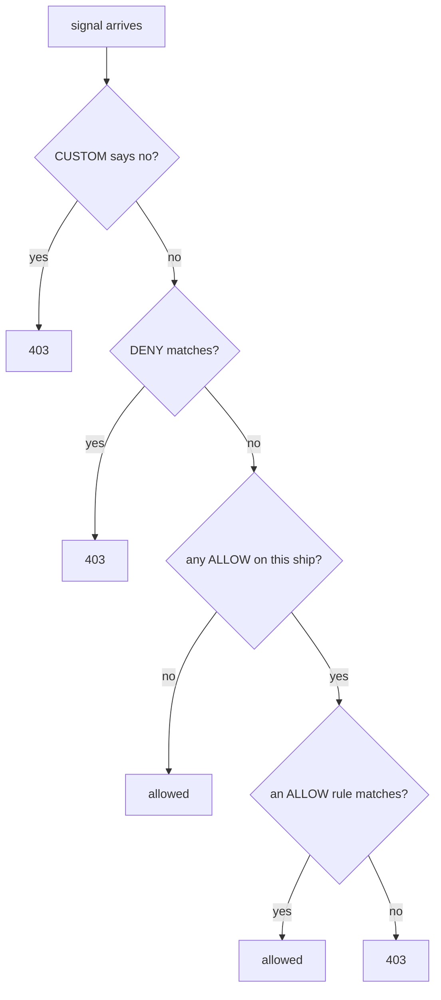

# Close The Airlock

Astronaut, right now every ship with a valid badge can call every other ship. Your first real order is to close the whole planet, so that nothing gets in until you say so. One small object does it, and it teaches the most important sentence in this module.

## The empty guest list

The first move in any lockdown is a policy that allows nothing. You apply it first and see what it does, then read why it works.

### Close the planet

<!-- astrona:playground:renew -->

Save this as `authorizationpolicy-allow-nothing.yaml`:

```yaml
apiVersion: security.istio.io/v1
kind: AuthorizationPolicy
metadata:
  name: allow-nothing
  namespace: starfleet
spec: {}
```

Apply it:

```sh
kubectl apply -f authorizationpolicy-allow-nothing.yaml
```

Then check the result. Send signals to the probe and to the bridge, and read one full answer:

```sh
from_shuttle http://probe:8000/get
from_shuttle http://bridge:9080/productpage
kubectl exec -n starfleet deploy/shuttle -- curl -s http://probe:8000/get
```

```text
403 403 403 <- http://probe:8000/get
403 403 403 <- http://bridge:9080/productpage
RBAC: access denied
```

Every signal is turned away. Look at the shape of this failure: a complete HTTP answer with a short body that explains itself. That is the guard at work, and it looks nothing like the cut connection (`000`) that the handshake check gives a ship without a badge.

If you see a mix like `200 403 403`, you tested too soon. On our test system the probe showed mixed results for about 30 seconds. Wait up to a minute and send the signals again.

### Read the flight log of the receiver

The reason is written in the flight log of the ship that refused the signal, the probe. The proxy writes its log in small batches, so wait a few seconds after the signal before you read it:

```sh
kubectl logs -n starfleet -l app=probe -c istio-proxy --tail=1
```

```text
[2026-10-09T07:35:21.074Z] "GET /get HTTP/1.1" 403 - rbac_access_denied_matched_policy[none] - "-" 0 19 0 - "-" "curl/8.11.1" "f0c4f8d8-31ca-41b5-95b0-7c8a44a0abce" "probe:8000" "-" inbound|8080|| - 10.244.0.13:8080 10.244.0.12:51248 outbound_.8000_._.probe.starfleet.svc.cluster.local default
[2026-10-09T07:35:21.361Z] "GET /get HTTP/1.1" 403 - rbac_access_denied_matched_policy[none] - "-" 0 19 0 - "-" "curl/8.11.1" "faea01ad-77af-46cd-a583-be6e4a1ca041" "probe:8000" "-" inbound|8080|| - 10.244.0.14:8080 10.244.0.12:41684 outbound_.8000_._.probe.starfleet.svc.cluster.local default
```

There are two probe pods (v1 and v2), so `--tail=1` prints the last line of each. `rbac_access_denied_matched_policy[none]` means: the guard refused the signal, and **no** `ALLOW` rule matched it. The word `none` is the clue. No rule on any list fitted the signal.

### Three empty fields

The policy has an empty `spec`, so it relies on three defaults at once. Reading them one by one is the whole trick:

| Field left out | Default | Effect here |
| --- | --- | --- |
| `action` | `ALLOW` | this is a guest list |
| `selector` | every workload in the namespace | it covers every ship on `starfleet` |
| `rules` | an empty list | no signal can match it |

Put together: a guest list that covers every ship and names nobody. Every ship on the planet now has a list, every signal must match a rule on it, and there are no rules.

## The rule worth remembering

The empty guest list closed the planet because of one rule. Learn it word for word, because exam questions are built around it.

### The first ALLOW closes the door

**Default-deny is created by the first `ALLOW` policy that selects a workload.**

Before that policy exists, the ship lets everyone in, because the guard has no list. After it exists, the ship lets in only what is written down. And "what is written down" starts at nothing.

So adding an `ALLOW` policy is what makes a ship strict. It is not a key that opens an otherwise closed door.

### Which list wins

The guard checks the lists in a fixed order for each signal. There are four kinds of policy, set by `action`: `ALLOW` (the guest list), `DENY` (the banned list), `CUSTOM` (ask an outside guard) and `AUDIT` (only write it in the log). The order looks like this:



The diagram shows the guard's checklist, read from the top. This module writes only `ALLOW` policies, so the last two questions do the work. A ship with only `DENY` policies still lets in everything they do not name, because the "any ALLOW on this ship?" question still answers "no".

## `spec: {}` and `rules: [{}]` are opposites

Two policies that look almost the same do opposite things. Mixing them up is one of the most common mistakes on the exam, so see both work.

### An empty rule matches everything

Keep `allow-nothing` in place and add a second policy with one empty rule. Save this as `authorizationpolicy-allow-all.yaml`:

```yaml
apiVersion: security.istio.io/v1
kind: AuthorizationPolicy
metadata:
  name: allow-all
  namespace: starfleet
spec:
  action: ALLOW
  rules:
  - {}
```

Apply it:

```sh
kubectl apply -f authorizationpolicy-allow-all.yaml
```

Then check the result:

```sh
from_shuttle http://probe:8000/get
from_shuttle http://bridge:9080/productpage
```

```text
200 200 200 <- http://probe:8000/get
200 200 200 <- http://bridge:9080/productpage
```

Everything is open again, even with `allow-nothing` still applied. A rule with no conditions fits every signal, and one matching rule on any list is enough.

### Put the planet back to closed

Remove the open policy, so only the empty guest list is left:

```sh
kubectl delete -f authorizationpolicy-allow-all.yaml
```

Here are the shapes side by side:

| Spec | Effect |
| --- | --- |
| `spec: {}` | allow nothing: a list with no rules |
| `rules: [{}]` | allow everything: one rule with no conditions |
| `action: DENY` with `rules: [{}]` | refuse everything, even when `ALLOW` lists exist, because the banned list is checked first |

## One planet, not the whole fleet

`allow-nothing` closed one planet, because a policy with no `selector` covers every workload **in its own namespace**. Where you put the policy decides how far it reaches.

### Where the policy lives decides its reach

The wider scope follows the same pattern as `PeerAuthentication`:

```text
   namespace = root namespace (istio-system)  +  no selector   ->  the whole mesh
   any other namespace                        +  no selector   ->  that namespace
   any namespace                              +  selector      ->  the matching pods
```

The same empty `spec` in `istio-system` closes the entire mesh, including any gateways. That is a quick way to take down a whole cluster, so check the namespace twice before you apply a policy with no selector.

One difference matters. For `PeerAuthentication`, the closest rule wins and the others are ignored. For `AuthorizationPolicy`, every policy that selects a ship counts, and their rules add up.

## Why keep the empty list afterwards

Once you add real rules, `allow-nothing` never decides any signal on its own. A list with no rules can never be the reason a signal got in. So why not delete it?

Because it keeps the planet closed for ships nobody has written a rule for yet. Launch a new ship on `starfleet` tomorrow, and `allow-nothing` covers it too: it starts closed, not open. Without the empty list, that new ship would have no policy and would accept any signal from the mesh, from the moment it starts.

That is why the usual pattern is **one empty list for the planet, plus narrow entries per ship**. Apply the narrow entries first and the empty list last, so traffic you still need is never cut off. When you remove things, go the other way round.

> [!TIP]
> After every `kubectl apply` of a policy, wait up to about a minute before you trust a test. A connection that was already open can keep the old list for a while, so the change reaches live traffic step by step. A mixed result like `200 200 403` is the sign.

## Common pitfalls

> [!WARNING]
> - **Expecting Istio to deny by default.** With no policy selecting a ship, every signal that passes the handshake is allowed.
> - **Mixing up `spec: {}` and `rules: [{}]`.** The first allows nothing. The second allows everything.
> - **Applying the empty list before the allow rules.** Everything breaks until the allow rules arrive. Apply the narrow entries first.
> - **Putting a policy with no selector in the wrong namespace.** In `istio-system` it covers the whole mesh; anywhere else, only that namespace.

> *An `ALLOW` policy with three empty fields covers every ship and names nobody. The first `ALLOW` to select a ship is what makes that ship deny by default.*
