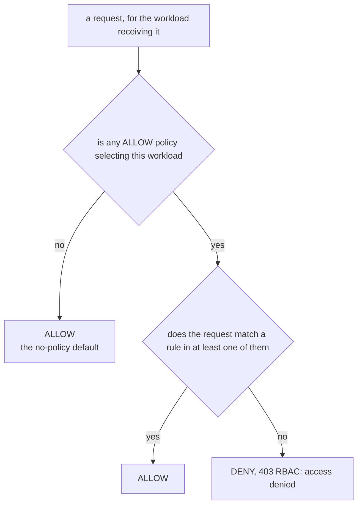

# Part 2 — Default-deny and the allow-nothing policy

> Prerequisite: [Part 1 — How a request gets authorized](./course-01-how-a-request-is-authorized.md). Next: [Part 3 — Rule anatomy: from, to, when](./course-03-rule-anatomy.md).

Part 1 ended with an open namespace: no policy, everything allowed. This part is about the single object that closes it, and about the sentence that object teaches — the one worth carrying into every authorization question you will be asked.

## Three empty fields

The first move in any lockdown is a policy that permits nothing:

```yaml
apiVersion: security.istio.io/v1
kind: AuthorizationPolicy
metadata:
  name: allow-nothing
  namespace: authz-demo
spec: {}
```

That empty `spec` is doing three things at once, each by omission, and reading them off one at a time is the whole trick:

| Omitted field | Default | Effect here |
| --- | --- | --- |
| `action` | `ALLOW` | this is an allow policy |
| `selector` | *(all workloads in the namespace)* | it selects everything in `authz-demo` |
| `rules` | *(empty list)* | no request can match it |

Put together: an `ALLOW` policy that selects every workload and matches no request.

Now run that through [Part 1](./course-01-how-a-request-is-authorized.md)'s mechanism. Every workload in the namespace is now selected by an `ALLOW` policy, so the RBAC filter at stage 4 has rules to enforce. A request must match one of them. There are none. The namespace is closed.

## The rule worth memorising

**Default-deny is created by the first `ALLOW` policy that selects a workload.**

Before that policy exists, the workload allows everything, because no rules were compiled into its filter. After it exists, the workload allows only what is written down — and "what is written down" starts at nothing.

State the same thing as a decision procedure, which is the form an exam question usually wants:



The default is allow, and it flips the moment *any* ALLOW policy selects the workload. That is the whole mechanism behind an allow-nothing policy: it selects everything and matches nothing.

Two readings of that diagram trip people up in opposite directions. Adding an `ALLOW` policy is what makes a workload restrictive — it is not "permission granting" on an otherwise-closed door. And a *`DENY`* policy does **not** have this effect: a workload selected only by `DENY` policies still allows everything those policies do not name, because the first branch is still "no `ALLOW` selects it". That asymmetry is [Module 2](../module-02/course.md)'s subject and it is the single most examinable thing in this section.

> [!TIP]
> **Try it — close the namespace and prove it**
>
> ```sh
> kubectl apply -f - <<'YAML'
> apiVersion: security.istio.io/v1
> kind: AuthorizationPolicy
> metadata:
>   name: allow-nothing
>   namespace: authz-demo
> spec: {}
> YAML
>
> kubectl -n authz-demo exec deploy/tester -- \
>   curl -s -w '\n' -X POST http://booking-service/book
> ```
>
> Expect something like:
>
> ```text
> RBAC: access denied
> ```
>
> Add `-o /dev/null -w '%{http_code}\n'` to see the status code — `403`. Note the shape of this failure: a complete HTTP response, with a body that explains itself. That is what a stage-4 denial looks like, and it is nothing like the `000` connection reset a `STRICT` transport rejection produces at stage 1. Leave the policy in place — [Part 3](./course-03-rule-anatomy.md) opens holes in it — or undo it with `kubectl -n authz-demo delete authorizationpolicy allow-nothing`.

## Namespace-wide, not mesh-wide

`allow-nothing` above closes one namespace, because a policy with no `selector` applies to every workload **in its own namespace**.

The wider scope works the same way it did for `PeerAuthentication`: a policy created in the **root namespace**, normally `istio-system`, with no selector applies mesh-wide. The same three empty fields in `istio-system` would close the entire mesh, including the ingress gateways, which is a memorable way to take down a cluster.

```text
   namespace == root namespace (istio-system)  +  no selector   →  whole mesh
   any other namespace                         +  no selector   →  that namespace
   any namespace                               +  selector      →  matching workloads
```

The scoping rule is identical to [Module 2 of section 010](../../section-010/module-02/course-02-scopes-and-precedence.md), which is worth noticing: Istio uses one scoping convention across its security objects, so learning it once covers `PeerAuthentication`, `AuthorizationPolicy` and `RequestAuthentication` alike.

What is *not* identical is how multiple policies combine. `PeerAuthentication` selects one winner — narrowest wins. `AuthorizationPolicy` does not: every policy selecting the workload contributes, and they combine. That difference is [Part 4](./course-04-identity-union-and-debugging.md)'s subject and the source of the "why did adding a policy not restrict anything?" question.

## Why keep the empty policy afterwards

Once real rules exist, `allow-nothing` contributes nothing to any decision — a rule list that matches nothing can never be the reason a request was allowed. So why not delete it?

Because it is what keeps the namespace closed for workloads nobody has written a rule for yet. Deploy a new service into `authz-demo` tomorrow, and `allow-nothing` selects it too: it starts denied rather than open. Without the baseline, the same new service arrives with no policy selecting it and is reachable by anything in the mesh, silently, from the moment its first pod is ready.

That is the whole reason the pattern is *baseline plus narrow exceptions* rather than *one policy per service*. The baseline is a standing default for things that do not exist yet.

> *An `ALLOW` policy with three empty fields selects everything and matches nothing — and the first `ALLOW` to select a workload is what makes that workload deny by default.*

## Common pitfalls

> [!WARNING]
> **Expecting Istio to deny by default.** With no policy selecting a workload, every request is allowed.
>
> **Writing `rules: []` and reading it as allow-everything.** An empty rule list matches nothing, so it denies everything not allowed elsewhere.
>
> **Applying an allow-nothing policy before the allow rules exist.** The order you apply them in is the order traffic breaks in.
>
> **Putting a selector-less policy in the wrong namespace.** In the root namespace it is mesh-wide; anywhere else it covers that namespace only.

## Reference

- [AuthorizationPolicy reference](https://istio.io/latest/docs/reference/config/security/authorization-policy/) — the defaults for `action`, `selector` and `rules`, stated field by field.
- [Authorization for HTTP traffic](https://istio.io/latest/docs/tasks/security/authorization/authz-http/) — Istio's own deny-all-then-allow walkthrough.
- [Global mesh options](https://istio.io/latest/docs/reference/config/istio.mesh.v1alpha1/) — `rootNamespace`, which decides where a mesh-wide policy has to live.
