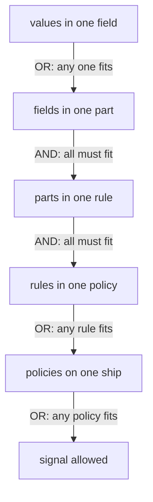

# Write A Guest List Entry

Astronaut, the planet is closed. Now you open it again, one narrow door at a time. Each door is a **rule** on a guest list: who may come in, through which door, and under which extra conditions.

A rule has three optional parts, and they combine in a fixed way. Almost every policy that "looks right but does not work" comes from misreading how those parts combine. This part settles that.

The commands below need the `allow-nothing` policy (`spec: {}` in `starfleet`) applied in your playground, and the three helpers from the module's landing page pasted into your terminal.

## Open one door

Start with one real rule: only the shuttle may read from the probe. You apply it first, then take it apart.

### Only the shuttle, only GET

<!-- astrona:playground:renew -->

Save this as `authorizationpolicy-probe-allow-shuttle-get.yaml`:

```yaml
apiVersion: security.istio.io/v1
kind: AuthorizationPolicy
metadata:
  name: probe-allow-shuttle-get
  namespace: starfleet
spec:
  selector:
    matchLabels:
      app: probe
  action: ALLOW
  rules:
  - from:
    - source:
        principals:
        - cluster.local/ns/starfleet/sa/shuttle
    to:
    - operation:
        methods:
        - GET
```

Apply it:

```sh
kubectl apply -f authorizationpolicy-probe-allow-shuttle-get.yaml
```

Then check the result. Try the right caller with the right method, the right caller with the wrong method, and the wrong caller:

```sh
from_shuttle http://probe:8000/get
from_shuttle -X POST http://probe:8000/post
from_fortio http://probe:8000/get
```

```text
200 200 200 <- http://probe:8000/get
403 403 403 <- -X POST http://probe:8000/post
Code 403
```

Only the first one gets in. The shuttle's `POST` fails on the method. fortio's `GET` fails on the caller: it carries the badge `sa/default`, not `sa/shuttle`.

### Read it out loud

Read a rule as one sentence, starting with the selector: *on the probe ships, allow a caller with the badge `cluster.local/ns/starfleet/sa/shuttle` to use `GET`*. And, because `allow-nothing` is still there, nothing else.

If a policy is hard to read aloud in one sentence, its parts probably do not combine the way its author thought.

## The three parts of a rule

Every rule is built from up to three parts. Each part answers a different question, and each one gets its facts from a different stage of the signal's path.

### From, to and when

```yaml
  rules:
  - from:                       # who sends the signal
    - source:
        principals: [...]         # the name on the caller's ID badge (from mTLS)
        namespaces: [...]         # the caller's planet (from mTLS)
        ipBlocks: [...]           # the caller's address
        requestPrincipals: [...]  # the astronaut's boarding pass (from a JWT)
    to:                         # which door and channel the signal asks for
    - operation:
        methods: [...]            # GET, POST, ...
        paths: [...]              # /get, /status/*, ...
        ports: [...]              # the destination port
        hosts: [...]              # the Host header
    when:                       # extra conditions on the signal
    - key: request.headers[x-mission]
      values: ["apollo"]
```

`from` facts come from the handshake, `to` facts from reading the HTTP request, and token facts in `when` from the token check. That is why `principals` fails quietly without mTLS, and why token conditions need a `RequestAuthentication`.

Every field also has a "not" form, for example `notMethods`, `notPaths` and `notPrincipals`. It means "everything except these".

## How the pieces combine

Values, fields, parts, rules and policies each combine in their own way. Get these five levels straight and most authorization questions answer themselves.

### Five levels, two answers



Read the diagram from the top: OR inside a list of values, AND across fields and parts, then OR again across rules and policies.

Two facts follow, and both catch people out:

- **A part you leave out is not a limit.** No `to` means *any* operation, not *no* operation. A rule with only `from` lets that caller do anything.
- **Two rules are never an "and".** A second rule can only let more signals in. To say "this caller, but only these methods", put both in **one** rule, as two parts.

Several `- source:` entries under one `from` are combined with OR. That is the usual way to say "either of these two callers" without copying the whole rule.

### See a missing part at work

This rule has a `to` part and no `from` part, so it lets **any** caller with a badge read one path. Save this as `authorizationpolicy-probe-allow-headers.yaml`:

```yaml
apiVersion: security.istio.io/v1
kind: AuthorizationPolicy
metadata:
  name: probe-allow-headers
  namespace: starfleet
spec:
  selector:
    matchLabels:
      app: probe
  action: ALLOW
  rules:
  - to:
    - operation:
        paths: ["/headers"]
```

Apply it:

```sh
kubectl apply -f authorizationpolicy-probe-allow-headers.yaml
```

Then check the result from fortio, the caller that no rule names:

```sh
from_fortio http://probe:8000/headers
from_fortio http://probe:8000/get
```

```text
Code 200
Code 403
```

fortio now gets in on `/headers`, because the rule does not ask who is calling. `/get` is still closed to fortio, because no rule on any list fits it.

## Path matching, exactly

`paths` is where policies quietly leave holes, because the matching is more literal than people expect. There are three forms, and only three.

### Exact, prefix and suffix

| Form | Matches | Does **not** match |
| --- | --- | --- |
| `/headers` | exactly `/headers` | `/headers/`, `/Headers` |
| `/status/*` | prefix: `/status/200`, `/status/418` | `/status` |
| `*/status` | suffix: `/api/status`, `/v1/status` | `/status/200` |

There is no regular expression and no wildcard in the middle. A `*` only works at the very start or the very end. A path of just `*` matches any path.

Matching is case-sensitive and looks at the path only. The query string after `?` is not part of it. To check a header or a query value, use `when`.

Two habits follow. An exact path in an `ALLOW` rule is often too narrow: `/status` does not let in `/status/200`. And an exact path in a `DENY` rule is often too wide open: banning `/admin` still lets in `/admin/users`.

## `when`, briefly

`when` checks facts that are not "who" or "which operation": request headers, the destination address, and, after a `RequestAuthentication` has run, the lines printed on a boarding pass (the token's claims).

### The syntax

```yaml
    when:
    - key: request.headers[x-mission]
      values: ["apollo"]
```

Each entry has a `key` and either `values` or `notValues`. Entries are combined with AND, with each other and with the rest of the rule. That is the whole syntax.

A `when` on a header is only as trustworthy as the header. The caller sets it, so the caller controls it. Conditions on `request.auth.claims[...]` are different: a signature was checked before those facts existed.

## Common pitfalls

> [!WARNING]
> - **Reading values in a list as "and".** `methods: ["GET", "POST"]` means either one.
> - **Reading separate rules as "and".** A signal that fits any one rule gets in.
> - **Leaving a part out and expecting it to limit.** No `from` means every caller; no `to` means every operation.
> - **Splitting one idea over two rules.** "This caller, only GET" is one rule with a `from` and a `to`.
> - **Guessing how paths match.** Exact, prefix (`/x/*`) and suffix (`*/x`) behave differently, and there is no regular expression.

> *Values OR, fields AND, parts AND, rules OR. A part you leave out is not a limit, it is a wildcard.*
