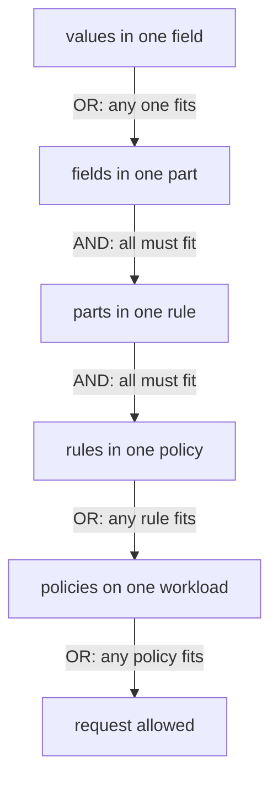

# Write An ALLOW Rule

The namespace is closed, and now you open it again, one narrow call at a time. Each opening is a **rule** in an `ALLOW` policy. A rule says who may call, which operation they may use, and under which extra conditions.

A rule has three optional parts, and they combine in a fixed way. Almost every policy that "looks right but does not work" comes from misreading how those parts combine. This chapter starts with one real rule, takes it apart, and then settles how the parts, rules and paths are matched.

The commands below need the `allow-nothing` policy (`spec: {}` in `starfleet`) applied in your playground, and the three helper functions from the landing page pasted into your terminal.

## Open one call

Start with one real rule: only the `shuttle` may read from the `probe`, and only with `GET`. You apply it first, and then read it.

<!-- astrona:playground:renew -->

Save this as `authorizationpolicy-probe-allow-shuttle-get.yaml`:

```yaml
apiVersion: security.istio.io/v1
kind: AuthorizationPolicy
metadata:
  name: probe-allow-shuttle-get
  namespace: starfleet
spec:
  selector:
    matchLabels:
      app: probe
  action: ALLOW
  rules:
  - from:
    - source:
        principals:
        - cluster.local/ns/starfleet/sa/shuttle
    to:
    - operation:
        methods:
        - GET
```

Apply it:

```sh
kubectl apply -f authorizationpolicy-probe-allow-shuttle-get.yaml
```

Then check the result. Try the right caller with the right method, the right caller with the wrong method, and the wrong caller:

```sh
from_shuttle http://probe:8000/get
from_shuttle -X POST http://probe:8000/post
from_fortio http://probe:8000/get
```

```text
200 200 200 <- http://probe:8000/get
403 403 403 <- -X POST http://probe:8000/post
Code 403
```

Only the first request gets in. The `shuttle`'s `POST` fails on the method. The `fortio` `GET` fails on the caller, because its identity is `sa/default`, not `sa/shuttle`.

It helps to read a rule out loud as one sentence, starting with the selector: *on the `probe` pods, allow a caller with the identity `cluster.local/ns/starfleet/sa/shuttle` to use `GET`*. And, because `allow-nothing` is still there, nothing else. If you cannot read a policy aloud in one sentence, its parts probably do not combine the way its author thought.

## The three parts of a rule

The rule you just applied used two of the three parts. Each part answers a different question, and each one gets its facts from a different stage of the request's path through the receiving proxy. Here is the full shape, with every field this module uses:

```yaml
  rules:
  - from:                       # who sends the request
    - source:
        principals: [...]         # the identity in the caller's certificate (from mTLS)
        namespaces: [...]         # the caller's namespace (from mTLS)
        ipBlocks: [...]           # the caller's address
        requestPrincipals: [...]  # the end user's identity (from a JWT)
    to:                         # which operation and port the request asks for
    - operation:
        methods: [...]            # GET, POST, ...
        paths: [...]              # /get, /status/*, ...
        ports: [...]              # the destination port
        hosts: [...]              # the Host header
    when:                       # extra conditions on the request
    - key: request.headers[x-mission]
      values: ["apollo"]
```

`from` facts come from mTLS, `to` facts from reading the HTTP request, and token facts in `when` from the JWT (JSON Web Token) check. That is why `principals` fails quietly without mTLS, and why token conditions need a `RequestAuthentication`.

Every field also has a "not" form, for example `notMethods`, `notPaths` and `notPrincipals`. It means "everything except these".

## How the pieces combine

Knowing the parts is not enough; you also need to know how they add up. Values, fields, parts, rules and policies each combine in their own way. Get these five levels straight, and most authorization questions answer themselves.



Read the diagram from the top: OR inside a list of values, AND across fields and parts, then OR again across rules and policies.

Two facts follow, and both catch people out. First, a part you leave out is not a limit. No `to` means *any* operation, not *no* operation, so a rule with only `from` lets that caller do anything. Second, two rules are never an "and". A second rule can only let more requests in, so to say "this caller, but only these methods", you put both in **one** rule, as two parts.

Several `- source:` entries under one `from` are combined with OR. That is the usual way to say "either of these two callers" without copying the whole rule.

You can see a missing part at work with a rule that has a `to` part and no `from` part. It lets **any** caller with a certificate read one path. Save this as `authorizationpolicy-probe-allow-headers.yaml`:

```yaml
apiVersion: security.istio.io/v1
kind: AuthorizationPolicy
metadata:
  name: probe-allow-headers
  namespace: starfleet
spec:
  selector:
    matchLabels:
      app: probe
  action: ALLOW
  rules:
  - to:
    - operation:
        paths: ["/headers"]
```

Apply it:

```sh
kubectl apply -f authorizationpolicy-probe-allow-headers.yaml
```

Then check the result from `fortio`, the caller that no rule names:

```sh
from_fortio http://probe:8000/headers
from_fortio http://probe:8000/get
```

```text
Code 200
Code 403
```

`fortio` now gets in on `/headers`, because the rule does not ask who is calling. `/get` is still closed to `fortio`, because no rule in any policy matches that request.

## Path matching

The `paths` field is where policies quietly leave holes, because the matching is more literal than people expect. There are three forms, and only three:

| Form | Matches | Does **not** match |
| --- | --- | --- |
| `/headers` | exactly `/headers` | `/headers/`, `/Headers` |
| `/status/*` | prefix: `/status/200`, `/status/418` | `/status` |
| `*/status` | suffix: `/api/status`, `/v1/status` | `/status/200` |

There is no regular expression and no wildcard in the middle. A `*` only works at the very start or the very end, and a path of just `*` matches any path. Matching is case-sensitive and looks at the path only, so the query string after `?` is not part of it. To check a header or a query value, use `when`.

Two habits follow from this. An exact path in an `ALLOW` rule is often too narrow: `/status` does not let in `/status/200`. And an exact path in a `DENY` rule often leaves a gap: denying `/admin` still lets in `/admin/users`.

## Extra conditions with `when`

The last part, `when`, checks facts that are not "who" or "which operation". Examples are request headers, the destination address and the JWT's claims (the facts written inside the token, available after a `RequestAuthentication` has run). The syntax is short:

```yaml
    when:
    - key: request.headers[x-mission]
      values: ["apollo"]
```

Each entry has a `key` and either `values` or `notValues`. The proxy combines entries with AND, with each other and with the rest of the rule. That is the whole syntax.

A `when` on a header is only as trustworthy as the header. The caller sets it, so the caller controls it. Conditions on `request.auth.claims[...]` are different, because the proxy checked a signature before those facts existed.

You can now write an `ALLOW` rule and predict what it lets in: values OR, fields AND, parts AND, rules OR, and a part you leave out is a wildcard, not a limit. The rules so far named the caller by an identity string, but where that string comes from, and what it needs to match, is still open.

## Common pitfalls

> [!WARNING]
> - **Reading values in a list as "and".** `methods: ["GET", "POST"]` means either one.
> - **Reading separate rules as "and".** A request that matches any one rule gets in.
> - **Leaving a part out and expecting it to limit.** No `from` means every caller; no `to` means every operation.
> - **Splitting one idea over two rules.** "This caller, only GET" is one rule with a `from` and a `to`.
> - **Guessing how paths match.** Exact, prefix (`/x/*`) and suffix (`*/x`) behave differently, and there is no regular expression.
