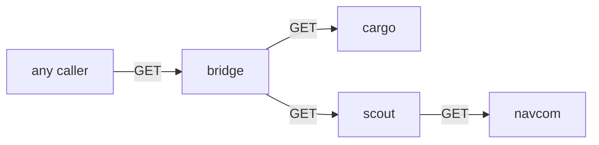

# Least Privilege For The Whole Fleet

Astronaut, so far you guarded one ship, the probe. A real application is a fleet of ships that call each other. **Least privilege** means each ship gets exactly the access it needs to do its job, and nothing more. In this part you give every ship of the Starfleet its own guest list, so the bridge page works again but nobody can take a shortcut past it.

The commands below need the `allow-nothing` policy (`spec: {}` in `starfleet`) applied in your playground, and the three helpers from the module's landing page.

## Map who calls whom

You cannot write a least-privilege policy without knowing the real calls. Write them down first. Every arrow becomes one rule on the receiving ship's list.

### The Starfleet's call map



The map shows four arrows. Anyone may open the bridge page. Only the bridge calls `cargo` and `scout`. Only the scouts (v2 and v3) call `navcom` for the star rating.

### See the fleet closed

<!-- astrona:playground:renew -->

With only `allow-nothing` applied, even the front page is closed:

```sh
from_shuttle http://bridge:9080/productpage
```

```text
403 403 403 <- http://bridge:9080/productpage
```

The bridge's own guard turns the shuttle away. And if the bridge could get in, its signals to `cargo` and `scout` would be turned away too, by their guards.

Your browser tells a slightly different story. The port forward on `127.0.0.1:9080` enters the bridge ship directly and skips its communications officer, so the bridge's guard never sees that signal. The page still loads, but it says `Sorry, product details are currently unavailable` and `Sorry, product reviews are currently unavailable`. Those are the bridge's own signals to `cargo` and `scout`, turned away by their guards.

## One guest list per ship

Now turn each arrow of the map into a rule. Each ship gets its own policy, selected by its `app` label, and each rule names the caller by its service account.

### Write the four lists

Save this as `authorizationpolicy-starfleet-least-privilege.yaml`:

```yaml
# bridge: anyone may call it (it is the front page), GET only.
apiVersion: security.istio.io/v1
kind: AuthorizationPolicy
metadata:
  name: bridge-allow-get
  namespace: starfleet
spec:
  selector:
    matchLabels:
      app: bridge
  action: ALLOW
  rules:
  - to:
    - operation:
        methods: ["GET"]
---
# cargo: only the bridge.
apiVersion: security.istio.io/v1
kind: AuthorizationPolicy
metadata:
  name: cargo-allow-bridge
  namespace: starfleet
spec:
  selector:
    matchLabels:
      app: cargo
  action: ALLOW
  rules:
  - from:
    - source:
        principals: ["cluster.local/ns/starfleet/sa/starfleet-bridge"]
    to:
    - operation:
        methods: ["GET"]
---
# scout: only the bridge.
apiVersion: security.istio.io/v1
kind: AuthorizationPolicy
metadata:
  name: scout-allow-bridge
  namespace: starfleet
spec:
  selector:
    matchLabels:
      app: scout
  action: ALLOW
  rules:
  - from:
    - source:
        principals: ["cluster.local/ns/starfleet/sa/starfleet-bridge"]
    to:
    - operation:
        methods: ["GET"]
---
# navcom: only the scout.
apiVersion: security.istio.io/v1
kind: AuthorizationPolicy
metadata:
  name: navcom-allow-scout
  namespace: starfleet
spec:
  selector:
    matchLabels:
      app: navcom
  action: ALLOW
  rules:
  - from:
    - source:
        principals: ["cluster.local/ns/starfleet/sa/starfleet-scout"]
    to:
    - operation:
        methods: ["GET"]
```

Apply it:

```sh
kubectl apply -f authorizationpolicy-starfleet-least-privilege.yaml
```

```text
authorizationpolicy.security.istio.io/bridge-allow-get created
authorizationpolicy.security.istio.io/cargo-allow-bridge created
authorizationpolicy.security.istio.io/scout-allow-bridge created
authorizationpolicy.security.istio.io/navcom-allow-scout created
```

One file holds four policies, and `kubectl` applies them from top to bottom. The bridge rule has no `from` part, so any caller that passes the handshake may `GET` it. The other three name exactly one caller each, by the name on its badge.

### Prove the page works

Wait up to about a minute, then load the bridge page six times. The loop prints, for each load, whether the page shows stars and whether it shows an error:

```sh
for i in 1 2 3 4 5 6; do
  kubectl exec -n starfleet deploy/shuttle -- curl -s http://bridge:9080/productpage \
    | grep -oE 'currently unavailable|glyphicon-star' | sort -u | tr '\n' ' '; echo
done
```

```text

glyphicon-star 

glyphicon-star 
glyphicon-star 
glyphicon-star 
```

Lines with `glyphicon-star` came from a v2 or v3 scout, which got its rating from `navcom`. Empty lines came from scout v1, which shows no stars. No line says `currently unavailable`, so every call on the map got through. If you have the bridge page open in your browser, reload it: the item facts, the reviews and the stars are back.

### Prove the shortcuts are closed

Now try to skip the bridge and call the other ships straight from the shuttle:

```sh
from_shuttle http://cargo:9080/details/0
from_shuttle http://scout:9080/reviews/0
from_shuttle http://navcom:9080/ratings/0
```

```text
403 403 403 <- http://cargo:9080/details/0
403 403 403 <- http://scout:9080/reviews/0
403 403 403 <- http://navcom:9080/ratings/0
```

All three are turned away. The shuttle has a valid badge, but `sa/shuttle` is not on any of those lists. That is least privilege: the page works, and the shortcuts do not.

## Why the narrow lists work together

The four policies and `allow-nothing` all live on the same planet, and they never get in each other's way. Each ship's guard combines only the lists that select that ship.

### What each ship's guard holds

| Ship | Lists that select it | Who gets in |
| --- | --- | --- |
| `bridge` | `allow-nothing`, `bridge-allow-get` | any caller with a badge, `GET` only |
| `cargo` | `allow-nothing`, `cargo-allow-bridge` | the bridge, `GET` only |
| `scout` (all versions) | `allow-nothing`, `scout-allow-bridge` | the bridge, `GET` only |
| `navcom` | `allow-nothing`, `navcom-allow-scout` | the scouts, `GET` only |
| `probe`, `shuttle`, `fortio` | `allow-nothing`, plus any probe lists you kept | only what those lists name |

`allow-nothing` adds no rule anywhere. It only makes sure that every ship, including one launched tomorrow, starts closed.

On a real cluster, apply the narrow lists first and the empty list last. Then the fleet never goes dark while you work. To remove them, delete the empty list first and the narrow lists after it.

## Common pitfalls

> [!WARNING]
> - **Writing the policy before mapping the calls.** A missed arrow means a broken page. A guessed arrow means a shortcut nobody needed.
> - **Using `namespaces` for internal calls.** `namespaces: ["starfleet"]` would let the shuttle and fortio call `scout` directly. Name the caller's service account.
> - **Using the app name as the service account.** The bridge runs as `starfleet-bridge`, not `bridge`. Read it from the pod.
> - **Forgetting the second hop.** The page loads but shows no stars when `navcom` does not let the scouts in.

> *Least privilege is the call map turned into rules: one list per ship, one rule per arrow, and every caller named by its badge.*
