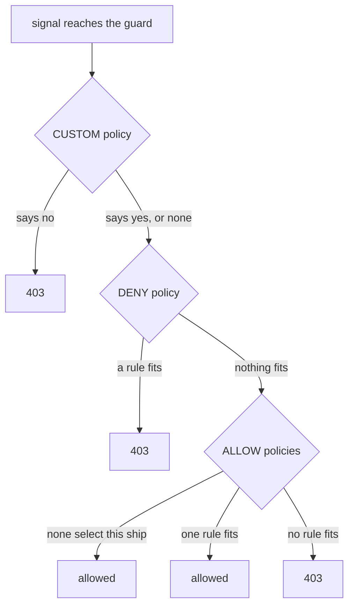

# The Guard Checks The Banned List First

Astronaut, the guard at a ship's airlock does not weigh all its lists at once. It reads them one after another, in a fixed order, and it may stop early. Almost every question about `DENY` is answered by that order.

In this part you put a banned list on the echo probe, watch what it blocks and what it lets through, and read the note the guard writes in its flight log.

## Three lists, one fixed order

An `AuthorizationPolicy` has an `action`. The guard sorts all policies that select a ship into three groups by that action, and checks the groups in the same order for every signal. Knowing the order lets you predict the answer before you send anything.

### The order the guard follows

The guard is the sidecar proxy of the ship that **receives** the signal. For each signal it walks these steps:



The guard asks an outside guard first (`CUSTOM`), then reads the banned list (`DENY`), and only then the guest list (`ALLOW`).

### What ends the decision

The first two steps can only ever say no. When a `CUSTOM` policy rejects a signal, or a `DENY` rule fits it, the decision **ends**. The guard does not read the rest. A `DENY` does not cast a vote that an `ALLOW` can outweigh; it stops the walk before the `ALLOW` policies are even looked at.

`CUSTOM` hands the decision to an outside authorization service. It only works when an administrator has set up that service as an extension provider in the mesh configuration. You will rarely write one, but you should know where it sits in the order.

There is no "most specific rule wins" here. The guard does not score rules or compare how narrow they are. It walks the steps, and the first final answer is the answer.

## A ship with only a banned list

Here you put one `DENY` policy on the probe and nothing else. The result surprises many people, so predict it before you run the check.

<!-- astrona:playground:renew -->

### Signals before any policy

First, confirm that the probe answers both paths you will use. Send three signals to each from the shuttle:

```sh
from_shuttle $PROBE/get
from_shuttle $PROBE/status/200
```

```text
200 200 200 <- shuttle http://probe:8000/get
200 200 200 <- shuttle http://probe:8000/status/200
```

No policy exists, so the guard lets everything in.

### Ban one path

This policy bans every path under `/status/` on the probe, for every caller.

Save this as `authorizationpolicy-probe-deny-status.yaml`:

```yaml
apiVersion: security.istio.io/v1
kind: AuthorizationPolicy
metadata:
  name: probe-deny-status
  namespace: starfleet
spec:
  selector:
    matchLabels:
      app: probe
  action: DENY
  rules:
  - to:
    - operation:
        paths:
        - /status/*
```

Apply it:

```sh
kubectl apply -f authorizationpolicy-probe-deny-status.yaml
```

```text
Warning: configured AuthorizationPolicy will deny all traffic to TCP ports under its scope due to the use of only HTTP attributes in a DENY rule; it is recommended to explicitly specify the port
authorizationpolicy.security.istio.io/probe-deny-status created
```

The policy is created. The warning comes from mission control, `istiod`, which checks every policy you apply. It is explained below.

Wait up to about a minute, then check the result from both callers:

```sh
from_shuttle $PROBE/get
from_shuttle $PROBE/status/200
from_fortio $PROBE/status/200
from_fortio $PROBE/get
```

```text
200 200 200 <- shuttle http://probe:8000/get
403 403 403 <- shuttle http://probe:8000/status/200
Code 403
Code 200
```

The banned path is shut for both callers, because the rule has no `from` part and so fits every caller. And `/get` still answers, for both. The probe has no guest list, so the guard's last step says "no `ALLOW` policy selects this ship: allowed".

Now the warning from `kubectl apply`. The rule checks HTTP paths, but a plain TCP port (a channel that carries raw bytes, not web signals) has no paths to check. So on such ports the guard cannot tell what fits, and it blocks everything there to be safe. That does no harm here, because the probe only speaks HTTP. On a ship that also has a TCP port, add `ports` to the rule's `operation`, as the warning suggests.

### The rule this shows

Adding a `DENY` does **not** turn on default-deny. Only an `ALLOW` policy does that. Put side by side:

| The ship is selected by... | Result |
| --- | --- |
| no policy | everything allowed |
| only `DENY` policies | everything allowed **except** what they match |
| at least one `ALLOW` policy | only what an `ALLOW` rule matches |
| both | a `DENY` match is refused at once; the rest is decided by the `ALLOW` policies |

## Read the guard's note

The caller only sees a short reply. The guard on the receiving ship writes down why it said no, and that note is how you find the policy that did it.

### The reply and the flight log

Send one banned signal and print its body, then read the probe's flight log line for it:

```sh
kubectl exec -n starfleet deploy/shuttle -- curl -s $PROBE/status/200; echo
probe_guard_log status/200
```

```text
RBAC: access denied
[2026-10-09T08:05:55.932Z] "GET /status/200 HTTP/1.1" 403 - rbac_access_denied_matched_policy[ns[starfleet]-policy[probe-deny-status]-rule[0]] - "-" 0 19 0 - "-" "curl/8.11.1" "66146f25-bad9-438d-bbe8-c08ceb51be1e" "probe:8000" "-" inbound|8080|| - 10.244.0.14:8080 10.244.0.12:54616 outbound_.8000_._.probe.starfleet.svc.cluster.local default
```

The body `RBAC: access denied` comes from the probe's sidecar, not from the probe app. RBAC stands for role-based access control, the name of the Envoy filter that does the checking. The log line names the namespace, the policy and the rule number (counted from `0`) that fit. So a `403` with `RBAC: access denied` always means an `AuthorizationPolicy`, and the receiving ship's log tells you which one.

## Common pitfalls

> [!WARNING]
> - **Ignoring the TCP port warning.** A `DENY` with only HTTP fields blocks every plain TCP port on the ships it selects. Add `ports` if the ship has one.
> - **Expecting a `DENY` to lock down the rest of the ship.** A ship with only `DENY` policies still allows everything they do not match.
> - **Thinking the guard reads policies in the order you wrote them.** It groups them by action. Within the `DENY` group, any match ends the decision.
> - **Looking for the reason in the caller's log.** The guard sits on the receiving ship. Read that ship's `istio-proxy` log.
> - **Testing straight after `kubectl apply`.** Old connections keep the old rules for a while. Wait up to about a minute; a mix like `200 403 403` means you tested too early.

> *The guard reads the banned list before the guest list, and a match on the banned list ends the decision.*
