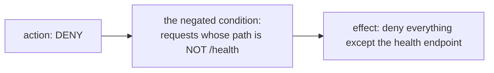

# Part 2 — Writing DENY rules

> Prerequisite: [Part 1 — The evaluation pipeline](./course-01-the-evaluation-pipeline.md). Next: [Part 3 — AUDIT, and choosing between ALLOW and DENY](./course-03-audit-and-design.md).

The object is the one you already know with one word changed. What is different is how you have to *think* while writing it: an `ALLOW` rule that is slightly too narrow inconveniences someone, and a `DENY` rule that is slightly too narrow leaves the thing you were protecting reachable.

## One word different

```yaml
apiVersion: security.istio.io/v1
kind: AuthorizationPolicy
metadata:
  name: deny-admin
  namespace: deny-demo
spec:
  selector:
    matchLabels:
      app: notification-service
  action: DENY
  rules:
    - to:
        - operation:
            paths: ["/admin*"]
```

Same `selector`, same `rules` structure, same `from` / `to` / `when` parts, same combination rules from [Module 1, Part 3](../module-01/course-03-rule-anatomy.md) — values OR, fields AND, parts AND, rules OR. Only `action` changed.

But the meaning of the combination rules inverts along with the action. Under `ALLOW`, "rules are ORed" means *more rules permit more*. Under `DENY`, it means *more rules block more*. And "an absent part is unconstrained" — the thing that makes an `ALLOW` rule accidentally generous — makes a `DENY` rule accidentally sweeping. The rule above has no `from` part, so it matches **any** caller, which is what was wanted here and is not always what someone writing quickly intends.

## Prefix matching is not optional here

`paths: ["/admin*"]` has a `*` for a reason. Recall the three path forms from [Module 1, Part 3](../module-01/course-03-rule-anatomy.md):

| Form | Matches | Under `DENY`, leaves reachable |
| --- | --- | --- |
| `/admin` | exactly `/admin` | `/admin/`, `/admin/users`, `/admin?x=1` |
| `/admin*` | `/admin` and everything beneath it | `/api/admin` |
| `*/admin` | any path ending `/admin` | `/admin/users` |

The middle column is the same in both actions; the right-hand column is what makes this a security problem rather than an inconvenience. An exact-path `DENY` blocks the URL you tested and nothing else, so it reports as working. `/admin` returns `403`, you move on, and `/admin/users` was never covered.

The generalisation is worth stating: **when writing a `DENY`, test the thing you did *not* write.** If the rule names `/admin*`, try `/api/admin`. If it names a method, try another method. A `DENY` that has only been tested on the case it obviously covers has not been tested.

## An ALLOW cannot undo a DENY

This is the examinable consequence of [Part 1](./course-01-the-evaluation-pipeline.md)'s pipeline, and it is worth watching rather than reading. With the `ALLOW` baseline and the `DENY` both in place, add a *third* policy — an `ALLOW` that explicitly permits `/admin` — and predict the result before running it.

> [!TIP]
> **Try it — DENY plus a conflicting ALLOW**
>
> ```sh
> kubectl apply -f - <<'YAML'
> apiVersion: security.istio.io/v1
> kind: AuthorizationPolicy
> metadata:
>   name: deny-admin
>   namespace: deny-demo
> spec:
>   selector:
>     matchLabels:
>       app: notification-service
>   action: DENY
>   rules:
>     - to:
>         - operation:
>             paths: ["/admin*"]
> ---
> apiVersion: security.istio.io/v1
> kind: AuthorizationPolicy
> metadata:
>   name: allow-admin-attempt
>   namespace: deny-demo
> spec:
>   selector:
>     matchLabels:
>       app: notification-service
>   action: ALLOW
>   rules:
>     - to:
>         - operation:
>             paths: ["/admin*"]
> YAML
>
> kubectl -n deny-demo get authorizationpolicy
> kubectl -n deny-demo exec deploy/tester -- \
>   curl -s -o /dev/null -w 'GET /admin: %{http_code}\n' http://notification-service/admin
> ```
>
> Expect something like:
>
> ```text
> NAME                  AGE
> allow-admin-attempt   3s
> allow-notify          2m
> deny-admin            3s
> GET /admin: 403
> ```
>
> Three policies, one of which explicitly allows exactly this request, and it is still refused. The `DENY` matched at step 2 and the decision ended there — `allow-admin-attempt` was never read. Note also that this `403` is indistinguishable from [Part 1](./course-01-the-evaluation-pipeline.md)'s, which was produced by step 3 instead.

The practical consequence is a design rule: **you cannot carve an exception out of a `DENY` by adding an `ALLOW`.** If `/admin/health` must be reachable while the rest of `/admin` is closed, the exception has to be written into the `DENY` itself — by narrowing its paths, or by a negated condition.

## Negated conditions

`notPaths`, `notMethods`, `notPrincipals`, `notNamespaces` and their siblings invert a condition *inside* a rule. They are genuinely useful and genuinely easy to misread, because under `DENY` two negations stack:

```yaml
  action: DENY
  rules:
    - to:
        - operation:
            notPaths: ["/health"]
```

Read it slowly, in this order — action, then field, then negation:



A DENY with a negated condition reads backwards the first few times. Say the sentence out loud before you apply it — the object does exactly what it says, which is rarely what a first reading suggests.

That is an extremely aggressive policy that at a glance looks like it is *about* `/health`. The same fields inside an `ALLOW` mean something quite different — "allow anything except `/health`" — and the object gives you no hint which reading its author intended.

The habit that helps is mechanical: **say the whole sentence out loud, starting with the action.** "DENY … requests whose path is not /health." If the sentence surprises you, the policy would have surprised you too.

A second, subtler property: a negated condition matches when the attribute is **present and different**, and its behaviour on a missing attribute is not something to rely on from memory. `notPrincipals` on a request with no verified identity is exactly the sort of edge that reads one way and behaves another. When a rule's correctness depends on that case, test it in a playground rather than reasoning about it — and prefer expressing the intent positively where you can.

> *Under `DENY` every combination rule inverts: an absent part is now sweeping, a missing `*` is now a hole, and a negation reads backwards unless you start the sentence with the action.*

## Common pitfalls

> [!WARNING]
> **Reading a negated DENY as an ALLOW.** `DENY` plus `notPaths` denies everything the list does not name. It is not a way to permit that list.
>
> **Assuming a DENY narrows an existing ALLOW.** It is evaluated earlier and independently; it removes traffic the ALLOW would have permitted.
>
> **Forgetting an empty `from` matches every source.** A DENY with no source restriction covers callers you did not have in mind.
>
> **Testing a DENY only with traffic it should block.** The traffic it must *not* block is the half that breaks production.

## Reference

- [AuthorizationPolicy `Operation`](https://istio.io/latest/docs/reference/config/security/authorization-policy/#Operation) — `paths`, `methods` and every `not*` counterpart.
- [AuthorizationPolicy `Source`](https://istio.io/latest/docs/reference/config/security/authorization-policy/#Source) — `notPrincipals`, `notNamespaces`, `notIpBlocks`.
- [Authorization for HTTP traffic](https://istio.io/latest/docs/tasks/security/authorization/authz-http/) — Istio's deny-rule examples, including path prefixes.
