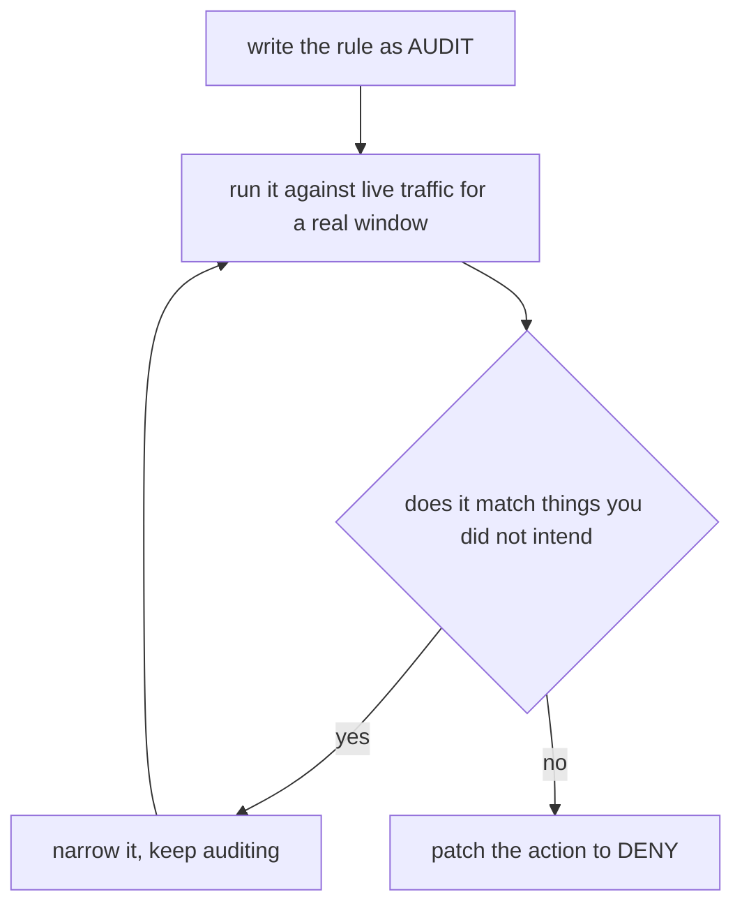

# Part 3 — AUDIT, and choosing between ALLOW and DENY

> Prerequisite: [Part 2 — Writing DENY rules](./course-02-writing-deny-rules.md). Next: [the module landing page](./course.md), then [Section 030 — End-User Authentication With JWT](../../section-030/README.md).

A `DENY` that is slightly too broad breaks production instantly, and — as [Part 2](./course-02-writing-deny-rules.md) established — no `ALLOW` can mitigate it. That makes a way to test a rule against real traffic *without* enforcing it more than a convenience. This part covers that mechanism, then settles when a requirement wants `ALLOW` and when it wants `DENY`.

## AUDIT

The third action records that a rule matched and changes nothing about the response:

```yaml
spec:
  action: AUDIT
  rules:
    - to:
        - operation:
            paths: ["/admin*"]
```

Place it in [Part 1](./course-01-the-evaluation-pipeline.md)'s pipeline and its behaviour is immediate: an `AUDIT` policy is **not** a terminal step. It is evaluated, a match is recorded, and the walk continues to the steps that decide. So converting a `DENY` to `AUDIT` removes step 2's veto entirely, and whatever step 3 says becomes the answer.

An `AUDIT` match goes to telemetry, not to the caller. Precisely where depends on how the mesh's access logging and telemetry are configured — in a bare playground with no logging configured, "nothing visible happened" is the expected experience, and that is worth knowing before you go looking for output that was never enabled.

> [!TIP]
> **Try it — switch the DENY to AUDIT**
>
> ```sh
> kubectl -n deny-demo patch authorizationpolicy deny-admin --type merge \
>   -p '{"spec":{"action":"AUDIT"}}'
>
> kubectl -n deny-demo exec deploy/tester -- \
>   curl -s -o /dev/null -w 'GET /admin: %{http_code}\n' http://notification-service/admin
> ```
>
> Expect something like:
>
> ```text
> GET /admin: 404
> ```
>
> The status is now whatever the application itself returns — `notification-service` has no `/admin` handler, hence `404`. The important part is what it is *not*: no longer `403`. With `deny-admin` demoted to `AUDIT`, step 2 no longer ends the decision, and `allow-admin-attempt` from [Part 2](./course-02-writing-deny-rules.md) finally gets its turn. Restore enforcement by patching `action` back to `DENY`.

That result restates the precedence lesson from the other direction: the conflicting `ALLOW` was never wrong, it was simply unreachable. Change what happens at step 2 and step 3 becomes visible again.

The intended workflow follows directly:



AUDIT lets you find out what a rule would have caught before it catches anything. The loop back to the top is the part people skip.

A single-field patch in each direction, with no window and no redeploy, because — as everywhere in this course — the change is a configuration push to running proxies.

## Two designs for "only /notify is reachable"

Both actions can express the same outcome, so the choice is really about what happens to the cases you did not think of.

```text
   ALLOW-based                          DENY-based
   ───────────                          ──────────
   closed by default                    open by default
   enumerate everything legitimate      enumerate everything forbidden
        │                                    │
   forgot something?                    forgot something?
   → it is refused                      → it is reachable
   → someone reports it, you fix it     → nobody reports it
```

**`ALLOW`-based is the safer posture**, and the default to reach for when locking down a service. Its cost is completeness: every legitimate call must be enumerated, including health checks, readiness probes, metrics endpoints and anything operational. Those are exactly the calls nobody remembers until they break.

**`DENY`-based suits a narrow, absolute prohibition** layered on an otherwise unrestricted workload — an admin surface that must never be exposed, a method that must never be reachable. It is a subtraction, not a security model.

The failure modes are asymmetric in a way worth internalising. An over-tight `ALLOW` produces a loud failure: something legitimate stops working and a human reports it within minutes. An under-tight `DENY` produces silence: the thing you meant to block is reachable, and nothing will tell you.

## Composing them

The two work together precisely because of the pipeline, and the common shape uses each for what it is good at:

- an **`ALLOW`** policy defining the service's normal surface — the access model, readable top to bottom;
- a small **`DENY`** for the handful of things that must stay closed *even if someone later widens the `ALLOW` by mistake*.

The `DENY` is a backstop, and step 2 running before step 3 is what guarantees it holds. Someone adding a generous `ALLOW` rule six months from now — including someone who never read the `DENY` — cannot accidentally expose what it covers.

Keep the `DENY` set small for the same reason. Each one is an unconditional veto that no future `ALLOW` can qualify, so a large `DENY` set becomes a source of denials nobody can explain from the `ALLOW` policies they are reading.

The traps here are all consequences of the ordering rather than of syntax.

> [!WARNING]
## Common pitfalls

> [!WARNING]
> **Trying to re-enable a path with an `ALLOW`** — impossible. Narrow the `DENY` instead, or express the exception inside it.
>
> **Expecting a `DENY` to create default-deny** — a workload with only `DENY` policies still allows everything not explicitly denied.
>
> **Reading a negated field without the action** — `DENY` + `notPaths: ["/health"]` denies *everything except* `/health`.
>
> **Exact paths where a prefix was meant** — `paths: ["/admin"]` leaves `/admin/users` wide open, and testing only `/admin` reports success.
>
> **Assuming the `403` tells you which policy fired** — an `ALLOW`-miss and a `DENY`-hit are identical to the caller. Only the policy set on the callee distinguishes them.
>
> **Expecting `AUDIT` output without configuring telemetry** — the match is recorded where your mesh's logging sends it, which in a bare install is nowhere.
>
> **Rolling out a new `DENY` straight to enforcement** — `AUDIT` first is a single-field patch and costs nothing.
>
> **Accumulating `DENY` policies** — each is an unconditional veto invisible to anyone reading the `ALLOW` set.

> *`AUDIT` is a non-terminal step, so demoting a `DENY` to it hands the decision back to `ALLOW` — which is what makes it a safe way to test a veto before arming it.*

## Reference

- [AuthorizationPolicy actions](https://istio.io/latest/docs/reference/config/security/authorization-policy/#AuthorizationPolicy-Action) — `ALLOW`, `DENY`, `AUDIT`, `CUSTOM` and what each does to the decision.
- [Istio access logging](https://istio.io/latest/docs/tasks/observability/logs/access-log/) — how to turn on the output an `AUDIT` match is recorded to.
- [Authorization best practices](https://istio.io/latest/docs/ops/best-practices/security/) — Istio's own guidance on deny-by-default and layering.
