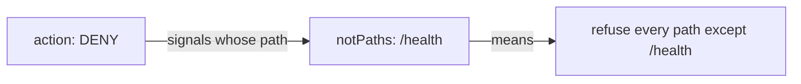

# Say It Out Loud: Negative Fields

Most fields in a rule say what a signal **is**: this method, this path, this caller. Each of them has a twin that starts with `not`: `notMethods`, `notPaths`, `notPrincipals`, `notNamespaces` and more. They are the usual way to say "everything except", astronaut, and inside a `DENY` they are easy to read the wrong way round.

In this part you ban every method except one, and you learn a simple habit that stops you from misreading a negative field.

## Ban everything except reading

Here you write a banned list for the whole planet that lets only `GET` through. Before you apply it, say out loud what it will do.

<!-- astrona:playground:renew -->

### Start clean

Remove every policy on the planet, so only the policy in this part decides:

```sh
kubectl delete authorizationpolicy --all -n starfleet
```

### Ban every method that is not GET

This policy has no `selector`, so it covers every ship on `starfleet`.

Save this as `authorizationpolicy-deny-non-get.yaml`:

```yaml
apiVersion: security.istio.io/v1
kind: AuthorizationPolicy
metadata:
  name: deny-non-get
  namespace: starfleet
spec:
  action: DENY
  rules:
  - to:
    - operation:
        notMethods: ["GET"]
```

Apply it:

```sh
kubectl apply -f authorizationpolicy-deny-non-get.yaml
```

Wait up to about a minute, then send a read and three writes, two from the shuttle and one from fortio:

```sh
from_shuttle $PROBE/get
from_shuttle -X POST $PROBE/post
from_shuttle -X DELETE $PROBE/delete
from_fortio -X POST $PROBE/post
```

```text
200 200 200 <- shuttle http://probe:8000/get
403 403 403 <- shuttle -X POST http://probe:8000/post
403 403 403 <- shuttle -X DELETE http://probe:8000/delete
Code 403
```

`notMethods: ["GET"]` fits every signal whose method is **not** `GET`. The action is `DENY`, so all of those are refused, from every caller. Only reads get through. Because the policy has no `selector`, the bridge, the scouts and every other ship on the planet are now read-only too.

When you are done, remove it with `kubectl delete -f authorizationpolicy-deny-non-get.yaml`.

## Read the sentence, starting with the action

A negative field inside a `DENY` is a double negative: "refuse what is not X". The safe way to read it is the same every time.

### The habit

Read the policy as one sentence, in this order: the action, then the field, then the values.



The diagram shows a `DENY` with `notPaths: ["/health"]`, read out loud. At a glance it looks like a rule *about* `/health`. Read as a sentence, it bans every path on the ship except one.

The same fields inside an `ALLOW` mean the opposite: "let in every path except `/health`". The YAML gives no hint which meaning the author wanted, so say the sentence before you apply it. If the sentence surprises you, the policy would have surprised you too.

| Policy | The sentence |
| --- | --- |
| `DENY` + `notMethods: ["GET"]` | refuse every signal that is not a `GET` |
| `DENY` + `notPaths: ["/health"]` | refuse every path except `/health` |
| `ALLOW` + `notPaths: ["/health"]` | let in every path except `/health` |
| `DENY` + `notPrincipals: ["*"]` | refuse every signal that carries no ID badge |

### Callers without an ID badge

The last row is a pattern worth knowing. `principals: ["*"]` fits any caller that showed a valid ID badge. So `notPrincipals: ["*"]` fits any caller that showed **none**, such as the drifter on the outpost, which has no communications officer and sends plain text. Inside a `DENY`, it refuses every signal without a verified identity.

On `starfleet` you cannot see this with the drifter: the `STRICT` `PeerAuthentication` already makes the ships refuse its plain-text signals at the handshake, before any `AuthorizationPolicy` is read. The pattern matters on ships that still accept plain text. We checked it on a test system with the probe switched to `PERMISSIVE`: with `DENY` + `notPrincipals: ["*"]` in place, the drifter got `403 RBAC: access denied`, and the shuttle still got `200`.

Whenever a rule depends on what happens when a value is missing, as here, test it with a real caller rather than reasoning about it. And where you can say the same thing with a positive field, do.

## Common pitfalls

> [!WARNING]
> - **Reading a negative `DENY` as a guest list.** `DENY` + `notPaths` refuses everything the list does **not** name. It does not let that list in.
> - **Forgetting the scope of a policy without a selector.** `deny-non-get` made every ship on the planet read-only, not only the probe.
> - **Using `notMethods` when you meant `methods`.** `DENY` + `methods: ["POST"]` bans one method; `DENY` + `notMethods: ["POST"]` bans every other method.
> - **Expecting a negative field to see a caller that never got to the guard.** Under `STRICT`, a plain-text caller is turned away at the handshake first.

> *Read a policy as a sentence that starts with the action. A negative field inside a `DENY` bans everything except its list.*

## Your mission: Make The Probe Read-Only

You can now ban every method except one with a single negative field, and predict how it combines with a guest list. Now prove it in a graded mission: the probe has an open guest list for the whole planet, and you must make it read-only for every caller without touching that guest list.

The mission runs in its own training solar system, so first pause your playground. Nothing in it is lost:

```sh
astrona stop ats-015-playground-020-02
```

Then start the mission:

```sh
astrona run --git git@github.com:astrona-io/ATS015.git -c sections/section-020/module-02/labs/lab-02
```

Read the task in [`question.md`](./labs/lab-02/question.md) and solve it on your own first. When you think you are done, send it for grading:

```sh
astrona submit -c sections/section-020/module-02/labs/lab-02
```

When the mission is done, remove it and wake your playground up again:

```sh
astrona destroy ats-015-lab-020-02-02
astrona start ats-015-playground-020-02
```
