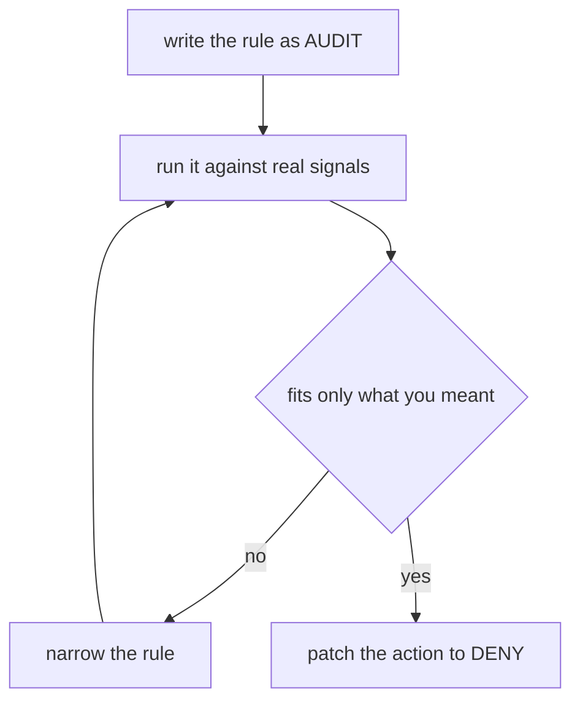

# AUDIT, And Choosing ALLOW Or DENY

A `DENY` that is a little too wide breaks real work the moment you apply it, astronaut, and no guest list can rescue it. So it helps to try a rule against real signals **before** it blocks anything. That is what the `AUDIT` action is for.

This part shows `AUDIT` in your playground, then settles a design question: when should a requirement be written as a guest list, and when as a banned list?

## AUDIT writes it down and lets it pass

An `AUDIT` policy has the same fields as any other. When a rule fits, the guard records the match and then carries on as if the policy were not there. It never changes the reply. That makes it the safe way to arm a new ban: write it as `AUDIT` first, then switch one word.

<!-- astrona:playground:renew -->

### Start clean

Remove every policy on the planet, so only the policy in this part decides:

```sh
kubectl delete authorizationpolicy --all -n starfleet
```

### Write the ban as AUDIT first

This rule fits every signal to the probe's `/headers` path, but its action is `AUDIT`.

Save this as `authorizationpolicy-probe-ban-headers.yaml`:

```yaml
apiVersion: security.istio.io/v1
kind: AuthorizationPolicy
metadata:
  name: probe-ban-headers
  namespace: starfleet
spec:
  selector:
    matchLabels:
      app: probe
  action: AUDIT
  rules:
  - to:
    - operation:
        paths: ["/headers"]
```

Apply it:

```sh
kubectl apply -f authorizationpolicy-probe-ban-headers.yaml
```

Wait up to about a minute, then check the result:

```sh
from_shuttle $PROBE/headers
```

```text
200 200 200 <- shuttle http://probe:8000/headers
```

The rule fits, and the signal still gets through. `AUDIT` is not a final step in the guard's order: the guard records the match and walks on. No `ALLOW` policy selects the probe, so the answer is "allowed".

Where the record goes depends on how the mesh's telemetry is set up. `AUDIT` needs an audit provider configured in the mesh; this playground has none. Its flight log line for `/headers` is a normal `200` line with `via_upstream`, and nothing about the policy. Do not go looking for output that was never switched on.

### Arm it, then stand it down

When you are sure the rule fits only what you meant, change the action to `DENY` with one patch:

```sh
kubectl patch authorizationpolicy probe-ban-headers -n starfleet --type merge -p '{"spec":{"action":"DENY"}}'
```

`kubectl` prints `authorizationpolicy.security.istio.io/probe-ban-headers patched`, after the same TCP port warning you get for every `DENY` that uses only HTTP fields.

Wait up to about a minute, then check the result:

```sh
from_shuttle $PROBE/headers
from_shuttle $PROBE/get
```

```text
403 403 403 <- shuttle http://probe:8000/headers
200 200 200 <- shuttle http://probe:8000/get
```

The same rule now ends the decision. Patch the action back to `AUDIT` and `/headers` answers `200` again. One field moves a rule between "watch" and "block", with no restart, because mission control pushes the change to the running proxies.

The way of working looks like this:



You keep narrowing the rule while it is harmless, and switch it to `DENY` only when it fits exactly what you meant. The loop back is the step people skip.

## Two designs for one requirement

Both actions can express "only `GET` on the probe is allowed". The choice is really about what happens to the cases you did not think of.

### Guest list or banned list

```text
   ALLOW-based (guest list)               DENY-based (banned list)
   closed by default                      open by default
   list everything that is fine           list everything that is forbidden
        |                                      |
   forgot something?                      forgot something?
   -> it is refused                       -> it is reachable
   -> someone reports it, you fix it      -> nobody reports it
```

- **A guest list is the safer design**, and the default when you lock down a service. Its cost is completeness: you must list every legitimate call, including health checks and metrics, which are exactly the calls nobody remembers until they break.
- **A banned list suits a narrow, absolute ban** on an otherwise open ship: an admin area that must never be reachable, a method that must never be used. It removes things; it is not a security model on its own.

The failures are not equal. A guest list that is too tight fails loudly: something stops working, and someone reports it within minutes. A banned list that is too loose fails silently: the door you meant to shut stays open, and nothing tells you.

### Use both together

The common pattern uses each for what it does well:

- a **guest list** (`ALLOW`) that describes the ship's normal traffic, readable top to bottom;
- a small **banned list** (`DENY`) for the few things that must stay shut, **even if** someone later widens the guest list by mistake.

The banned list is a backstop, and the guard's order guarantees it holds. Keep it small: each `DENY` is a veto that no future guest list can soften, and a long banned list causes refusals nobody can explain from the guest list they are reading.

## Common pitfalls

> [!WARNING]
> - **Expecting `AUDIT` to block or change anything.** It only records a match. The reply stays the same.
> - **Looking for `AUDIT` output that was never configured.** Without an audit provider in the mesh, nothing special appears.
> - **Sending a new `DENY` straight to enforcement.** Writing it as `AUDIT` first costs one patch and can save an outage.
> - **Building a whole access model from `DENY` policies.** Anything you forget to ban stays open. Use a guest list for the model and a banned list as the backstop.

> *`AUDIT` records and lets pass, so it is a safe way to try a ban before you arm it. Guest lists describe what is allowed; a short banned list guards what must never be.*
