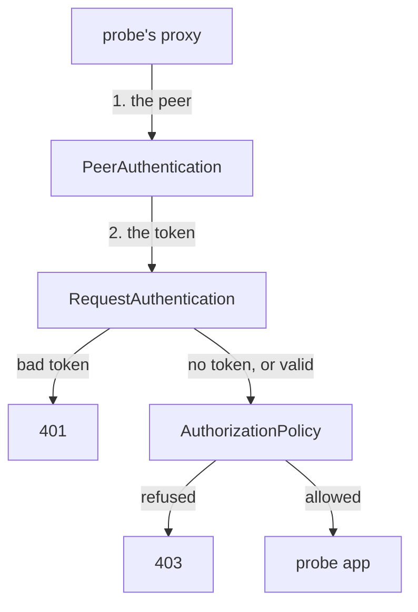

# Peer Identity And Request Identity

One request can say two different things about who is behind it: which workload sent it, and which end user it was sent for. Istio keeps these two apart, with different objects and field names that look alike. If you mix them up, you write a rule that never matches, and nothing tells you why.

This chapter separates the two identities. Then it decodes a real token to see what is inside, and shows where the proxy checks it and in which order.

## The workload and the end user

Take a user logged in to the `bridge` web frontend, which then sends a request to the `probe`. Two facts travel with that request. The workload that sends it is the `bridge`. The end user it is sent for is the logged-in user. Istio proves each fact in its own way.

The **peer identity** belongs to the workload. Workloads prove it with mTLS (mutual TLS): both sides present a certificate, so the connection is encrypted and both identities are verified. The **request identity** belongs to the end user. It travels inside the request as a token. The table puts the two side by side:

| | Peer identity (the workload) | Request identity (the end user) |
| --- | --- | --- |
| Proved by | a certificate, in the mTLS handshake | a JWT in the `Authorization` header |
| Issued by | `istiod`, automatically | an identity provider outside the mesh (a login service) |
| Checked by | `PeerAuthentication` | `RequestAuthentication` |
| Field in an `AuthorizationPolicy` | `principals` | `requestPrincipals` |
| Looks like | `cluster.local/ns/starfleet/sa/starfleet-bridge` | `<issuer>/<subject>` |
| Travels | one hop: each workload presents its own certificate | end to end: the token is passed on from workload to workload |

The last row explains why both exist. When the `bridge` calls the `scout`, the `scout` sees the **bridge's** certificate, not the user's. The token, in contrast, can be passed on, so a workload three hops away still knows which end user the work is for. Neither one can replace the other.

Because they answer different questions, one rule can ask for both. Both fields sit in the same `from.source` block of an `AuthorizationPolicy` rule, so one rule can require a certain workload **and** a valid end user. You do not apply this yet; just read it:

```yaml
      from:
      - source:
          principals: ["cluster.local/ns/starfleet/sa/starfleet-bridge"]
          requestPrincipals: ["*"]
```

`principals` is the workload's identity from its certificate. `requestPrincipals` is the end user's identity from the token. Mixing up these two fields is the most common reason a rule never matches.

## What is inside a token

The end user's identity lives inside the token, so it pays to know what a token holds. A JWT (JSON Web Token) is a signed token, written as text, that carries claims about the end user. What is inside decides everything the proxy does with it.

A JWT has three parts: `header.payload.signature`. Each part is written in base64url, a way to turn data into plain letters and numbers.

- The **header** says how the token was signed. Its `kid` (key ID) names the key that signed it.
- The **payload** holds the **claims**: the facts the token states. `iss` (issuer) is who made the token. `sub` (subject) is who the token is about. `exp` (expiry) is when it stops being valid. `aud` (audience) is who the token is meant for. A token can carry any other claim too, such as `groups`.
- The **signature** proves that the issuer made the token and that nobody changed it.

The issuer signs each token with a secret private key. It then publishes the matching public keys as a **JWKS** (JSON Web Key Set). Anyone can use the JWKS to verify a signature, but nobody can use it to create a new valid signature.

You can see this on Istio's sample token. The helpers you pasted when you launched the playground put it in `$TOKEN`; if the variable is empty, paste the helpers again.

<!-- astrona:playground:renew -->

Decode the middle part of the token, the payload:

```sh
echo "$TOKEN" | cut -d. -f2 | base64 -d 2>/dev/null; echo
```

```text
{"exp":4685989700,"foo":"bar","iat":1532389700,"iss":"testing@secure.istio.io","sub":"testing@secure.istio.io"}
```

No key was needed. Anyone who holds a token can read every claim in it, so a token never carries secrets. `base64 -d` may complain about missing padding at the end and still print the payload; the `2>/dev/null` hides that complaint. Note `iss` and `sub`: you need both later.

That simple decode leads to the two facts that matter most about tokens. First, the payload is encoded, not encrypted, so decoding it proves nothing: a fake token decodes just as well as a real one. Second, the signature is what makes the claims worth anything. When the proxy checks a token, it checks that a key from the issuer's JWKS signed it, and that it has not expired. That is the whole promise: *the issuer said this*.

## The probe is open today

Before you add anything, check the starting point. The `probe` has no security objects at all, so a token should change nothing, because nothing validates it. List the security objects in the namespace, then send 3 requests without a token and 3 with one:

```sh
kubectl get requestauthentication,authorizationpolicy -n starfleet
check_status $PROBE/headers
check_status -H "$AUTH $TOKEN" $PROBE/headers
```

```text
No resources found in starfleet namespace.
200 200 200 
200 200 200 
```

Both get `200`. Nothing validates the token, so sending one makes no difference. The rest of this module changes that, one object at a time.

## Where the token is checked

When the time comes, the token is checked by the sidecar proxy (Envoy) of the workload that **receives** the request, here the probe's sidecar. The sidecar proxy is a proxy container Istio adds to each pod; all inbound and outbound traffic of the pod passes through it. Inside that proxy, the checks run in a fixed order:



The diagram shows the order inside the probe's proxy. It first checks the peer (the mTLS handshake, set by `PeerAuthentication`), then the end user's token (`RequestAuthentication`), and then the authorization rules (`AuthorizationPolicy`). Only after all three does the request reach the app.

Three facts follow from that order, and they are the core of this module. The token check has no opinion about a missing token: its job is to validate tokens, and a request with no `Authorization` header has nothing to validate, so it moves on to the `AuthorizationPolicy`.

The other two facts are about who answers. `401` and `403` come from different steps: `RequestAuthentication` stops a bad token with `401`, and `AuthorizationPolicy` stops a refused request with `403`. And the token check hands its results on. When a token is valid, `RequestAuthentication` publishes the end user's identity and claims, and the `AuthorizationPolicy` reads them. Without a valid token, there is nothing to read.

You now know that a request carries two identities. A workload proves its identity with a certificate, one hop at a time; an end user proves their identity with a signed token that travels end to end. You have read the claims in a token and seen that the probe, with no objects in place, ignores tokens completely. The question still open is how to make the probe's proxy actually check one.

## Common pitfalls

> [!WARNING]
> - **Mixing up the two identities.** The workload's identity comes from its certificate, the end user's from a token. `principals` and `requestPrincipals` are different fields.
> - **Trusting a token because it decodes.** Anyone can decode a token, including a fake one. Only the signature check proves anything.
> - **Thinking the token is secret.** A JWT is signed, not encrypted. Every claim in it can be read by anyone who holds it.
> - **Expecting a missing token to be stopped by the token check.** It is not. A request with no token moves on, and only an `AuthorizationPolicy` can refuse it.
