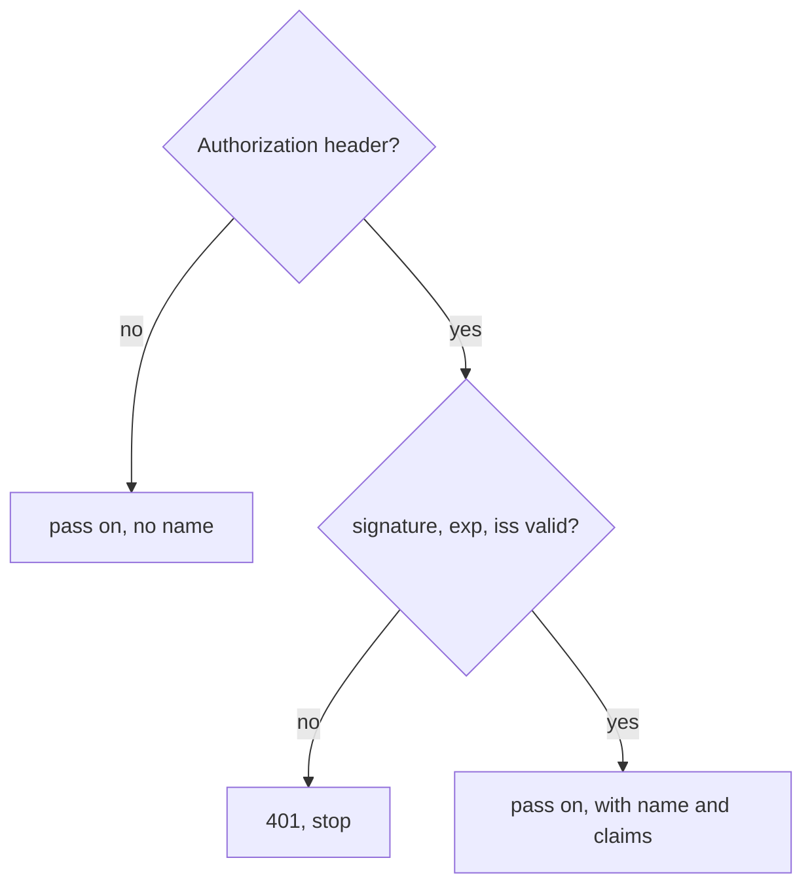
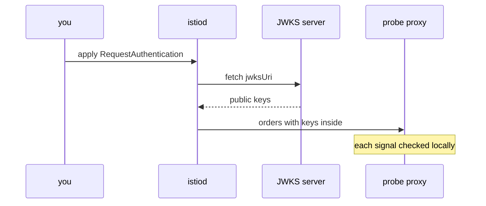

# Check The Token With RequestAuthentication

Astronaut, now you put a pass checker on the probe. A `RequestAuthentication` tells the probe's communications officer how to check a token: which issuer to trust, and where its public keys live. It is a short object, but it has one behaviour that surprises almost everyone. This part shows that behaviour first, then explains each field and where the keys come from.

## Turn on the token check

Start with a real example. You apply the object, send three kinds of signals, and see three different results.

### See it in your playground

These steps use `check_status`, `$TOKEN`, `$AUTH` and `$PROBE` from the helpers you pasted at the start of the module.

<!-- astrona:playground:renew -->

Save this as `requestauthentication-probe.yaml`:

```yaml
apiVersion: security.istio.io/v1
kind: RequestAuthentication
metadata:
  name: probe-jwt
  namespace: starfleet
spec:
  selector:
    matchLabels:
      app: probe
  jwtRules:
  - issuer: testing@secure.istio.io
    jwksUri: https://raw.githubusercontent.com/istio/istio/release-1.30/security/tools/jwt/samples/jwks.json
    forwardOriginalToken: true
```

Apply it:

```sh
kubectl apply -f requestauthentication-probe.yaml
```

Wait about a minute, then send 3 signals with no token, 3 with a broken token and 3 with the sample token:

```sh
check_status $PROBE/headers
check_status -H "$AUTH broken" $PROBE/headers
check_status -H "$AUTH $TOKEN" $PROBE/headers
```

```text
200 200 200 
401 401 401 
200 200 200 
```

Three kinds of signals, three results. The broken token gets `401`: the probe's communications officer checked it and found it false. That `401` also proves the keys arrived, because without keys the officer could not tell a true pass from a false one.

But look at the first line. The signal **without** a token still gets `200`. The probe is no safer than before: anyone who wants in just leaves the token out.

> [!TIP]
> Wait about a minute after every `kubectl apply` before you test a security change. The proxies keep old connections open for a while, and those still follow the old rules. If the three results of one `check_status` line differ, the change is still on its way. Run it again.

## Three outcomes of the check

With only a `RequestAuthentication` in place, the probe's communications officer does one of three things with each signal:



A signal with no token moves on with no name attached. A signal with a bad token is stopped with `401`. A signal with a good token moves on, and the proxy attaches the person's name (`iss/sub`) and claims for the next step to read.

The left branch is not a bug. **`RequestAuthentication` checks tokens; it does not require them.** Requiring a token is the job of the guard's list, the `AuthorizationPolicy`.

## What each field does

The object you applied has a `selector` and one entry in `jwtRules`. This section goes through them, because a wrong value here gives the same unhelpful `401` for every token.

### Which ships, and which issuers

`selector` picks the ships, exactly like other Istio security objects. With no `selector`, the object covers every ship in its namespace. In the root namespace (`istio-system`), it covers the whole mesh.

`jwtRules` is a list. A ship can trust tokens from several issuers, one entry each. The proxy picks the entry whose `issuer` matches the token's `iss` claim.

### The fields inside one rule

| Field | What it does |
| --- | --- |
| `issuer` | Must equal the token's `iss` claim **exactly**, letter for letter. `https://auth.example.com` and `https://auth.example.com/` are two different issuers |
| `jwksUri` | The address of the issuer's public keys (the JWKS) |
| `jwks` | The same keys pasted into the object instead of an address. Nothing is downloaded |
| `audiences` | The token's `aud` claim must contain one of these values. Without this field, `aud` is not checked at all |
| `forwardOriginalToken` | Keeps the `Authorization` header on the signal when it goes on to the app. Without it, the proxy removes the header after the check |
| `outputPayloadToHeader` | Writes the decoded claims into a header you name, so the app can read them without decoding the token |
| `fromHeaders`, `fromParams` | Read the token from another header or from a query parameter instead of `Authorization: Bearer` |

### See it in your playground

`forwardOriginalToken: true` is why the token reaches the probe app. Ask the probe which headers it received:

```sh
kubectl exec -n starfleet deploy/shuttle -- curl -s -H "$AUTH $TOKEN" $PROBE/headers
```

```text
{
  "headers": {
    "Accept": [
      "*/*"
    ],
    "Authorization": [
      "Bearer eyJhbGciOiJSUzI1NiIsImtpZCI6IkRIRmJwb0lVcXJZOHQyenBBMnFYZkNtcjVWTzVaRXI0UnpIVV8tZW52dlEiLCJ0eXAiOiJKV1QifQ...."
    ],
    "Host": [
      "probe:8000"
    ],
    "User-Agent": [
      "curl/8.11.1"
    ],
    "X-Envoy-Attempt-Count": [
      "1"
    ],
    "X-Forwarded-Client-Cert": [
      "By=spiffe://cluster.local/ns/starfleet/sa/probe;Hash=d549500743443238934963051fc09c5eec23cdfdc7a4712dadf38f17a0cb63cc;Subject=\"\";URI=spiffe://cluster.local/ns/starfleet/sa/shuttle"
    ],
    "X-Forwarded-Proto": [
      "http"
    ],
    "X-Request-Id": [
      "dff34d18-16a2-4f51-8cc8-f08aa4bb8303"
    ]
  }
}
```

We cut the long token after its first part and put `....` in its place.

The probe echoes the `Authorization` header, so the token reached the app. Without `forwardOriginalToken: true`, the probe's communications officer would check the token and then remove it, and the app would never see it.

## How the keys reach the proxy

The proxy needs the issuer's public keys to check a signature. It does not ask the issuer for every signal; that would make every signal depend on a server outside the mesh. Instead, the keys are fetched once and kept.

### Mission control fetches the keys



`istiod` (mission control) downloads the JWKS from `jwksUri` and puts the keys into the orders it sends to the probe's proxy. It downloads them again from time to time. Every signal is then checked inside the proxy, with no call outside the mesh.

### What follows from that

- **An unreachable `jwksUri` breaks every token, not one.** If `istiod` cannot download the keys, the proxy has nothing to check against, and every token gets `401`, including correct ones. The evidence is in the `istiod` log, not in the app's log.
- **The failure shows up after a clean apply.** `kubectl apply` accepts the object and `kubectl get` lists it. Only real signals show that the keys never arrived.
- **A new key at the issuer is used after the next download, not at once.** An issuer that swaps keys without publishing the old and new keys side by side for a while causes a burst of `401`s.

The `jwks` field avoids the download completely: the keys live in the object. The price is that you now must update them yourself when the issuer changes them.

## When every token gets 401

When even the correct token gets `401`, there are three usual causes. Check them in this order, because that is roughly how often each one happens:

1. **`issuer` does not match `iss` exactly.** A trailing slash, `http` against `https`, a value copied from documentation instead of from a real token. Decode a token and compare the two strings letter by letter. The body of the `401` then says `Jwt issuer is not configured`.
2. **The keys never arrived.** Check the `istiod` log for download errors, and check that the cluster can reach the address at all.
3. **The token really is bad.** It has expired, or a key that is not in the JWKS signed it.

The first two are mistakes in your configuration, but they look exactly like the third. That is why "the token must be wrong" is such a common wrong turn.

### See it in your playground

Read the issuer back out of the probe's proxy. This is the exact string the proxy compares with the token's `iss` claim:

```sh
istioctl proxy-config listener deploy/probe-v1 -n starfleet -o json \
  | grep -o '"envoy.filters.http.jwt_authn"\|"issuer": "[^"]*"\|"localJwks"' | sort | uniq -c
```

```text
   4 "envoy.filters.http.jwt_authn"
   4 "issuer": "testing@secure.istio.io"
   4 "localJwks"
```

The proxy has the token filter (`jwt_authn`), the exact issuer string, and `localJwks`: the keys that `istiod` downloaded and put inside the orders. Each line shows up more than once because the probe's proxy has several inbound filter chains, one for each kind of traffic it accepts. The counts do not matter; the three lines do. Now you compare two strings you can both see, instead of one you see and one you assume. If the `jwt_authn` filter is missing completely, the `selector` matched no pod.

## Common pitfalls

> [!WARNING]
> - **Expecting `RequestAuthentication` to require a token.** It only rejects *bad* tokens. A signal with no token gets through.
> - **An `issuer` that is almost right.** It must match `iss` letter for letter, trailing slash included. A mismatch gives `401` for every token, with an object that looks correct.
> - **A `jwksUri` that `istiod` cannot reach.** Every token fails with `401`. Look in the `istiod` log, not the app's log.
> - **Assuming `aud` is checked.** It is only checked when you list `audiences`. Otherwise a token made for another service is accepted.
> - **Expecting the app to see the token.** The proxy removes the `Authorization` header after the check unless `forwardOriginalToken` is `true`.

> *A `RequestAuthentication` is a pass checker: it checks every pass it is shown, and it never asks a signal to show one.*
