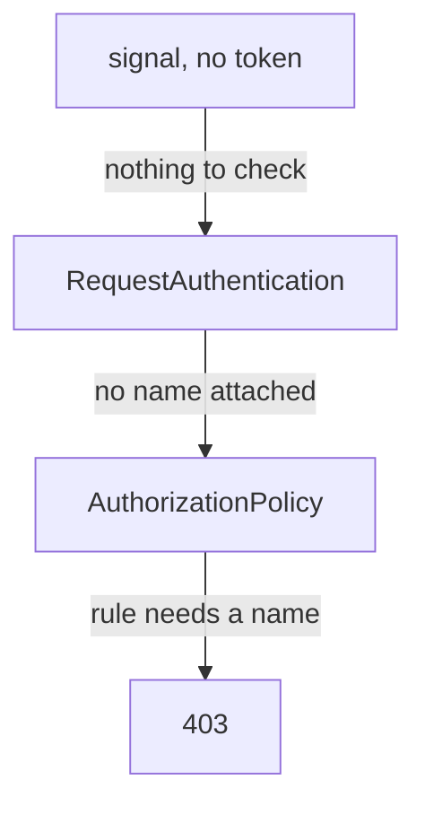

# Require A Token

Astronaut, the pass checker is on duty, but the probe is still open to anyone who simply shows no pass. This part closes that gap. The object that does it comes from authorization, not authentication: a guard's list. Then you make the two failure codes tell you which object to look at.

## Put a guard's list on the probe

"Every signal must carry a valid token" is a rule about who may come aboard, not about how a pass is checked. So Istio puts it where such rules live: in an `AuthorizationPolicy`.

### See it in your playground

These steps need the `probe-jwt` `RequestAuthentication` applied. It checks tokens from `testing@secure.istio.io` on the probe, and the steps use the helpers you pasted at the start of the module.

<!-- astrona:playground:renew -->

Save this as `authorizationpolicy-probe-require-jwt.yaml`:

```yaml
apiVersion: security.istio.io/v1
kind: AuthorizationPolicy
metadata:
  name: probe-require-jwt
  namespace: starfleet
spec:
  selector:
    matchLabels:
      app: probe
  action: ALLOW
  rules:
  - from:
    - source:
        requestPrincipals: ["*"]
```

Apply it:

```sh
kubectl apply -f authorizationpolicy-probe-require-jwt.yaml
```

Wait about a minute, then send the same three kinds of signals again:

```sh
check_status $PROBE/headers
check_status -H "$AUTH broken" $PROBE/headers
check_status -H "$AUTH $TOKEN" $PROBE/headers
```

```text
403 403 403 
401 401 401 
200 200 200 
```

Now the signal without a token gets `403`. The broken token still gets `401`, and the valid token still gets `200`. Two different failures, from two different steps, sent by two different objects.

## How the guard's list refuses a missing token

No new feature was needed to require a token. The result comes from two facts you already know, working together.

### The request principal

`requestPrincipals` matches the **request principal**: the person's name that `RequestAuthentication` attaches to a signal with a valid token. It is the token's `iss` claim, a slash, and its `sub` claim. The sample token has `testing@secure.istio.io` in both, so its request principal is:

```text
testing@secure.istio.io/testing@secure.istio.io
```

`["*"]` means "any request principal", which reads as *any valid token, whoever it belongs to*. You can also be stricter:

| Value | Lets in |
| --- | --- |
| `["*"]` | any valid token |
| `["testing@secure.istio.io/*"]` | any person with a token from this one issuer |
| `["testing@secure.istio.io/testing@secure.istio.io"]` | exactly this one person |

### Following one signal without a token



The probe's `RequestAuthentication` finds no token, so it attaches no name. The `AuthorizationPolicy` is an `ALLOW` policy on the probe, so only signals that match a rule may come aboard. The only rule needs a request principal, the signal has none, and the answer is `403`.

The requirement is the result of two things: an `ALLOW` policy refuses whatever no rule allows, and only a valid token can match this rule.

## 401 and 403 point at different objects

The two codes look alike, but each one points at a different object to fix. The response body names the step that refused the signal.

### See it in your playground

Send one signal without a token and one with a broken token, and read the answers:

```sh
kubectl exec -n starfleet deploy/shuttle -- curl -s $PROBE/headers; echo
kubectl exec -n starfleet deploy/shuttle -- curl -s -H "$AUTH broken" $PROBE/headers; echo
```

```text
RBAC: access denied
Jwt is not in the form of Header.Payload.Signature with two dots and 3 sections
```

`RBAC: access denied` comes from the guard's list. A message that starts with `Jwt` comes from the pass checker.

### What each code tells you

| Code and body | Sent by | It means | Look at |
| --- | --- | --- | --- |
| `401` with `Jwt ...` | `RequestAuthentication` | a token was there, but it is not valid. The signal never reached the guard's list | the token, the `issuer` string, the keys |
| `403` with `RBAC: access denied` | `AuthorizationPolicy` | the token was fine, or missing, and the rule said no | the `requestPrincipals` value, the `selector`, the policy |

Reading `403` as "the token must be wrong" is the classic wrong turn. It sends you editing `jwtRules` when the problem is in the policy.

Neither code is a **connection reset**. A reset (curl exit code 56, or status `000`) happens before any HTTP is read, during the ship-to-ship handshake. That points at mTLS settings, and no token work will change it.

## Apply things in the right order

Security mistakes do not show up as errors in a log. They lock people out. So add the two objects in an order that never refuses a signal you still need.

### Add the token check first

1. **First the `RequestAuthentication`.** It changes nothing for signals without a token, and good tokens still get in.
2. **Then the `AuthorizationPolicy` that requires a token.**

In the other order, the policy arrives first and no token is checked yet. No signal has a request principal, so **every** signal is refused with `403`, even ones with a perfectly good token.

To remove them, go the other way round: delete the policy that requires a token first, then the `RequestAuthentication`.

### Check your work

`istioctl analyze` runs Istio's own checks over the objects in a namespace. It catches typos and selectors that point at nothing before a signal does:

```sh
istioctl analyze -n starfleet
```

```text
✔ No validation issues found when analyzing namespace: starfleet.
```

A clean result means the objects are well formed and point at real ships. It does not prove that the right signals get in; only `check_status` proves that.

## Common pitfalls

> [!WARNING]
> - **Believing `RequestAuthentication` protects a ship.** Without a policy that needs `requestPrincipals`, signals without a token get `200`.
> - **Reading `403` as a token problem.** It is the opposite: the guard's list refused a signal that passed the token check, or had no token at all.
> - **Applying the policy before the `RequestAuthentication`.** No token is checked yet, so every signal is refused, even good ones.
> - **Mixing up `principals` and `requestPrincipals`.** One is the ship's certificate name, the other the person's token name. Both sit in `from.source`.
> - **Writing only the issuer in `requestPrincipals`.** The value is `<issuer>/<subject>`. `testing@secure.istio.io` on its own matches nobody; use `testing@secure.istio.io/*` for everyone from that issuer.

> *Requiring a token is not a feature of `RequestAuthentication`. It is an `ALLOW` policy with a rule that only a valid token can match.*

## Your mission: Require A Valid End-User Token

You can now check tokens on a ship, require one, and tell from `401` and `403` which object refused a signal. Now prove it in a graded mission: protect a notification service so that only signals with a valid token from the sample issuer get through, while the service next to it stays open.

This mission runs on its own small app (`notification-service`, `booking-service` and a `tester` client on the planet `jwt-demo`), not on the Starfleet. The objects you write are the same.

The mission runs in its own training solar system, so first pause your playground. Nothing in it is lost:

```sh
astrona stop ats-015-playground-030-01
```

Then start the mission:

```sh
astrona run --git git@github.com:astrona-io/ATS015.git -c sections/section-030/module-01/labs/lab-01
```

Read the task in [`question.md`](./labs/lab-01/question.md) and solve it on your own first. When you think you are done, send it for grading:

```sh
astrona submit -c sections/section-030/module-01/labs/lab-01
```

When the mission is done, remove it and wake your playground up again:

```sh
astrona destroy ats-015-lab-030-01
astrona start ats-015-playground-030-01
```
