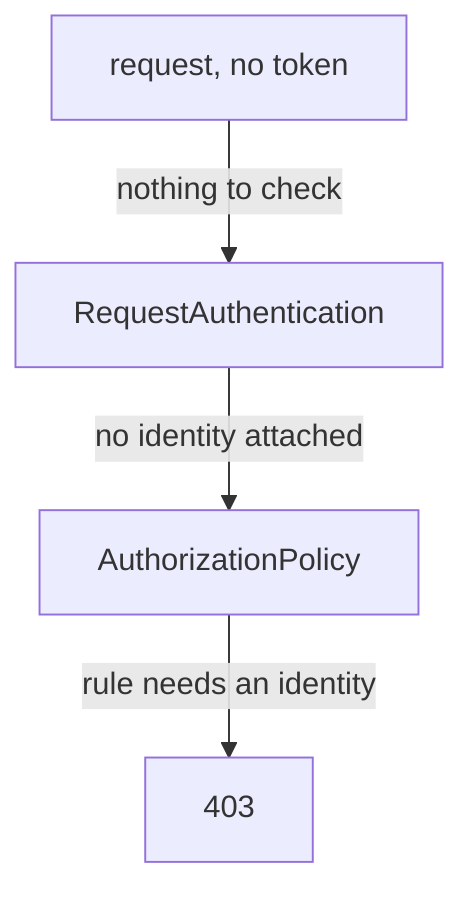

# Require A Token

The `RequestAuthentication` on the probe now validates tokens, but the probe is still open to any request that simply carries no token. On the exam, and in production, that gap is the difference between a protected service and an open one.

This chapter closes the gap. The object that does it comes from authorization, not authentication: an `AuthorizationPolicy`, which allows or denies requests to a workload. Then you use the two failure codes, `401` and `403`, to tell which object to look at, and you learn the order that keeps users from being locked out.

## Add an AuthorizationPolicy to the probe

"Every request must carry a valid token" is a rule about which requests are allowed, not about how a token is validated. So Istio puts it where such rules live: in an `AuthorizationPolicy`.

The steps below need the `probe-jwt` `RequestAuthentication` applied. It checks tokens from `testing@secure.istio.io` on the probe. The steps also use the helpers you pasted when you launched the playground.

<!-- astrona:playground:renew -->

Save this as `authorizationpolicy-probe-require-jwt.yaml`:

```yaml
apiVersion: security.istio.io/v1
kind: AuthorizationPolicy
metadata:
  name: probe-require-jwt
  namespace: starfleet
spec:
  selector:
    matchLabels:
      app: probe
  action: ALLOW
  rules:
  - from:
    - source:
        requestPrincipals: ["*"]
```

Apply it:

```sh
kubectl apply -f authorizationpolicy-probe-require-jwt.yaml
```

Wait about a minute, then send the same three kinds of requests again: no token, a broken token, and the sample token.

```sh
check_status $PROBE/headers
check_status -H "$AUTH broken" $PROBE/headers
check_status -H "$AUTH $TOKEN" $PROBE/headers
```

```text
403 403 403 
401 401 401 
200 200 200 
```

Now the request without a token gets `403`. The broken token still gets `401`, and the valid token still gets `200`. Two different failures, from two different steps, sent by two different objects.

## How the policy refuses a missing token

No new feature was needed to require a token. The result comes from two facts working together: what `requestPrincipals` matches, and how an `ALLOW` policy treats a request that matches nothing.

`requestPrincipals` matches the **request principal**: the end user's identity that `RequestAuthentication` attaches to a request with a valid token. It is the token's `iss` claim, a slash, and its `sub` claim. The sample token has `testing@secure.istio.io` in both, so its request principal is:

```text
testing@secure.istio.io/testing@secure.istio.io
```

`["*"]` means "any request principal", which reads as *any valid token, whoever it belongs to*. You can also be stricter:

| Value | Lets in |
| --- | --- |
| `["*"]` | any valid token |
| `["testing@secure.istio.io/*"]` | any end user with a token from this one issuer |
| `["testing@secure.istio.io/testing@secure.istio.io"]` | exactly this one end user |

Now follow one request without a token through the probe's proxy:



The diagram shows why the answer is `403`. The probe's `RequestAuthentication` finds no token, so it attaches no identity. The `AuthorizationPolicy` is an `ALLOW` policy on the probe, so only requests that match a rule are allowed. The only rule needs a request principal, and the request has none. So the requirement is really the result of two things: an `ALLOW` policy refuses whatever no rule allows, and only a valid token can match this rule.

## 401 and 403 point at different objects

The two codes look alike, but each one points at a different object to fix. The response body names the step that refused the request. Send one request without a token and one with a broken token, and read the answers:

```sh
kubectl exec -n starfleet deploy/shuttle -- curl -s $PROBE/headers; echo
kubectl exec -n starfleet deploy/shuttle -- curl -s -H "$AUTH broken" $PROBE/headers; echo
```

```text
RBAC: access denied
Jwt is not in the form of Header.Payload.Signature with two dots and 3 sections
```

`RBAC: access denied` comes from the `AuthorizationPolicy`. RBAC stands for role-based access control, Envoy's name for its authorization filter. A message that starts with `Jwt` comes from the `RequestAuthentication` check. The table sums up what each answer tells you:

| Code and body | Sent by | It means | Look at |
| --- | --- | --- | --- |
| `401` with `Jwt ...` | `RequestAuthentication` | a token was there, but it is not valid. The request never reached the `AuthorizationPolicy` | the token, the `issuer` string, the keys |
| `403` with `RBAC: access denied` | `AuthorizationPolicy` | the token was fine, or missing, and the rule said no | the `requestPrincipals` value, the `selector`, the policy |

Reading `403` as "the token must be wrong" is the classic wrong turn. It sends you editing `jwtRules` when the problem is in the policy.

There is also a third kind of failure, and it is neither code. A **connection reset** (curl exit code 56, or status `000`) happens before any HTTP is read, during the TLS handshake between the two proxies. That points at mTLS (mutual TLS) settings, and no token work will change it.

## Apply things in the right order

Security mistakes do not show up as errors in a log. They lock users out. So add the two objects in an order that never refuses a request you still need:

1. **First the `RequestAuthentication`.** It changes nothing for requests without a token, and good tokens still get in.
2. **Then the `AuthorizationPolicy` that requires a token.**

In the other order, the policy arrives first and no token is checked yet. No request has a request principal, so **every** request is refused with `403`, even ones with a perfectly good token. To remove them, go the other way round: delete the policy that requires a token first, then the `RequestAuthentication`.

Once both objects are in place, check them. `istioctl analyze` runs Istio's own checks over the objects in a namespace. It catches typos and selectors that point at nothing before a request does:

```sh
istioctl analyze -n starfleet
```

```text
✔ No validation issues found when analyzing namespace: starfleet.
```

A clean result means the objects are well formed and point at real workloads. It does not prove that the right requests get in; only `check_status` proves that.

You can now require a token on a workload. Requiring a token is not a feature of `RequestAuthentication`: it is an `ALLOW` policy with a rule that only a valid token can match. A `401` sends you to the token check, a `403` sends you to the policy, and the safe order is token check first, policy second. One thing is still fixed: the proxy reads the token only from the `Authorization` header, and the requirement is written only as `ALLOW`.

## Common pitfalls

> [!WARNING]
> - **Believing `RequestAuthentication` protects a workload.** Without a policy that needs `requestPrincipals`, requests without a token get `200`.
> - **Reading `403` as a token problem.** It is the opposite: the `AuthorizationPolicy` refused a request that passed the token check, or had no token at all.
> - **Applying the policy before the `RequestAuthentication`.** No token is checked yet, so every request is refused, even ones with a valid token.
> - **Mixing up `principals` and `requestPrincipals`.** One is the workload's identity from its certificate, the other the end user's identity from the token. Both sit in `from.source`.
> - **Writing only the issuer in `requestPrincipals`.** The value is `<issuer>/<subject>`. `testing@secure.istio.io` on its own matches nobody; use `testing@secure.istio.io/*` for everyone from that issuer.
