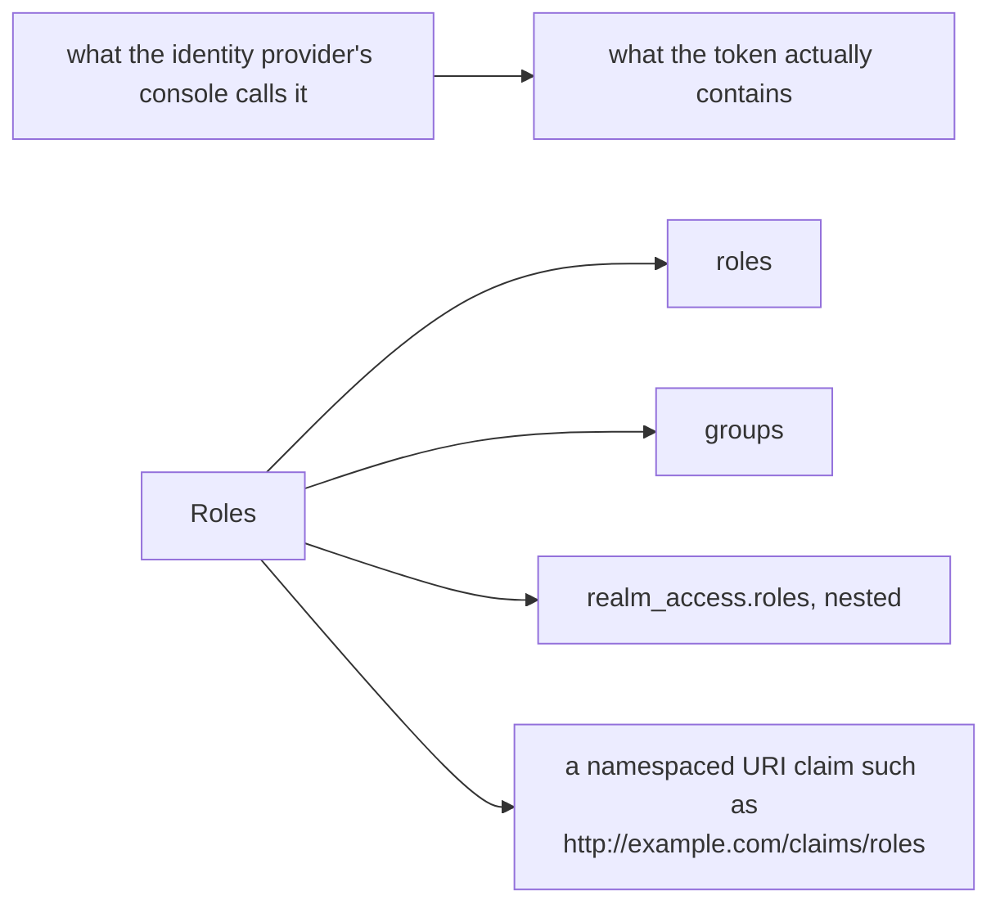

# Part 1 — Claims as request attributes

> Prerequisite: [the module landing page](./course.md). Next: [Part 2 — `when` conditions and how they match](./course-02-when-conditions.md).

A token's contents do not reach an authorization rule by magic. The `jwt_authn` filter decodes a validated token and publishes its claims as **request attributes**, which the RBAC filter one stage later can read. This part is about what gets published, what it is called, and why reading a real token first is not optional.

## The hand-off

From [Module 1](../module-01/course-01-two-identities-and-the-filter.md), stages 3 and 4 of the pipeline, with the data between them made explicit:

```text
   stage 3: jwt_authn
        validates signature, exp, iss
        │
        ├── publishes ──▶  request.auth.principal    "<iss>/<sub>"
        │                  request.auth.audiences    the aud claim
        │                  request.auth.presenter    the azp claim, if present
        │                  request.auth.claims[...]  every claim in the payload
        ▼
   stage 4: rbac
        from.source.requestPrincipals   ← matches request.auth.principal
        when: key: request.auth.claims[groups]  ← matches a claim
```

Two things follow from the arrow's direction.

**No validation, no attributes.** If no `RequestAuthentication` selects this workload, stage 3 publishes nothing, and every `request.auth.*` attribute is absent — not empty, absent. A rule depending on one cannot match. That is why the playground applies the `RequestAuthentication` as a precondition, and why a claim rule on a workload with no `RequestAuthentication` denies everything while looking perfectly correct.

**The attributes are per request, not per connection.** Peer identity was extracted once during the handshake and applies to every request on that connection. Token attributes are recomputed for each request, because each request carries its own header. Two requests on one connection can legitimately be two different users.

## The attribute names

| Attribute | Contains | Typical use |
| --- | --- | --- |
| `request.auth.principal` | `<issuer>/<subject>` | the same value `requestPrincipals` matches |
| `request.auth.audiences` | the `aud` claim | confirming the token was minted for this service |
| `request.auth.presenter` | the `azp` claim | which client application obtained the token |
| `request.auth.claims[<name>]` | any claim in the payload | roles, groups, scopes, tenant, email |

`request.auth.claims[groups]` reaches the `groups` claim; `request.auth.claims[email]` reaches `email`. Nested claims use a chained form in recent Istio versions:

```yaml
        - key: request.auth.claims[realm_access][roles]
          values: ["admin"]
```

which reads `{"realm_access": {"roles": ["admin", "user"]}}` — a shape common enough (Keycloak emits exactly that) to be worth recognising.

Note the two spellings that are not interchangeable: `request.auth.principal` is an attribute used in a `when` key, while `requestPrincipals` is a field in `from.source`. They match the same value by different routes, and mixing up which context takes which name is a routine source of rejected YAML.

## Decode before you write

Every rule in this module is a string comparison against a value some other system produced. The single most common failure is not a syntax error but a **claim name that does not exist in the token** — because it was taken from an identity provider's admin console rather than from the token itself.

Providers differ, and they differ in ways the UI hides:



The label in a vendor's UI is not the claim name. Decode a real token and read the payload before writing a rule against it — this one mismatch accounts for most claim rules that silently never match.

Decoding one real token settles all of it, costs one command, and needs no key — a JWT payload is base64url-encoded JSON, as [Module 1](../module-01/course-01-two-identities-and-the-filter.md) established.

> [!TIP]
> **Try it — fetch two tokens and read what is inside them**
>
> ```sh
> export TOKEN=$(curl -s https://raw.githubusercontent.com/istio/istio/release-1.30/security/tools/jwt/samples/demo.jwt)
> export TOKEN_GROUP=$(curl -s https://raw.githubusercontent.com/istio/istio/release-1.30/security/tools/jwt/samples/groups-scope.jwt)
>
> echo "$TOKEN"       | cut -d. -f2 | base64 -d 2>/dev/null; echo
> echo "$TOKEN_GROUP" | cut -d. -f2 | base64 -d 2>/dev/null; echo
> ```
>
> Expect something like:
>
> ```text
> {"exp":4685989700,"foo":"bar","iat":1532389700,"iss":"testing@secure.istio.io","sub":"testing@secure.istio.io"}
> {"exp":3537391104,"groups":["group1","group2"],"iat":1537391104,"iss":"testing@secure.istio.io","scope":["scope1","scope2"],"sub":"testing@secure.istio.io"}
> ```
>
> Read the difference carefully, because the rest of the module depends on it. Both tokens share the same `iss` and `sub`, so both produce the **same request principal** — `requestPrincipals` cannot tell them apart. The second has `groups` and `scope`; the first has neither. The *claims* are the only thing distinguishing these two users, which is exactly the situation claim-based rules exist for.

Note also `foo: "bar"` in the first token. Claims are not a fixed vocabulary: an issuer can put anything in the payload, and `request.auth.claims[foo]` would match it. The registered claims (`iss`, `sub`, `aud`, `exp`, `iat`) are the ones with defined meaning; everything else is a convention between the issuer and whoever reads it.

## What a claim is and is not

A claim is **an assertion by the issuer, checked by signature**. Istio verifies that the issuer said it. Whether the issuer should have said it — whether this user really belongs in `group1` — is the identity provider's problem.

That boundary is worth being precise about, because it decides what these rules can be trusted for:

- A claim is as trustworthy as the issuer and the key set. Trusting an issuer means trusting every claim it emits.
- A claim is a snapshot at issue time. Revoking a group membership does not invalidate tokens already issued; they keep asserting it until they expire. Short token lifetimes are the mitigation, and they are the issuer's setting, not Istio's.
- A claim is visible to anyone holding the token, so it can carry an assertion and never a secret.

> *Stage 3 publishes `request.auth.*` and stage 4 reads it — so a claim rule on a workload with no `RequestAuthentication` matches nothing, and a claim name guessed from a console usually matches nothing either.*

## Common pitfalls

> [!WARNING]
> **Writing the claim name from the provider's console.** Decode an actual token; the displayed label and the JSON key are frequently different.
>
> **Assuming a nested claim can be addressed directly.** A claim inside an object needs the nested syntax, and getting it wrong compiles fine and matches nothing.
>
> **Forgetting `request.auth.principal` is `<iss>/<sub>`.** Matching it against a bare subject never works.
>
> **Expecting attributes when no token was sent.** Nothing is published, so every claim rule simply fails to match.

## Reference

- [Authorization policy conditions](https://istio.io/latest/docs/reference/config/security/conditions/) — the full list of `when` keys, including every `request.auth.*` attribute.
- [RFC 7519 §4 — JWT claims](https://datatracker.ietf.org/doc/html/rfc7519#section-4) — the registered claims and what they mean.
- [Envoy JWT authentication filter](https://www.envoyproxy.io/docs/envoy/latest/configuration/http/http_filters/jwt_authn_filter) — how the filter makes a validated payload available to later filters.
