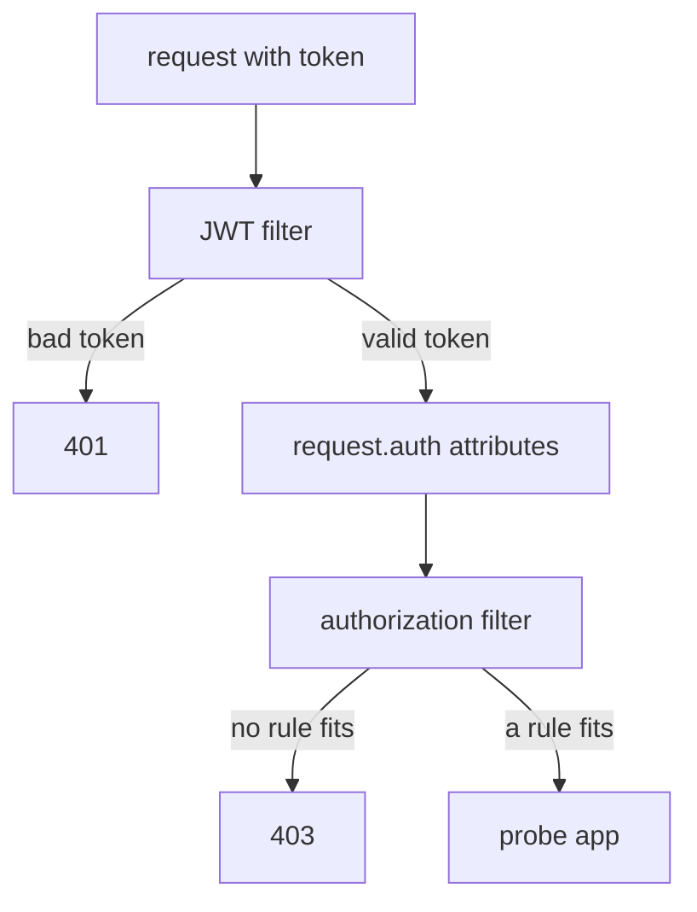

# Read What The Token Says

A claim rule compares text in a token with text in a policy. If the two do not match exactly, the rule fails, and nothing tells you why. So before you write any claim rule, you need to know two things: how the claims travel from the token to the policy, and what the claims in a real token are really called.

The claims do not reach your rules by magic. Two filters inside the probe's sidecar proxy (Envoy) pass them along, one after the other. This chapter shows what the first filter hands to the second, what each fact is called, and why you always read a real token before you write a rule.

## The hand-off between two filters

The sidecar proxy runs a chain of filters on every request. A filter is one step in that chain that looks at the request and can act on it. Two filters matter here, and they do different jobs.

The **JWT filter** (`jwt_authn`) validates the token, and the `RequestAuthentication` sets its configuration. It checks the token's signature, its issuer (`iss`) and its expiry time (`exp`). A bad token gets `401` right here. The **authorization filter** (`rbac`) comes next and allows or denies the request, and the `AuthorizationPolicy` sets its rules. It reads what the JWT filter left behind and answers `403` when no rule fits.



The diagram shows the order: the JWT filter checks the token and writes its facts into `request.auth` attributes, and the authorization filter reads those attributes and decides.

Two facts follow from this order. First, no check means no attributes. If no `RequestAuthentication` selects the workload, the JWT filter writes nothing, so every `request.auth` attribute is missing, not empty. A rule that needs one can never fit, which is why the playground already has the `probe-jwt` `RequestAuthentication` on the probe.

Second, the attributes belong to one request. Each request carries its own token, so the JWT filter builds the attributes again for every request. Two requests on the same connection can come from two different users.

## The attribute names

Now that you know who writes the attributes, you need their names. The JWT filter publishes four kinds of attributes:

| Attribute | Holds | Typical use |
| --- | --- | --- |
| `request.auth.principal` | `<iss>/<sub>`, the issuer and the subject | the same value `requestPrincipals` matches |
| `request.auth.audiences` | the `aud` claim | checking the token was made for this service |
| `request.auth.presenter` | the `azp` claim | which client app got the token |
| `request.auth.claims[<name>]` | any claim in the token | groups, scopes, roles, email |

So `request.auth.claims[groups]` reads the `groups` claim, and `request.auth.claims[email]` reads `email`. A claim inside another object uses one bracket per level. For example, `request.auth.claims[realm_access][roles]` reads `{"realm_access": {"roles": ["admin"]}}`, where some identity providers put a user's roles.

You use these names in two different places in an `AuthorizationPolicy`, and the spelling is not the same in both. `request.auth.principal` is a **key** you use in a `when` condition. `requestPrincipals` is a **field** under `from.source`. Both match the same `<iss>/<sub>` value, but each one only works in its own place, and swapping them gives YAML that Istio rejects.

## Decode a real token first

Every claim rule is a text comparison against something another system wrote. That is why the most common mistake is not a syntax error. It is a claim name that is not in the token, because someone copied it from an identity provider's administration screen instead of from the token itself.

The cure is to read the token. A JWT has three parts joined by dots: `header.payload.signature`. The middle part, the **payload**, holds the claims. It is written in base64, a way to turn data into plain letters and numbers, so you can decode it without any key.

<!-- astrona:playground:renew -->

If your terminal is new, paste the helpers first. They download the two sample tokens:

```sh
SAMPLES_URL=https://raw.githubusercontent.com/istio/istio/release-1.30/security/tools/jwt/samples
TOKEN=$(curl -s $SAMPLES_URL/demo.jwt)
GROUPS_TOKEN=$(curl -s $SAMPLES_URL/groups-scope.jwt)
AUTH="Authorization: Bearer"
PROBE=http://probe:8000
check_status() { for i in 1 2 3; do
  kubectl exec -n starfleet deploy/shuttle -- curl -s -o /dev/null -w "%{http_code} " "$@"
done; echo; }
```

Now cut out the payload of each token and decode it:

```sh
echo "$TOKEN"        | cut -d. -f2 | base64 -d 2>/dev/null; echo
echo "$GROUPS_TOKEN" | cut -d. -f2 | base64 -d 2>/dev/null; echo
```

```text
{"exp":4685989700,"foo":"bar","iat":1532389700,"iss":"testing@secure.istio.io","sub":"testing@secure.istio.io"}
{"exp":3537391104,"groups":["group1","group2"],"iat":1537391104,"iss":"testing@secure.istio.io","scope":["scope1","scope2"],"sub":"testing@secure.istio.io"}
```

Read the two lines side by side. Both tokens have the same `iss` and the same `sub`, so both give the **same principal**, and `requestPrincipals` cannot tell them apart. Only the second one has `groups` and `scope`, and only the first has `foo`. The claims are the only thing that sets these two users apart, and that is exactly the job of claim rules.

The claim `foo: bar` also shows that claims are not a fixed list. An issuer can put anything in the payload, and `request.auth.claims[foo]` would match it. Only a few claims, such as `iss`, `sub`, `aud`, `exp` and `iat`, have a meaning set by the JWT standard.

Decoding shows what the token says. The next question is whether the token really reaches the probe. The `probe-jwt` `RequestAuthentication` keeps the token in the request (`forwardOriginalToken: true`), so the probe can echo it back. Send a request with the groups token and look at the headers the probe received:

```sh
kubectl exec -n starfleet deploy/shuttle -- curl -s -H "$AUTH $GROUPS_TOKEN" $PROBE/headers
```

```text
{
  "headers": {
    "Accept": [
      "*/*"
    ],
    "Authorization": [
      "Bearer eyJhbGciOiJSUzI1NiIsImtpZCI6IkRIRmJwb0lVcXJZOHQyenBBMnFYZkNtcjVWTzVaRXI0UnpIVV8tZW52dlEiLCJ0eXAiOiJKV1QifQ.eyJleHAiOjM1MzczOTExMDQsImdyb3Vwcy..."
    ],
    "Host": [
      "probe:8000"
    ],
    "User-Agent": [
      "curl/8.11.1"
    ],
    "X-Envoy-Attempt-Count": [
      "1"
    ],
    "X-Forwarded-Client-Cert": [
      "By=spiffe://cluster.local/ns/starfleet/sa/probe;Hash=2553c2fb5b9240b6265e16479024066edadb74afe2d9f22c3cd440b727ebcab6;Subject=\"\";URI=spiffe://cluster.local/ns/starfleet/sa/shuttle"
    ],
    "X-Forwarded-Proto": [
      "http"
    ],
    "X-Request-Id": [
      "90feaef5-1441-9a1c-923b-d84cec8e8230"
    ]
  }
}
```

We cut the token short (`...`); on your screen it is much longer.

The token reached the probe, and the request got through. There is no `AuthorizationPolicy` yet, so nothing reads the claims. The probe's sidecar proxy lets in every valid token, and even a request with no token at all.

## What a claim proves

Before you build rules on claims, it helps to know how far you can trust them. A claim is a statement by the issuer, protected by its signature. The JWT filter checks that the issuer really said it. Whether the issuer **should** have said it is a different question.

So a claim is only as trustworthy as the issuer and its keys. Trusting an issuer means trusting every claim it signs. A claim is also a snapshot from the moment the issuer made the token. If someone leaves `group1` today, tokens made yesterday still say `group1` until they expire. Short token lifetimes fix that, and they are the issuer's setting, not Istio's.

Finally, anyone who holds a token can read its claims, as you just did with one command. A claim can carry a fact, but never a secret.

You now know how claims travel: the JWT filter checks the token and publishes its claims as `request.auth` attributes, and the authorization filter reads them. You have also read the real claims in both sample tokens. What you have not done yet is write a rule that uses one of them.

## Common pitfalls

> [!WARNING]
> - **Copying a claim name from the identity provider's screen.** Decode a real token. The label on the screen and the name in the token are often different.
> - **Writing a nested claim as one name.** A claim inside an object needs one bracket per level, such as `[realm_access][roles]`. The wrong form is accepted and never matches.
> - **Matching `request.auth.principal` against the subject alone.** The value is `<iss>/<sub>`, both parts with a slash between them.
> - **Expecting attributes when no token was sent, or when no `RequestAuthentication` selects the workload.** Nothing is published, so no claim rule can fit.
