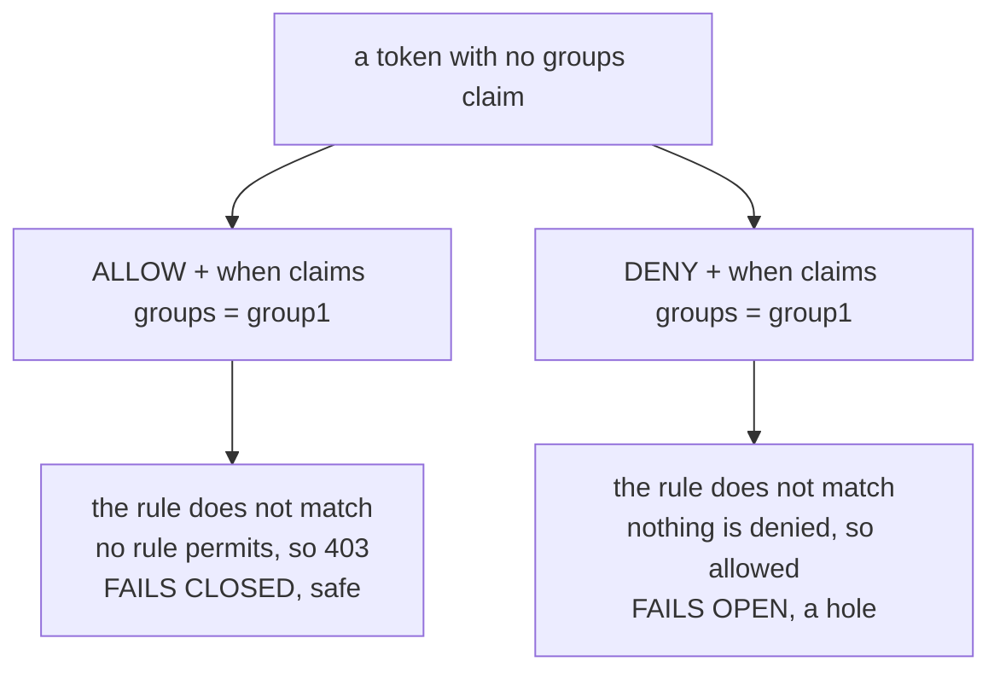

# Part 2 — `when` conditions and how they match

> Prerequisite: [Part 1 — Claims as request attributes](./course-01-claims-as-attributes.md). Next: [Part 3 — Designing and debugging claim rules](./course-03-designing-and-debugging.md).

The syntax is four lines. The behaviour has four rules, one of which — what happens when a claim is simply absent — changes meaning depending on the policy's action and is the difference between a safe rule and a hole.

## The block

```yaml
      when:
        - key: request.auth.claims[groups]
          values: ["group1"]
```

A `when` entry takes a `key` — one of the attributes from [Part 1](./course-01-claims-as-attributes.md) — and either `values` or `notValues`. That is the whole schema.

## Four combination rules

The first three are the same algebra as the rest of `AuthorizationPolicy` from [section 020](../../section-020/module-01/course-03-rule-anatomy.md); the fourth is specific to claims:

```text
   values inside one entry        OR     values: ["group1","group2"]
                                         → a token in either matches

   multiple when entries         AND     two entries
                                         → both must hold

   when + from + to              AND     a when is one part of a rule
                                         → all present parts must hold

   a LIST claim                   OR     groups: ["group1","group2"] in the token
                                         vs values: ["group1"] in the rule
                                         → matches if ANY element matches
```

That last one is where people reach for syntax that does not exist. There is no `contains`, no list operator, no special bracket form. `values: ["group1"]` against a token whose `groups` is a list already means "does any element equal `group1`". A single-valued claim and a list claim are written identically in the rule; the difference is entirely in the token.

Combining the first and fourth gives the behaviour worth stating explicitly: `values: ["group1","group2"]` against `groups: ["group2","group3"]` matches, because *some* value in the rule equals *some* element in the claim. It is an intersection test, not a subset test. Expressing "must be in both groups" needs two `when` entries, because entries are ANDed.

## A missing claim never matches

If the token has no `groups` claim at all, a condition on `request.auth.claims[groups]` does not match. Not "matches vacuously", not "is skipped" — it does not match, so the rule containing it does not apply.

The consequence depends entirely on the action, and it is worth writing out because the two are opposites:



The same missing claim produces opposite outcomes depending on the action. That asymmetry is the argument for expressing requirements as ALLOW rules wherever you can.

Under `ALLOW`, a user with a missing claim is refused, which is almost always what you want. Under `DENY`, the same user sails through — and the tokens most likely to be missing a claim are the odd ones: a service account token from a different issuer, a legacy token minted before the claim existed, a token from a provider misconfiguration. Exactly the population a `DENY` was probably written to catch.

This is a concrete reason to prefer the `ALLOW` shape for claim-based rules, over and above [Module 2 of section 020](../../section-020/module-02/course-03-audit-and-design.md)'s general argument.

## `when` does not require a token

A `when` condition is evaluated against whatever attributes the request has. It is not a statement that a token must exist.

Work it through: a request with no `Authorization` header reaches stage 4 with no `request.auth.*` attributes at all. A `when` on a claim does not match, so that rule does not apply. If some *other* rule in the policy matches — one without a `when` — the request is allowed, tokenless.

So a claim rule intended as "an admin may do this" can, written carelessly, be satisfied by a request that presented no credentials whatsoever. The fix is to put `requestPrincipals: ["*"]` in the same rule's `from.source`, making a valid token part of what the rule requires:

```yaml
    - from:
        - source:
            requestPrincipals: ["*"]      # a valid token must exist
      to:
        - operation:
            methods: ["GET"]
            paths: ["/admin"]
      when:
        - key: request.auth.claims[groups]
          values: ["group1"]              # and it must say this
```

Read as one sentence: *allow a request that carries a valid token, is a GET to `/admin`, and whose token says `groups` includes `group1`*. All three parts, ANDed.

## Two tokens, one endpoint

The playground has exactly the pair needed to see a claim condition decide something: two tokens, same principal, different claims.

> [!TIP]
> **Try it — the same endpoint, two tokens, two answers**
>
> ```sh
> kubectl apply -f - <<'YAML'
> apiVersion: security.istio.io/v1
> kind: AuthorizationPolicy
> metadata:
>   name: jwt-claims
>   namespace: jwtclaims-demo
> spec:
>   selector:
>     matchLabels:
>       app: notification-service
>   action: ALLOW
>   rules:
>     - from:
>         - source:
>             requestPrincipals: ["*"]
>       to:
>         - operation:
>             methods: ["POST"]
>             paths: ["/notify"]
>     - from:
>         - source:
>             requestPrincipals: ["*"]
>       to:
>         - operation:
>             methods: ["GET"]
>             paths: ["/admin"]
>       when:
>         - key: request.auth.claims[groups]
>           values: ["group1"]
> YAML
>
> kubectl -n jwtclaims-demo exec deploy/tester -- sh -c \
>   "curl -s -o /dev/null -w 'no token  /notify: %{http_code}\n' -X POST http://notification-service/notify;
>    curl -s -o /dev/null -w 'plain     /notify: %{http_code}\n' -H 'Authorization: Bearer $TOKEN' -X POST http://notification-service/notify;
>    curl -s -o /dev/null -w 'plain     /admin:  %{http_code}\n' -H 'Authorization: Bearer $TOKEN' http://notification-service/admin;
>    curl -s -o /dev/null -w 'group1    /admin:  %{http_code}\n' -H 'Authorization: Bearer $TOKEN_GROUP' http://notification-service/admin"
> ```
>
> Expect something like:
>
> ```text
> no token  /notify: 403
> plain     /notify: 200
> plain     /admin:  403
> group1    /admin:  404
> ```
>
> Read the last two together. The plain token is refused at `/admin` because its payload has no `groups` claim, so the second rule's `when` cannot hold — failing closed, exactly as above. The group token is *allowed* through, and then gets `404`, because `notification-service` has no `/admin` handler to serve. `404` is the application answering; `403` is the mesh refusing. **Any status other than `403` means authorization let the request past.**

The `$TOKEN` variables expand in your shell before `kubectl` runs, which is why the inner command is in double quotes here. In single quotes they reach the pod as literal text and every call looks like a bad token — a `401` that sends you hunting for a configuration problem that does not exist.

> *A `when` condition is one ANDed part of a rule, a list claim matches on any element, and a missing claim fails closed under `ALLOW` and open under `DENY`.*

## Common pitfalls

> [!WARNING]
> **Putting a requirement in a DENY and assuming it is enforced.** A missing claim makes the DENY not match, which allows the request.
>
> **Reading multiple `when` entries as OR.** Entries are ANDed; only the values inside one entry are ORed.
>
> **Forgetting a list claim matches on any element.** One overlapping value is enough.
>
> **Testing only with a well-formed token.** The token that breaks your policy is the one missing the claim.

## Reference

- [Authorization policy conditions](https://istio.io/latest/docs/reference/config/security/conditions/) — every valid `key`, and the `values` / `notValues` semantics.
- [AuthorizationPolicy `Condition`](https://istio.io/latest/docs/reference/config/security/authorization-policy/#Condition) — the field definitions for a `when` entry.
- [JWT claim-based routing and authorization](https://istio.io/latest/docs/tasks/security/authorization/authz-jwt/) — Istio's own examples, including list claims.
