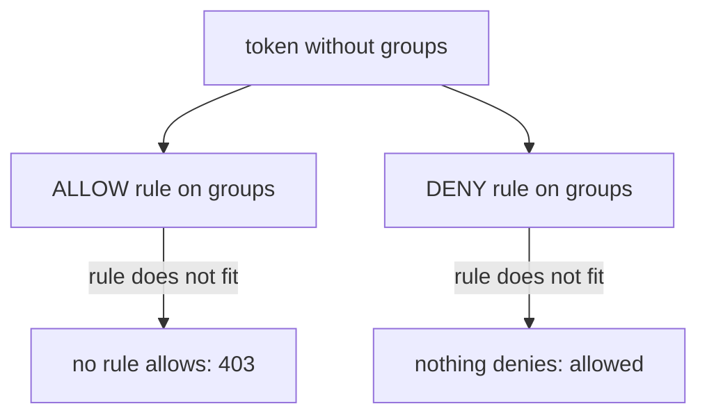

# One Rule Per Role

Real services rarely have one kind of user. A health page should be open to anyone, normal paths need any valid token, and an administrator path needs one group. In this part you build all three into one policy, and you see why a missing claim is safe under `ALLOW` and dangerous under `DENY`.

## One public path

Start with the smallest version: one path anyone may read, and a token required everywhere else.

### Two rules mean OR

Rules in one `ALLOW` policy are combined with OR. A request is allowed if **any** rule fits. So "public path, or valid token" is two rules.

<!-- astrona:playground:renew -->

If your terminal is new, paste the helpers first:

```sh
SAMPLES_URL=https://raw.githubusercontent.com/istio/istio/release-1.30/security/tools/jwt/samples
TOKEN=$(curl -s $SAMPLES_URL/demo.jwt)
GROUPS_TOKEN=$(curl -s $SAMPLES_URL/groups-scope.jwt)
AUTH="Authorization: Bearer"
PROBE=http://probe:8000
check_status() { for i in 1 2 3; do
  kubectl exec -n starfleet deploy/shuttle -- curl -s -o /dev/null -w "%{http_code} " "$@"
done; echo; }
```

Save this as `authorizationpolicy-probe-require-jwt.yaml`:

```yaml
apiVersion: security.istio.io/v1
kind: AuthorizationPolicy
metadata:
  name: probe-require-jwt
  namespace: starfleet
spec:
  selector:
    matchLabels:
      app: probe
  action: ALLOW
  rules:
  - to:
    - operation:
        paths: ["/headers"]
  - from:
    - source:
        requestPrincipals: ["*"]
```

Apply it:

```sh
kubectl apply -f authorizationpolicy-probe-require-jwt.yaml
```

Wait about a minute, then check the result: the public path with no token, another path with no token, and that path with a token:

```sh
check_status $PROBE/headers
check_status $PROBE/get
check_status -H "$AUTH $TOKEN" $PROBE/get
```

```text
200 200 200 
403 403 403 
200 200 200 
```

Rule 1 has no `from`, so it fits any caller on `/headers`, with or without a token. Rule 2 fits any request with a valid token, on any path. This is the usual shape for health checks or a public landing page.

The order of the rules does not matter: OR has no order. If you put `requestPrincipals` **inside** rule 1, it would mean "`/headers` **and** a token", and the path would stop being public.

## A whole access model in one policy

Now add a third role: an administrator path that only `group1` may reach. Each rule is one complete sentence about one role. Read top to bottom, the policy is the probe's whole access model in one object.

### Write the three roles

```text
   rule 1   anyone                     → /headers
   rule 2   any valid token            → GET /get
   rule 3   token with group1          → /anything/admin
```

Save this as `authorizationpolicy-probe-require-jwt.yaml` (it replaces the two-rule version):

```yaml
apiVersion: security.istio.io/v1
kind: AuthorizationPolicy
metadata:
  name: probe-require-jwt
  namespace: starfleet
spec:
  selector:
    matchLabels:
      app: probe
  action: ALLOW
  rules:
  - to:
    - operation:
        paths: ["/headers"]
  - from:
    - source:
        requestPrincipals: ["*"]
    to:
    - operation:
        methods: ["GET"]
        paths: ["/get"]
  - from:
    - source:
        requestPrincipals: ["*"]
    to:
    - operation:
        paths: ["/anything/admin"]
    when:
    - key: request.auth.claims[groups]
      values: ["group1"]
```

Apply it:

```sh
kubectl apply -f authorizationpolicy-probe-require-jwt.yaml
```

Wait about a minute, then check the administrator path with no token, the demo token and the groups token:

```sh
check_status $PROBE/anything/admin
check_status -H "$AUTH $TOKEN" $PROBE/anything/admin
check_status -H "$AUTH $GROUPS_TOKEN" $PROBE/anything/admin
```

```text
403 403 403 
403 403 403 
200 200 200 
```

Only the groups token reaches the administrator path. The demo token still reaches `/get`, because rule 2 fits it.

### Why the claim rule also has `requestPrincipals`

A request with no token has no claims, so the `when` in rule 3 already refuses it. Adding `requestPrincipals: ["*"]` makes that requirement written down, not only implied. Anyone reading rule 3 sees "a valid token, and it must say `group1`". It also stays true if someone later edits the `when` block. Istio's own examples pair the two in the same way.

One policy per workload, with one rule per role, is easier to check than one policy per role. With several policies, you must first find every policy whose `selector` matches the probe before you can answer "who can reach `/anything/admin`?".

## A missing claim under ALLOW and DENY

If a token has no `groups` claim, a condition on `request.auth.claims[groups]` does not fit. It is not skipped, and it does not fit by default. The effect depends on the action, and the two results are opposites.

### Fails closed, fails open



The same missing claim gives opposite results. Under `ALLOW` the request is refused, which is safe. Under `DENY` it passes, which is a hole.

That is why you write requirements as `ALLOW` rules. The tokens most likely to miss a claim are the odd ones: a token from another issuer, an old token from before the claim existed, a token from a badly set-up provider. Those are exactly the tokens a `DENY` was meant to stop.

Clean up before you go on:

```sh
kubectl delete authorizationpolicy probe-require-jwt -n starfleet
```

## Common pitfalls

> [!WARNING]
> - **Putting `requestPrincipals` in the public rule.** Inside one rule, `from` and `to` are combined with AND, so the path needs a token and is no longer public.
> - **Putting a requirement in a `DENY`.** A token without the claim does not fit the `DENY`, so it passes.
> - **Spreading one workload's access over many policies.** It works, but you can no longer read who may do what in one place.
> - **Testing only with a well-formed token.** The token that breaks your policy is the one missing the claim, or no token at all.

> *One `ALLOW` policy per workload, one rule per role. A rule without `from` is public, and a missing claim fails closed under `ALLOW` but open under `DENY`.*

## Your mission: Authorize On A JWT Claim

You can now build one policy with a rule for every role and gate a path on a group claim. The graded lab asks you to open one path to any logged-in user and an administrator path only to `group1`, on a small notification service that has its own app.

The lab runs in its own cluster, so first pause your playground. Nothing in it is lost:

```sh
astrona stop ats-015-playground-030-02
```

Then start the lab:

```sh
astrona run --git git@github.com:astrona-io/ATS015.git -c sections/section-030/module-02/labs/lab-01
```

Read the task in [`question.md`](./labs/lab-01/question.md) and solve it on your own first. When you think you are done, send it for grading:

```sh
astrona submit -c sections/section-030/module-02/labs/lab-01
```

When the lab is done, remove it and start your playground again:

```sh
astrona destroy ats-015-lab-030-02
astrona start ats-015-playground-030-02
```
