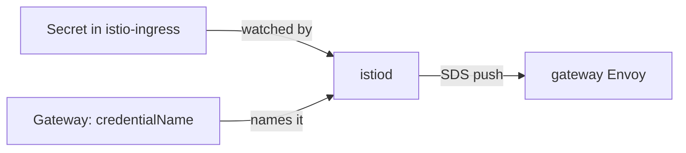

# Create A TLS Certificate And Secret

Before the ingress gateway can serve HTTPS, it needs a certificate to show and a private key to go with it. The ingress gateway is an Envoy proxy at the edge of the mesh that accepts traffic from outside the cluster. In this part you make the certificate and key with `openssl`, and you put them in the one place the gateway reads them from. Get that place right now, and the rest of the module is easy.

## Certificates in one picture

A certificate is easy to use and easy to misread. This section gives you the three ideas you need before you make one: what a certificate says, who signs it, and how a client decides to trust it.

### What a certificate proves

A **certificate** is a signed file that binds a name to a public key. It says "I am `starfleet.example.com`", and it carries a public key. The server keeps the matching **private key** secret. During the **TLS handshake** (the first messages of a connection, where both sides agree how to encrypt it), the gateway shows its certificate and proves it holds the private key.

### Who signs it

Anyone can create a certificate, so a client only believes a certificate that someone it trusts has signed. That signer is a **certificate authority (CA)**: a key pair whose job is to sign other certificates. A browser trusts a list of public CAs. In your playground you make your own small CA, and you tell `curl` to trust it.

### The name in the certificate

The client also checks that the name in the certificate is the name it asked for. Modern clients read that name from the **SAN** (subject alternative name), a list of host names inside the certificate. The older `CN` (common name) field is not enough on its own. So your server certificate must list `starfleet.example.com` in its SAN.

## Make the certificates

You make two certificates on your own machine: a CA, and a server certificate for the gateway that the CA signs. Run every command in the folder where you pasted the helper, so the files land in `certs/` next to it.

<!-- astrona:playground:renew -->

### A certificate authority

Make the CA. It signs itself, because it is the top of the chain:

```sh
mkdir -p certs
openssl req -x509 -sha256 -nodes -days 365 -newkey rsa:2048 \
  -subj '/O=Starfleet Command/CN=starfleet-ca' \
  -keyout certs/starfleet-ca.key -out certs/starfleet-ca.crt
```

```text
...+...+.....+.+.....+....+..+....+......+.....+...+.......+...........+++++++
.......+......+++++++++++++++++++++++++++++++++++++++*.+.....+..........++++++
-----
```

The rows of dots and plus signs are `openssl` searching for the large prime numbers in the new key (shortened here, and different every time). When they end, `certs/starfleet-ca.crt` and `certs/starfleet-ca.key` exist.

`req -x509` makes a finished certificate in one step instead of a request. `-nodes` ("no DES") leaves the private key unencrypted. The gateway starts on its own, with nobody to type a password, so its key must be readable without one. `-subj` fills in the name, so `openssl` does not ask you questions.

### A server certificate for the gateway

Now make a key and a signing request for `starfleet.example.com`, and let your CA sign it. The small `san.ext` file adds the SAN:

```sh
openssl req -newkey rsa:2048 -nodes -keyout certs/starfleet.example.com.key \
  -subj '/O=Starfleet/CN=starfleet.example.com' -out certs/starfleet.example.com.csr
printf "subjectAltName=DNS:starfleet.example.com\n" > certs/san.ext
openssl x509 -req -sha256 -days 365 -CA certs/starfleet-ca.crt -CAkey certs/starfleet-ca.key \
  -set_serial 1 -in certs/starfleet.example.com.csr -out certs/starfleet.example.com.crt \
  -extfile certs/san.ext
```

After the same progress dots for the new key, the CA signing step prints (OpenSSL 3; other versions word it slightly differently):

```text
Certificate request self-signature ok
subject=O=Starfleet, CN=starfleet.example.com
```

The `.csr` file is the certificate signing request: "please sign a certificate for this name and this public key". `openssl x509 -req` is the CA doing the signing.

### Read what you made

Check the subject, the issuer and the SAN of the server certificate:

```sh
openssl x509 -in certs/starfleet.example.com.crt -noout -text | grep -E "Issuer:|Subject:|DNS:"
```

```text
        Issuer: O=Starfleet Command, CN=starfleet-ca
        Subject: O=Starfleet, CN=starfleet.example.com
                DNS:starfleet.example.com
```

The issuer is your CA, the subject is the gateway's host name, and the SAN lists `starfleet.example.com`. This is the certificate the gateway will show.

## Where the gateway looks for its certificate

A `Gateway` names its certificate with one field, `credentialName`. Where that name is looked up is the thing almost everyone gets wrong, so it gets its own section before you create anything.

### `credentialName` is a bare name

In the `Gateway`, the TLS settings look like this:

```yaml
    tls:
      mode: SIMPLE
      credentialName: starfleet-credential
```

`credentialName` is the name of a Kubernetes **Secret** (an object that stores sensitive data such as keys). It is not a file path, and it has no namespace part. Istio looks it up in the namespace of the **gateway pod**, here `istio-ingress`. The `Gateway` object itself can live with the app, in `starfleet`. The Secret cannot.

### How the certificate reaches the gateway

Nothing is mounted into the gateway pod as a file. `istiod`, Istio's control plane, reads the Secret and sends its contents to the gateway's Envoy proxy over **SDS** (secret discovery service). SDS is the part of Istio's configuration protocol that delivers certificates and keys, with no restart.



`istiod` matches the name in the `Gateway` with a Secret in the gateway pod's namespace, and pushes the certificate and key to the Envoy in the `istio-ingress` pod.

### Why the rule exists

The gateway's namespace is a security boundary. If `credentialName` could point at any namespace, anyone who can create a Secret anywhere could give the shared gateway a certificate for any host name. Keeping the lookup in the gateway's own namespace means only the people who run the gateway decide what it shows.

## Put the certificate in a Secret

Now you store the server certificate and key where the gateway looks. Check the gateway's namespace first, then create the Secret, then check what is inside.

### Find the gateway pod

The Secret goes where the gateway **pod** runs, so look it up instead of guessing:

```sh
kubectl get pods -A -l istio=ingress
```

```text
NAMESPACE       NAME                             READY   STATUS    RESTARTS   AGE
istio-ingress   istio-ingress-5f768fb4b6-hbmwp   1/1     Running   0          54s
```

One pod, in the namespace `istio-ingress`. That is where the Secret goes.

### Create the Secret

`kubectl create secret tls` builds a Secret of type `kubernetes.io/tls` with exactly the two keys Istio reads:

```sh
kubectl create -n istio-ingress secret tls starfleet-credential \
  --key=certs/starfleet.example.com.key --cert=certs/starfleet.example.com.crt
```

```text
secret/starfleet-credential created
```

### Check the key names

List the keys inside the Secret:

```sh
kubectl get secret starfleet-credential -n istio-ingress \
  -o go-template='{{range $k, $v := .data}}{{$k}}{{"\n"}}{{end}}'
```

```text
tls.crt
tls.key
```

Two keys, with exactly these names: `tls.crt` holds the certificate and `tls.key` the private key. A Secret with other key names, such as `cert` and `key`, is accepted by Kubernetes but gives the gateway nothing it can use. Nothing has changed at the gateway yet: the certificate waits in its Secret until a `Gateway` asks for it.

> [!TIP]
> Before you test traffic in a TLS task, list the Secret's key names with the `go-template` above. It takes five seconds and rules out a whole class of silent failures.

## Common pitfalls

> [!WARNING]
> - **Creating the Secret next to the `Gateway`.** The gateway reads Secrets only from its own pod's namespace (`istio-ingress` here). A Secret in `starfleet` is never delivered, and nothing tells you.
> - **Wrong key names.** Use `kubectl create secret tls`, or name the keys exactly `tls.crt` and `tls.key`.
> - **An encrypted private key.** The gateway cannot type a password. Make the key with `-nodes`.
> - **A certificate without a SAN.** Clients check the host name against the SAN. A certificate with only a `CN` can be refused.

> *The gateway's certificate lives in a Secret in the gateway pod's namespace, and `istiod` sends it to the gateway over SDS.*
