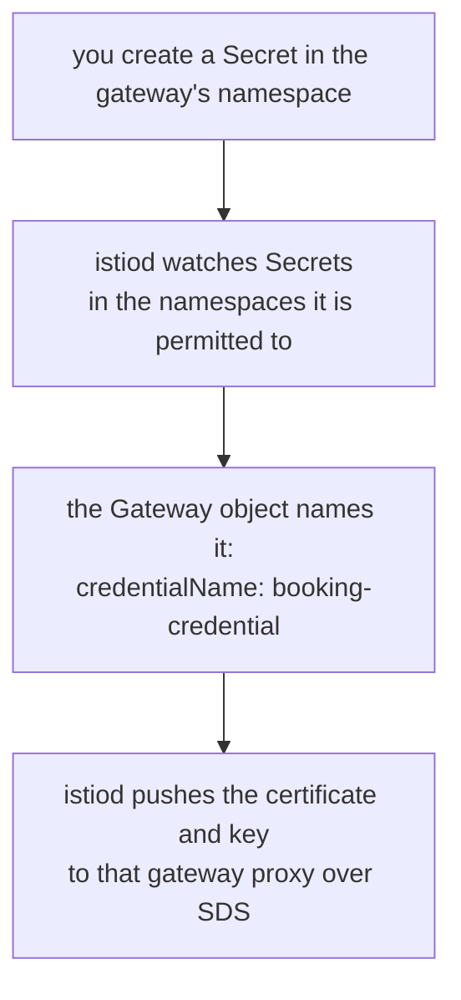

# Part 1 — How a gateway gets its certificate

> Prerequisite: [the module landing page](./course.md). Next: [Part 2 — The TLS listener](./course-02-the-tls-listener.md).

One field in a `Gateway` names a secret, and where that secret lives is the thing almost everyone gets wrong on a first attempt. This part is the delivery path that makes the rule inevitable rather than arbitrary, plus the secret layout that goes with it.

## `credentialName` is a name, not a reference

```yaml
      tls:
        mode: SIMPLE
        credentialName: booking-credential
```

Three things it is not, and each rules out a wrong instinct:

- **not a file path** — nothing is mounted into the gateway pod;
- **not a namespaced reference** — there is no `namespace:` field beside it, and no `namespace/name` syntax;
- **not resolved where the `Gateway` object lives.**

It is a bare name, looked up in the namespace of the **gateway pod** — normally `istio-system`. The `Gateway` object itself can live wherever the application does; `tls-demo` is fine, and is where the examples put it.

## Why the namespace rule exists

The rule follows from how the credential is delivered, which is the same SDS machinery that carried workload identities in [section 010](../../section-010/module-01/course-01-how-identity-is-issued.md) — pointed at a different source.



The Secret is read by `istiod`, not mounted into the gateway pod. That is why the namespace it lives in matters and why rotating it needs no restart.

Read that and the design reason is visible: **the gateway namespace is a trust boundary.** If `credentialName` could name a secret in any namespace, then anyone able to create a Secret anywhere could hand the shared ingress gateway a certificate for any hostname. Confining the lookup to the gateway's own namespace means only people who can write there — normally cluster operators — can supply what the edge presents.

The practical consequence is the failure mode. Create the secret in `tls-demo` and:

- the `Gateway` is accepted, because the API server does not check that the named secret exists;
- `kubectl get gateway` looks correct;
- the TLS listener never comes up, because the credential was never delivered;
- `istioctl proxy-config secret deploy/istio-ingressgateway -n istio-system` shows nothing for that name.

No error anywhere, which is why the last line is the diagnostic worth remembering.

There is an exception worth knowing exists rather than using immediately: newer Istio versions support a `credentialName` in `namespace/name` form together with a Gateway API `ReferenceGrant`, which lets an application namespace explicitly delegate its own certificate. It is an opt-in delegation with a consenting object on both sides — the trust boundary is still there, just crossed deliberately.

## The secret layout

For `SIMPLE` mode the secret carries two keys, and the names are fixed:

| Key | Contents |
| --- | --- |
| `tls.crt` | the server certificate (and any intermediates, concatenated) |
| `tls.key` | its private key |

`kubectl create secret tls` produces exactly those two, which is why it is worth preferring over `create secret generic` with hand-chosen key names — a secret with `cert` and `key` instead applies cleanly and delivers nothing usable. ([Module 2](../module-02/course.md) adds a third key and needs `create secret generic` for that reason.)

Two properties of the material itself:

- **The key must be unencrypted.** A gateway starts unattended; there is nobody to type a passphrase. That is what `openssl`'s `-nodes` flag does — "no DES", historically, meaning do not encrypt the private key.
- **The certificate's name must match what clients ask for.** A browser checks the hostname against the certificate's SAN (and, for older clients, the Subject `CN`). A self-signed certificate for `booking.ica.local` is fine for a playground precisely because `curl -k` skips that check.

## Building one

> [!TIP]
> **Try it — make a certificate and put it where the gateway looks**
>
> ```sh
> openssl req -x509 -nodes -days 365 -newkey rsa:2048 \
>   -keyout /tmp/booking.key -out /tmp/booking.crt \
>   -subj "/CN=booking.ica.local/O=ica"
>
> kubectl -n istio-system create secret tls booking-credential \
>   --key=/tmp/booking.key --cert=/tmp/booking.crt
>
> kubectl -n istio-system get secret booking-credential \
>   -o go-template='{{range $k, $v := .data}}{{$k}}{{"\n"}}{{end}}'
> ```
>
> Expect something like:
>
> ```text
> NAME                 TYPE                DATA   AGE
> booking-credential   kubernetes.io/tls   2      1s
> tls.crt
> tls.key
> ```
>
> Two keys, exactly those names. Checking the key names before testing traffic is a habit worth forming here, because it becomes essential in [Module 2](../module-02/course.md), where a third key decides whether client verification turns on at all. Remove the secret later with `kubectl -n istio-system delete secret booking-credential`.
>
> `openssl req -x509` makes a self-signed certificate in one step: `req` generates the request, `-x509` says sign it immediately with the key just created rather than emitting a CSR. `-subj` supplies the Subject non-interactively, which is what stops it prompting.

Nothing about the gateway has been configured yet. The credential exists and is waiting; [Part 2](./course-02-the-tls-listener.md) writes the listener that asks for it.

> *`credentialName` is a bare name resolved in the gateway pod's namespace, because that namespace is the trust boundary for what the edge is allowed to present.*

## Common pitfalls

> [!WARNING]
> **Creating the Secret in the application's namespace.** The gateway's credentials are read from the gateway's namespace, so it will simply never be found.
>
> **Expecting a mounted volume.** The certificate arrives over SDS; there is no file to look for in the pod.
>
> **Misnaming the keys inside the Secret.** `tls.crt` and `tls.key` are what is looked for; anything else delivers nothing and the listener never comes up.
>
> **Assuming a missing credential produces a clear error.** The listener fails to materialise and the connection fails in the handshake, with nothing naming the Secret.

## Reference

- [Secure gateways task](https://istio.io/latest/docs/tasks/traffic-management/ingress/secure-ingress/) — Istio's walkthrough, including the secret-namespace requirement.
- [`ServerTLSSettings`](https://istio.io/latest/docs/reference/config/networking/gateway/#ServerTLSSettings) — `credentialName`, `mode` and every other field in the `tls` block.
- [Kubernetes TLS secrets](https://kubernetes.io/docs/concepts/configuration/secret/#tls-secrets) — the `kubernetes.io/tls` type and its required keys.
