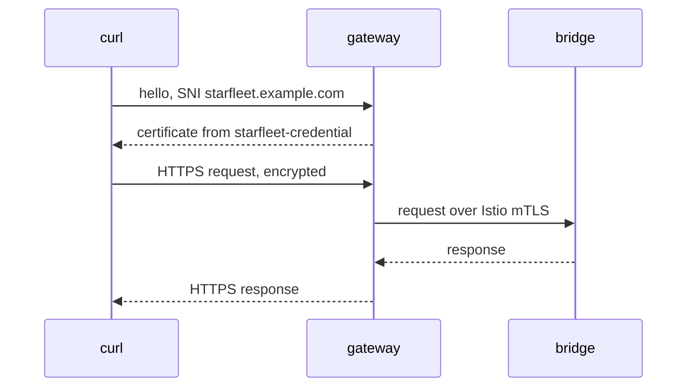

# Configure An HTTPS Gateway Server

A certificate on its own serves nothing. Your server certificate for `starfleet.example.com` waits in the TLS Secret `starfleet-credential`, in the namespace `istio-ingress`, where the ingress gateway pod runs. The ingress gateway is the Envoy proxy at the edge of the mesh, and it will not use that Secret until a `Gateway` server asks for it by name.

This chapter writes that server, links a `VirtualService` to `bridge`, and sends the first HTTPS request through the gateway. A working request is not the end, though. You also prove which certificate the gateway really showed, from both sides of the handshake.

## The TLS server

A `Gateway` opens ports on the ingress gateway. Each entry in its `servers` list is one server: a port, the host names it serves, and how it handles TLS. The server you need listens on port `443` and terminates TLS, which means the gateway decrypts the connection itself.

<!-- astrona:playground:renew -->

Save this as `gateway-starfleet.yaml`:

```yaml
apiVersion: networking.istio.io/v1
kind: Gateway
metadata:
  name: starfleet-gateway
  namespace: starfleet
spec:
  selector:
    istio: ingress
  servers:
  - port:
      number: 443
      name: https
      protocol: HTTPS
    hosts:
    - starfleet.example.com
    tls:
      mode: SIMPLE
      credentialName: starfleet-credential
```

Apply it:

```sh
kubectl apply -f gateway-starfleet.yaml
```

```text
gateway.networking.istio.io/starfleet-gateway created
```

The object is short, but each field has a job:

- **`selector: istio: ingress`** picks the gateway pods that get this configuration, by pod label. The Helm gateway chart in this playground labels its pods `istio=ingress`. (An `istioctl install` gateway uses `istio=ingressgateway` instead.)
- **`protocol: HTTPS`** tells the gateway to end TLS on this port and then read the request inside as HTTP. That is what lets a `VirtualService` route on paths.
- **`name: https`** is only a label for the port. By habit it repeats the protocol, but `protocol` decides how the gateway treats the port: a port named `secure-port` works just the same.
- **`hosts`** lists the host names this server serves. The gateway compares it with the name the client asks for in the handshake.
- **`tls.mode: SIMPLE`** is ordinary one-way TLS: the gateway shows a certificate, and the client shows none.
- **`credentialName`** is the Secret's name, looked up in the gateway pod's namespace.

Notice that the `Gateway` lives in `starfleet`, next to `bridge`, while its Secret lives in `istio-ingress`. That split is correct, because the Secret lookup always uses the gateway pod's namespace.

## Link the VirtualService

A `Gateway` only opens a port. It does not say where the requests go. For that you need a `VirtualService`, the Istio object that holds routing rules, and it must name the gateway in its `gateways:` field. Once the gateway has decrypted a request, the request is plain HTTP, so this `VirtualService` looks the same as it would for an HTTP server.

Save this as `virtualservice-bridge.yaml`:

```yaml
apiVersion: networking.istio.io/v1
kind: VirtualService
metadata:
  name: bridge
  namespace: starfleet
spec:
  hosts:
  - starfleet.example.com
  gateways:
  - starfleet-gateway
  http:
  - match:
    - uri:
        exact: /productpage
    - uri:
        prefix: /static
    - uri:
        exact: /login
    - uri:
        exact: /logout
    - uri:
        prefix: /api/v1/products
    route:
    - destination:
        host: bridge
        port:
          number: 9080
```

Apply it:

```sh
kubectl apply -f virtualservice-bridge.yaml
```

```text
virtualservice.networking.istio.io/bridge created
```

## Send an HTTPS request

The whole path now exists: the Secret, the `Gateway` server and the `VirtualService`. Send a request through it with the `https_status` helper. It calls `https://starfleet.example.com:8443/productpage` through the port forward, trusts your test CA, and prints the status code and curl's exit code:

```sh
https_status
```

```text
200 exit=0
```

The `200` is the response from `bridge`, and `exit=0` means curl was happy with the handshake: it trusted the certificate, and the name matched. `istiod` needs a few seconds to send the gateway its new configuration, so if the first try fails right after the apply, wait ten seconds and run it again. If you keep getting `000 exit=7`, check the port forward with `astrona port-forward list`.

A lot happened behind that one line of output. The diagram follows the request from curl to `bridge` and back:



The gateway Envoy in `istio-ingress` picks the certificate, decrypts the request, and sends it to `bridge`, encrypted again with the mesh's own mTLS.

The first message in that diagram explains why the helper uses `--resolve`. In its very first handshake message, the client sends the host name it wants in plain text. That name is the **SNI** (Server Name Indication). The gateway reads it to choose which server, and so which certificate, answers. Only after it decrypts the connection can the gateway read the HTTP `Host` header and pick a route:

| What the gateway reads | When | If it does not match |
| --- | --- | --- |
| SNI, from the handshake | before decryption | the handshake fails, no HTTP status |
| `Host` header, from the request | after decryption | `404`, but the connection is fine |

The option `--resolve starfleet.example.com:8443:127.0.0.1` tells curl to connect to your port forward while it still uses `starfleet.example.com` as the name. So both the SNI and the `Host` header are right. A plain `https://127.0.0.1:8443` sends no usable name, and the handshake fails with curl exit code `35`.

## Prove which certificate answered

A `200` proves that the path works. It does not prove *which* certificate the gateway showed, and that matters as soon as one gateway serves more than one host. You can ask both sides of the handshake: the client, and the gateway itself.

On the client side, `curl -v` prints the certificate the gateway showed during the handshake:

```sh
https_status -v 2>&1 | grep -E "subject:|issuer:"
```

```text
*  subject: O=Starfleet; CN=starfleet.example.com
*  issuer: O=Starfleet Command; CN=starfleet-ca
```

The exact layout of these lines depends on your curl version. The subject is the name you gave the server certificate, and the issuer is your CA. So the gateway showed exactly the certificate from `starfleet-credential`.

Trust is the client's half of the deal. Send the same request without `--cacert`, so that curl falls back to the public CAs it knows:

```sh
curl -s -o /dev/null --resolve starfleet.example.com:8443:127.0.0.1 \
  https://starfleet.example.com:8443/productpage; echo "exit=$?"
```

```text
exit=60
```

Exit code `60` means "the certificate is not trusted". The gateway did nothing wrong here; curl simply did not know your CA. A real browser behaves the same way with a certificate from an unknown CA, which is why a public site uses a certificate from a public CA.

On the gateway side, `istioctl proxy-config secret` lists the certificates the gateway's Envoy really holds:

```sh
istioctl proxy-config secret deploy/istio-ingress -n istio-ingress
```

```text
RESOURCE NAME                         TYPE           STATUS     VALID CERT     SERIAL NUMBER                        NOT AFTER                NOT BEFORE
kubernetes://starfleet-credential     Cert Chain     ACTIVE     true           00000000000000000000000000000001     2027-10-09T09:26:12Z     2026-10-09T09:26:12Z
default                               Cert Chain     ACTIVE     true           cd9f733cc187f798b625d29f662422ef     2026-10-10T09:25:24Z     2026-10-09T09:23:24Z
ROOTCA                                CA             ACTIVE     true           b6675b08fb0a7611a0824cb0029d824d     2036-10-06T09:25:12Z     2026-10-09T09:25:12Z
```

The row `kubernetes://starfleet-credential` with the state `ACTIVE` means that `istiod` delivered the Secret and the gateway is using it. Its serial number is `1`, the `-set_serial 1` you gave `openssl`. The other two rows are the gateway's own mesh identity, which it uses for mTLS towards `bridge`.

> [!TIP]
> When an HTTPS task fails, run `istioctl proxy-config secret` on the gateway first. If your Secret is missing there, or not `ACTIVE`, the problem is the Secret, not the `Gateway` or the `VirtualService`.

You now serve HTTPS for `starfleet.example.com`, and you can prove which certificate answered, from curl and from the gateway. The SNI picks the server and its certificate before decryption, and the `Host` header picks the route after it. Two questions are still open: what happens to clients that call the plain HTTP port, and how you replace this certificate when it expires.

## Common pitfalls

> [!WARNING]
> - **Testing with an IP address.** `https://127.0.0.1:8443` sends no usable SNI, so no server matches and the handshake fails. Use `--resolve` with the real host name.
> - **Mixing up the two checks.** A failed handshake is about the SNI or the certificate. A `404` on a working connection is about the `VirtualService`.
> - **Using `-k` to "fix" a trust error.** `-k` skips the check you want to pass. Give curl the CA with `--cacert` instead.
> - **Forgetting `gateways:` in the `VirtualService`.** Without it the `VirtualService` applies only inside the mesh, and the gateway answers `404`.
