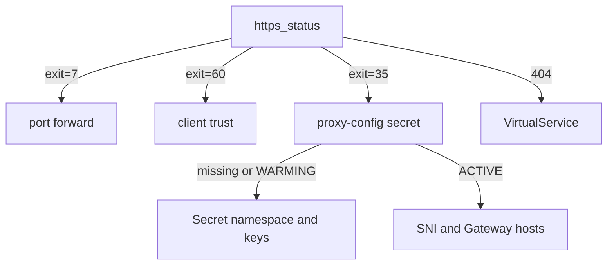

# Troubleshoot A Failed TLS Handshake

Most TLS mistakes at the ingress gateway give you no error message. Kubernetes accepts every object, and then the TLS handshake simply fails, with no HTTP status to read. Under exam pressure, that silence is what costs the most time: you know something is wrong, but not which object to open.

This chapter starts from a working setup. The `starfleet-gateway` `Gateway` in `starfleet` serves `starfleet.example.com` on port `443` with the TLS Secret `starfleet-credential` from `istio-ingress`, and the `https_status` helper answers `200 exit=0`. You make the two most common mistakes on purpose, read the clues they leave, and then learn to name the cause from curl's exit code.

## A Secret in the wrong namespace

The most common exam mistake is a Secret created next to the `Gateway`, in the app's namespace, instead of in the gateway pod's namespace. Making it once on purpose teaches you every clue, so you recognise them when it happens by accident.

<!-- astrona:playground:renew -->

Create a second Secret with the same certificate, but in the namespace `starfleet`, where the `Gateway` lives:

```sh
kubectl create -n starfleet secret tls starfleet-credential-app-ns \
  --key=certs/starfleet.example.com.key --cert=certs/starfleet.example.com.crt
```

```text
secret/starfleet-credential-app-ns created
```

Now point the `Gateway` at it. Save this as `gateway-starfleet-wrong-namespace.yaml`:

```yaml
apiVersion: networking.istio.io/v1
kind: Gateway
metadata:
  name: starfleet-gateway
  namespace: starfleet
spec:
  selector:
    istio: ingress
  servers:
  - port:
      number: 443
      name: https
      protocol: HTTPS
    hosts:
    - starfleet.example.com
    tls:
      mode: SIMPLE
      credentialName: starfleet-credential-app-ns
```

Apply it:

```sh
kubectl apply -f gateway-starfleet-wrong-namespace.yaml
```

```text
gateway.networking.istio.io/starfleet-gateway configured
```

Kubernetes accepts it, because it does not check that the named Secret exists, or where. The first clue only shows up in traffic. Wait about a minute, then send a request:

```sh
https_status
```

```text
000 exit=35
```

`000` means there is no HTTP status at all, because no HTTP was ever spoken. Exit code `35` means the TLS handshake failed: the gateway had no certificate to show for this server, so it closed the connection.

The wait matters. For the first few seconds the gateway keeps its old server, with the old certificate, while it waits for the new one. In our run, a request sent ten seconds after the apply still got `200`. Only when the new certificate never comes does the gateway switch to the new server, and then every handshake fails.

A failed handshake has one more side effect. The port forward on `8443` drops and restarts itself, so for a few seconds the next request gets `000 exit=7`. Wait about ten seconds between tries in this chapter.

The exit code tells you the handshake failed, but not why. For that, ask the gateway's Envoy which certificates it holds:

```sh
istioctl proxy-config secret deploy/istio-ingress -n istio-ingress
```

```text
RESOURCE NAME                                TYPE           STATUS      VALID CERT     SERIAL NUMBER                        NOT AFTER                NOT BEFORE
kubernetes://starfleet-credential-app-ns                    WARMING     false
kubernetes://starfleet-credential            Cert Chain     ACTIVE      true           00000000000000000000000000000002     2027-10-09T09:27:39Z     2026-10-09T09:27:39Z
default                                      Cert Chain     ACTIVE      true           cd9f733cc187f798b625d29f662422ef     2026-10-10T09:25:24Z     2026-10-09T09:23:24Z
ROOTCA                                       CA             ACTIVE      true           b6675b08fb0a7611a0824cb0029d824d     2036-10-06T09:25:12Z     2026-10-09T09:25:12Z
```

The Envoy knows the name `starfleet-credential-app-ns`, because the `Gateway` asked for it. But the state is **`WARMING`**, with no certificate: the Envoy is waiting for a Secret that never comes. `istiod` looked in `istio-ingress`, found nothing, and had nothing to send. The old `starfleet-credential` is still listed as `ACTIVE`, but no server uses it any more.

`istioctl analyze` gives you a second view of the same problem. It checks objects against each other, so it can spot a `credentialName` with no Secret behind it:

```sh
istioctl analyze -n starfleet
```

```text
Error [IST0101] (Gateway starfleet/starfleet-gateway) Referenced credentialName not found: "starfleet-credential-app-ns"
Error: Analyzers found issues when analyzing namespace: starfleet.
See https://istio.io/v1.30/docs/reference/config/analysis for more information about causes and resolutions.
```

**`IST0101`** ("referenced resource not found") names the `Gateway` and the missing credential. The Secret does exist, just not where the gateway can see it.

To put things right, apply your working `gateway-starfleet.yaml` again. It points at `starfleet-credential` in `istio-ingress`, and it brings back the port `80` redirect server:

```sh
kubectl apply -f gateway-starfleet.yaml
```

```text
gateway.networking.istio.io/starfleet-gateway configured
```

Then wait about fifteen seconds and check the result:

```sh
https_status
```

```text
200 exit=0
```

The fix for this mistake is always the same: create the Secret in the gateway pod's namespace. Copying the `Gateway` to `istio-ingress` does not help, because the Secret lookup ignores where the `Gateway` lives.

## A host the gateway does not serve

The second common mistake is a name mismatch. The gateway picks a server by the SNI (Server Name Indication), the host name the client sends in plain text in its first handshake message. A name that no server lists has no certificate, so the handshake fails before any HTTP exists.

To see it, send a request for `other.example.com`. Add `-k`, so that curl skips its own trust check and only the gateway can refuse:

```sh
curl -s -o /dev/null -w "%{http_code} " -k --resolve other.example.com:8443:127.0.0.1 \
  https://other.example.com:8443/productpage; echo "exit=$?"
```

```text
000 exit=35
```

It is exit code `35` again: the handshake itself failed. Even `-k` does not help, because the gateway has no server for `other.example.com` and so no certificate to show. That is why you never see a `404` for a wrong host on an HTTPS server. A `404` comes later, from the route table, once the connection is decrypted.

The same failure hits you when you test with `https://127.0.0.1:8443` instead of the host name. curl then sends no usable SNI, and no server matches. Always test with `--resolve` and the exact host from the `Gateway`'s `hosts`.

## What the exit codes tell you

Both mistakes ended the same way, and that is the pattern to learn. When TLS fails, curl prints `000` as the status, so the exit code is the real clue. It tells you which side to look at next, even when it cannot name the exact cause:

| curl exit code | What it means | Look at |
| --- | --- | --- |
| `0` | ok | nothing |
| `7` | cannot connect at all | the port forward (it also restarts for a few seconds after a failed handshake), the gateway Service |
| `35` | the gateway closed the handshake | `proxy-config secret` first, then SNI against the `Gateway` `hosts` |
| `60` | the certificate is not trusted | the client: `--cacert`, or a certificate from another CA |

Both mistakes in this chapter gave the same `35`: the Secret in the wrong namespace and the host the gateway does not serve. We saw the same code from curl on a Mac and from the Linux curl in the `shuttle` pod. Some curl builds report a closed handshake as `56` instead, so treat `35` and `56` alike. The exit code says "the gateway refused during the handshake", and the next check says why.

Put together, the checks form a short decision path:



The diagram starts from the exit code, then lets `istioctl proxy-config secret` on the gateway split "the certificate never arrived" from "the certificate is there but the name does not match".

Two more `tls` settings fail in the same way: `minProtocolVersion` (for example `TLSV1_3`) and `cipherSuites`. A client that is too old, or that shares no cipher with the gateway, fails during the handshake with no HTTP status. For example, with `minProtocolVersion: TLSV1_3` on the server, `https_status --tls-max 1.2` gets `000 exit=35`. If the Secret is `ACTIVE` and the name matches, check these settings next.

> [!TIP]
> In an exam task, read curl's exit code before you change any YAML, and on a `35` run `istioctl proxy-config secret` on the gateway next. Together they point at the right object, so you do not edit the wrong one.

You can now read a failed handshake instead of guessing. A missing certificate and a wrong host name both fail with exit code `35`. `WARMING` in `istioctl proxy-config secret` and `IST0101` in `istioctl analyze` tell you the certificate never arrived, while an `ACTIVE` certificate sends you to the SNI and the `Gateway` `hosts`. What remains is practice: finding both mistakes when someone else made them.

## Common pitfalls

> [!WARNING]
> - **Looking for an HTTP status when TLS fails.** There is none. `000` is curl's way of saying "no HTTP happened"; read the exit code.
> - **Moving the `Gateway` instead of the Secret.** The lookup always uses the gateway pod's namespace. Move or recreate the Secret.
> - **Trusting `kubectl get` alone.** The `Gateway` and the Secret both exist, and it still fails. `istioctl proxy-config secret` shows whether the gateway really has the certificate.
> - **Testing with an IP address.** No SNI, no matching server, exit `35`.
> - **Testing again too fast.** After a failed handshake the port forward restarts, and the next request gets `exit=7` for a few seconds. Wait ten seconds before you read that as a new problem.

## Your mission: Fix A Broken HTTPS Gateway

You can now read a failed handshake, find a Secret in the wrong namespace, and spot a host name the gateway does not serve. In the graded lab, the HTTPS server for `bridge` is broken in two places, and you must make `https://starfleet.example.com` answer again with the right certificate.

The lab runs in its own cluster, so first pause your playground. Nothing in it is lost:

```sh
astrona stop ats-015-playground-040-01
```

Then start the lab:

```sh
astrona run --git git@github.com:astrona-io/ATS015.git -c sections/section-040/module-01/labs/lab-02
```

Read the task in [`question.md`](./labs/lab-02/question.md) and solve it on your own first. When you think you are done, send it for grading:

```sh
astrona submit -c sections/section-040/module-01/labs/lab-02
```

When the lab is done, remove it and start your playground again:

```sh
astrona destroy ats-015-lab-040-01-02
astrona start ats-015-playground-040-01
```
