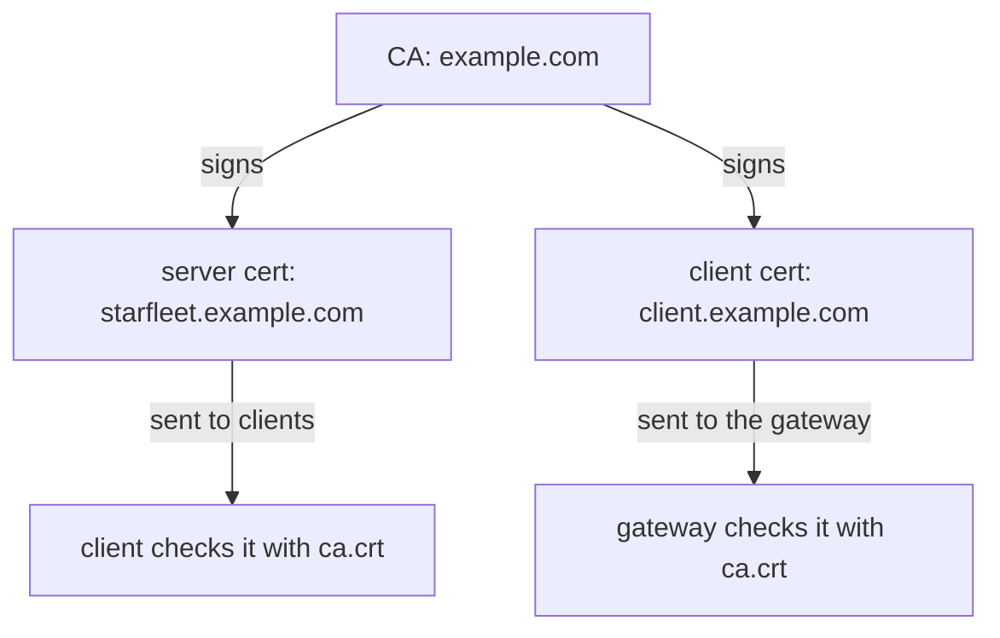

# Create A CA And Certificates With OpenSSL

Before the gateway can check a client certificate, somebody has to issue certificates. In a company, a security team usually does this. Here you do it yourself: you set up a small certificate authority and use it to make three certificates, one for the CA itself, one for the gateway and one for a trusted client.

Getting clear on which file goes where is most of the work in this module. People who copy the commands without that picture end up putting the wrong file in the wrong key. So this chapter starts with what a certificate authority is, then makes the files, and ends with a map of where each file goes.

## What a certificate authority is

A **certificate** is a file that ties a name to a public key. It holds a name, a public key, and a signature from whoever issued it. A **certificate authority** (CA) is the key pair that signs those certificates. The private half, `ca.key`, signs certificates and stays secret. The public half, `ca.crt`, goes to everyone who checks certificates.

Signing a certificate says one thing: *the holder of this key is the one named in this certificate.* It does not say the holder is trusted, or allowed to do anything in particular. It only says the CA vouched for the name when it signed.

That narrow meaning shapes what the gateway does. When a client sends a certificate, the gateway asks one question: *was this certificate signed by the CA I trust?* If yes, the connection goes ahead. If no, the gateway closes the connection.

So the CA decides who can connect. Every client the CA signed for can connect, and no other client can. Issuing a certificate **is** the access decision, made when the certificate is signed rather than when the request arrives.

## Three certificates, two directions

You need three certificates: the CA's own, a server certificate and a client certificate. The server certificate and the client certificate look the same inside: a name, a public key and the CA's signature. What differs is who holds each one and which side sends it.



The CA signs both certificates. The gateway sends the server certificate to clients, and a client sends the client certificate to the gateway. Each side checks the other's certificate against the same `ca.crt`.

In a large company the CA would also mark each certificate for one job: server or client. That mark is called **extended key usage**, and a strict checker reads it. The certificates in this module have no such mark, which both `openssl` and the gateway accept.

## Make the CA and the certificates

With the picture in place, you can make the files. You make everything with `openssl` on your own machine, in your working folder, and every file goes into a folder called `certs/`.

<!-- astrona:playground:renew -->

Start with the CA. This command creates the folder and the CA in one step:

```sh
mkdir -p certs
openssl req -x509 -sha256 -nodes -days 365 -newkey rsa:2048 \
  -subj '/O=example Inc./CN=example.com' \
  -keyout certs/example.com.key -out certs/example.com.crt
```

```text
...+...+...+++++++++++++++++++++++++++++++++++++++*..+++++++++++++++++++++++++++++++++++++++*.+..+......+.......+.........+...++++++
.................+......+...+.+.................+++++++++++++++++++++++++++++++++++++++*..+......+.+.....+++++++++++++++++++++++++++++++++++++++*..........+............+...
-----
```

The rows of dots and plus signs are `openssl` searching for the large prime numbers in the new key (shortened here, and different every time). When they end, `certs/example.com.key` and `certs/example.com.crt` exist.

`openssl req` normally makes a **certificate signing request** (CSR): a certificate that is waiting for a signature. With `-x509` it signs the certificate itself straight away. A certificate signed by its own key is a CA.

Next comes the gateway's server certificate. It must carry the host name clients ask for, `starfleet.example.com`. Clients check that name, so it goes in two places: the common name (CN) and the subject alternative name (SAN), which is the field modern clients read. You make a request, then let the CA sign it:

```sh
openssl req -out certs/starfleet.example.com.csr -newkey rsa:2048 -nodes \
  -keyout certs/starfleet.example.com.key \
  -subj "/CN=starfleet.example.com/O=starfleet organization"
printf "subjectAltName=DNS:starfleet.example.com\n" > certs/san.ext
openssl x509 -req -sha256 -days 365 -CA certs/example.com.crt -CAkey certs/example.com.key \
  -set_serial 0 -in certs/starfleet.example.com.csr -out certs/starfleet.example.com.crt \
  -extfile certs/san.ext
```

After the same progress dots for the new key, the CA signing step prints (OpenSSL 3; other versions word it slightly differently):

```text
Certificate request self-signature ok
subject=CN=starfleet.example.com, O=starfleet organization
```

`openssl x509 -req` is the step a real CA performs: it takes a request and signs it with `ca.key`. The other flags save you typing:

- `-nodes` leaves the private key without a password, so nothing asks you for one.
- `-subj` fills in the name, so `openssl` does not ask six questions.
- `-set_serial` gives each certificate its own serial number, so the CA can tell its certificates apart.

The last file is the certificate for a trusted client, `client.example.com`. It takes the same two steps, signed by the same CA:

```sh
openssl req -out certs/client.example.com.csr -newkey rsa:2048 -nodes \
  -keyout certs/client.example.com.key \
  -subj "/CN=client.example.com/O=client organization"
openssl x509 -req -sha256 -days 365 -CA certs/example.com.crt -CAkey certs/example.com.key \
  -set_serial 1 -in certs/client.example.com.csr -out certs/client.example.com.crt
```

After the progress dots, the signing step prints:

```text
Certificate request self-signature ok
subject=CN=client.example.com, O=client organization
```

## Read what you made

Every later step depends on the link between each certificate and the CA, so check that link now. First, read who the client certificate names and who signed it:

```sh
openssl x509 -in certs/client.example.com.crt -noout -subject -issuer
```

```text
subject=CN=client.example.com, O=client organization
issuer=O=example Inc., CN=example.com
```

The **subject** is the client. The **issuer** is your CA. That link is the whole check the gateway will do: it accepts any certificate whose issuer it trusts, and refuses everything else.

Reading the issuer only shows the name of the signer. To check the signature itself, ask `openssl` to verify both certificates against the CA, the same way the gateway will:

```sh
openssl verify -CAfile certs/example.com.crt certs/starfleet.example.com.crt certs/client.example.com.crt
```

```text
certs/starfleet.example.com.crt: OK
certs/client.example.com.crt: OK
```

Both certificates are signed by the CA you trust. If a line says anything other than `OK`, the certificate was signed by a different key, and the gateway will refuse it too.

## Which file goes where

You now have three `.crt` files and three `.key` files, plus two `.csr` request files you no longer need. Only some of them ever leave your machine:

| File | Goes to | Keep it secret? |
| --- | --- | --- |
| `example.com.key` | nowhere | **yes**: whoever has it can sign certificates |
| `example.com.crt` | the gateway's secret, as `ca.crt` | no, it is public |
| `starfleet.example.com.crt` and `.key` | the gateway's secret, as `tls.crt` and `tls.key` | the key, yes |
| `client.example.com.crt` and `.key` | the client | the key, yes |

`example.com.key` matters most. A stolen server key exposes one host. A stolen CA key lets anyone sign a client certificate that the gateway accepts, and nothing in any log tells it apart from a real one.

The gateway does not check the name in a **client** certificate against anything. It checks the signature, not the name. `client.example.com` is a label for people reading logs. If the name must mean something, a component behind the gateway has to read it.

You now have a CA and two certificates it signed, and you know which file belongs where. The gateway, though, still knows nothing about them. The open question is how to hand the gateway its server certificate and the CA, and how to make it ask clients for a certificate.

## Common pitfalls

> [!WARNING]
> - **Handing out the CA key.** Only `ca.crt` is meant to be shared. `ca.key` signs everything and stays with you.
> - **Using one certificate for both server and client.** They do different jobs and carry different names. Make both.
> - **A server name that does not match the host.** The server certificate must name `starfleet.example.com`, in the SAN as well as the CN, or clients refuse the gateway's certificate.
> - **Running the commands from another folder.** Every command in this module uses the relative path `certs/`. Stay in the same working folder.
> - **Using a training CA for real.** A CA made with one command is fine for a lab and has no place in front of anything real.
