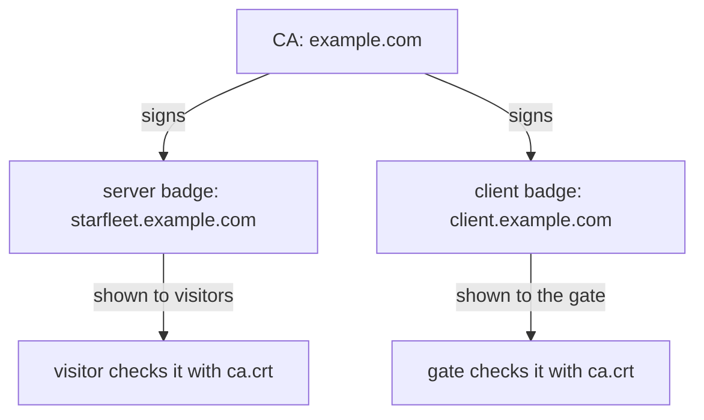

# Issue The Fleet's Badges

Astronaut, before the gate can check anyone's badge, somebody has to hand out badges. In this part you set up a small badge office of your own and use it to make three certificates: one for the office itself, one for the gate, and one for a trusted visitor.

Getting clear on which file goes where is most of the work in this module. People who copy the commands without that picture end up putting the wrong file in the wrong key.

## What a certificate authority is

A **certificate** is an ID badge for a computer. It holds a name, a public key, and a signature from whoever issued it. A **certificate authority** (CA) is the badge office that signs those badges.

The CA itself is just a key pair. The private half, `ca.key`, signs badges and stays locked away. The public half, `ca.crt`, goes to everyone who checks badges.

Signing a badge says one thing: *the holder of this key is the one named on this badge.* It does not say the holder is friendly, or allowed to do anything in particular. It only says the office vouched for the name when it signed.

### What this means at the gate

When a visitor shows a badge, the gate asks one question: *was this badge signed by the CA I trust?* If yes, the visitor gets in. If no, the gate hangs up.

So the CA decides who can connect. Every client the CA signed for can get in, and no other client can. Handing out a badge **is** the access decision, made when the badge is signed rather than when the signal arrives.

## Three certificates, two directions

You need three certificates. The two badges look the same inside: a name, a public key and the CA's signature. What differs is who holds each one and which way it is shown.



The CA signs both badges. The gate shows the server badge to visitors, and a visitor shows the client badge to the gate. Each side checks the other's badge against the same `ca.crt`.

In a large company the CA would also mark each badge for one job: server or client. That mark is called **extended key usage**, and a strict checker reads it. The badges in this module have no mark, which both `openssl` and the gateway accept.

## Make the badge office and the badges

You make everything with `openssl` on your own machine, in your working folder. Every file goes into a folder called `certs/`.

<!-- astrona:playground:renew -->

### Create the CA

Create the folder and the CA in one step:

```sh
mkdir -p certs
openssl req -x509 -sha256 -nodes -days 365 -newkey rsa:2048 \
  -subj '/O=example Inc./CN=example.com' \
  -keyout certs/example.com.key -out certs/example.com.crt
```

```text
...+...+...+++++++++++++++++++++++++++++++++++++++*..+++++++++++++++++++++++++++++++++++++++*.+..+......+.......+.........+...++++++
.................+......+...+.+.................+++++++++++++++++++++++++++++++++++++++*..+......+.+.....+++++++++++++++++++++++++++++++++++++++*..........+............+...
-----
```

The rows of dots and plus signs are `openssl` searching for the large prime numbers in the new key (shortened here, and different every time). When they end, `certs/example.com.key` and `certs/example.com.crt` exist.

`openssl req` normally makes a **certificate signing request** (CSR): a badge waiting for a signature. With `-x509` it signs the badge itself straight away. A badge signed by its own key is a CA.

### Create the gate's badge

The gate's badge must carry the host name visitors ask for, `starfleet.example.com`. Visitors check that name, so it goes in two places: the common name (CN) and the subject alternative name (SAN), which is the field modern clients read.

Make a request, then let the CA sign it:

```sh
openssl req -out certs/starfleet.example.com.csr -newkey rsa:2048 -nodes \
  -keyout certs/starfleet.example.com.key \
  -subj "/CN=starfleet.example.com/O=starfleet organization"
printf "subjectAltName=DNS:starfleet.example.com\n" > certs/san.ext
openssl x509 -req -sha256 -days 365 -CA certs/example.com.crt -CAkey certs/example.com.key \
  -set_serial 0 -in certs/starfleet.example.com.csr -out certs/starfleet.example.com.crt \
  -extfile certs/san.ext
```

After the same progress dots for the new key, the CA signing step prints (OpenSSL 3; other versions word it slightly differently):

```text
Certificate request self-signature ok
subject=CN=starfleet.example.com, O=starfleet organization
```

`openssl x509 -req` is the step a real CA performs: it takes a request and signs it with `ca.key`. A short note on the remaining flags:

- `-nodes` leaves the private key without a password, so nothing asks you for one.
- `-subj` fills in the name, so `openssl` does not ask six questions.
- `-set_serial` gives each badge its own serial number, so the CA can tell its badges apart.

### Create a visitor's badge

Now the badge for a trusted visitor, `client.example.com`. Same two steps, signed by the same CA:

```sh
openssl req -out certs/client.example.com.csr -newkey rsa:2048 -nodes \
  -keyout certs/client.example.com.key \
  -subj "/CN=client.example.com/O=client organization"
openssl x509 -req -sha256 -days 365 -CA certs/example.com.crt -CAkey certs/example.com.key \
  -set_serial 1 -in certs/client.example.com.csr -out certs/client.example.com.crt
```

After the progress dots, the signing step prints:

```text
Certificate request self-signature ok
subject=CN=client.example.com, O=client organization
```

## Read what you made

Two short checks show the link between the badges and the office. Do them now, because every later step depends on it.

### Who is named, and who signed

Read the visitor's badge:

```sh
openssl x509 -in certs/client.example.com.crt -noout -subject -issuer
```

```text
subject=CN=client.example.com, O=client organization
issuer=O=example Inc., CN=example.com
```

The **subject** is the visitor. The **issuer** is your CA. That link is the whole check the gate will do: it accepts any badge whose issuer it trusts, and turns away everything else.

### Let openssl check the signatures

Ask `openssl` to check both badges against the CA, the same way the gate will:

```sh
openssl verify -CAfile certs/example.com.crt certs/starfleet.example.com.crt certs/client.example.com.crt
```

```text
certs/starfleet.example.com.crt: OK
certs/client.example.com.crt: OK
```

Both badges are signed by the CA you trust. If a line says anything other than `OK`, the badge was signed by a different key, and the gate will refuse it too.

## Which file goes where

You now have three `.crt` files and three `.key` files (plus two `.csr` request files you no longer need). Only some of them ever leave your machine:

| File | Goes to | Keep it secret? |
| --- | --- | --- |
| `example.com.key` | nowhere | **yes**: whoever has it can sign badges |
| `example.com.crt` | the gate's secret, as `ca.crt` | no, it is public |
| `starfleet.example.com.crt` and `.key` | the gate's secret, as `tls.crt` and `tls.key` | the key, yes |
| `client.example.com.crt` and `.key` | the visitor | the key, yes |

`example.com.key` matters most. A stolen server key exposes one host. A stolen CA key lets anyone sign a visitor badge that the gate accepts, and nothing in any log tells it apart from a real one.

The name on a **client** badge is not checked against anything by the gate. The gate checks the signature, not the name. `client.example.com` is a label for people reading logs. If the name must mean something, something after the gate has to read it.

## Common pitfalls

> [!WARNING]
> - **Handing out the CA key.** Only `ca.crt` is meant to be shared. `ca.key` signs everything and stays with you.
> - **Using one certificate for both server and client.** They do different jobs and carry different names. Make both.
> - **A server name that does not match the host.** The server badge must name `starfleet.example.com`, in the SAN as well as the CN, or visitors refuse the gate's badge.
> - **Running the commands from another folder.** Every command in this module uses the relative path `certs/`. Stay in the same working folder.
> - **Using a training CA for real.** A CA made with one command is fine for a lab and has no place in front of anything real.

> *The gate only checks the CA's signature, so the clients that can connect are exactly the clients the CA signed for.*
