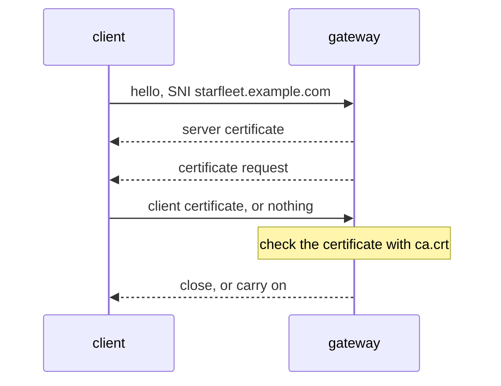

# Configure A MUTUAL TLS Gateway

You have a CA and two certificates. Now you give the gateway what it needs and switch on the client certificate check. Then you send two requests to the gateway: one with a client certificate, one without.

`MUTUAL` differs from `SIMPLE` TLS by one word in the `Gateway` and one key in the secret. This part starts with the secret, because that is where most mistakes happen.

The commands below need the files in `certs/` (the CA `example.com`, the server certificate `starfleet.example.com` and the client certificate `client.example.com`). Run them from the folder that holds `certs/`.

## One secret, two jobs

The gateway needs two different things from its secret, and Envoy (the proxy that runs in the gateway pod) has a name for each:

| Key in the secret | What it is | Envoy's name for the job |
| --- | --- | --- |
| `tls.crt` | the server certificate | what the gateway **sends** (`tls_certificate`) |
| `tls.key` | its private key | |
| `ca.crt` | the CA's public certificate | what the gateway **checks clients against** (`validation_context`) |

For `SIMPLE` TLS, only the first two keys exist, and the gateway checks no client. Adding `ca.crt` is what gives the gateway something to check client certificates against.

The key names are fixed: `tls.crt`, `tls.key` and `ca.crt`. Istio also reads an older set of names, `cert`, `key` and `cacert` (we checked: a secret with only those three keys works the same). Any other name, such as `ca`, is ignored.

### Why `kubectl create secret tls` cannot build it

`kubectl create secret tls` takes exactly one certificate and one key. It has no flag for a CA. So you build this secret with `kubectl create secret generic`, and name each key yourself.

The secret goes to the namespace where the gateway **pod** runs, `istio-ingress`. The gateway reads `credentialName` from its own namespace and nowhere else.

<!-- astrona:playground:renew -->

### Create the secret

Create it with the three keys:

```sh
kubectl create -n istio-ingress secret generic starfleet-credential-mutual \
  --from-file=tls.key=certs/starfleet.example.com.key \
  --from-file=tls.crt=certs/starfleet.example.com.crt \
  --from-file=ca.crt=certs/example.com.crt
```

```text
secret/starfleet-credential-mutual created
```

The `name=path` form of `--from-file` sets the key name inside the secret, whatever the file is called on disk. Without `tls.crt=`, the key would be named after the file, `starfleet.example.com.crt`, and the gateway would not find it.

Then check the key names before you do anything else:

```sh
kubectl get secret starfleet-credential-mutual -n istio-ingress \
  -o go-template='{{range $k, $v := .data}}{{$k}}{{"\n"}}{{end}}'
```

```text
ca.crt
tls.crt
tls.key
```

Exactly three keys, with exactly those names.

## Switch the gateway to `MUTUAL`

The secret is in place. Now you need a `VirtualService` for the `bridge` and a `Gateway` that asks for a client certificate.

### The VirtualService behind the gateway

The `VirtualService` holds routing rules: it says where requests that come through the gateway go next. The gateway handles TLS, so the `VirtualService` looks the same for HTTP and for HTTPS.

Save this as `virtualservice-bridge.yaml`:

```yaml
apiVersion: networking.istio.io/v1
kind: VirtualService
metadata:
  name: bridge
  namespace: starfleet
spec:
  hosts:
  - starfleet.example.com
  gateways:
  - starfleet-gateway
  http:
  - match:
    - uri:
        exact: /productpage
    - uri:
        prefix: /static
    - uri:
        exact: /login
    - uri:
        exact: /logout
    - uri:
        prefix: /api/v1/products
    route:
    - destination:
        host: bridge
        port:
          number: 9080
```

Apply it:

```sh
kubectl apply -f virtualservice-bridge.yaml
```

```text
virtualservice.networking.istio.io/bridge created
```

### The Gateway that asks for a client certificate

Save this as `gateway-starfleet.yaml`:

```yaml
apiVersion: networking.istio.io/v1
kind: Gateway
metadata:
  name: starfleet-gateway
  namespace: starfleet
spec:
  selector:
    istio: ingress
  servers:
  - port:
      number: 443
      name: https
      protocol: HTTPS
    hosts:
    - starfleet.example.com
    tls:
      mode: MUTUAL
      credentialName: starfleet-credential-mutual
```

Apply it:

```sh
kubectl apply -f gateway-starfleet.yaml
```

```text
gateway.networking.istio.io/starfleet-gateway created
```

Everything except `tls` is what any HTTPS server on a gateway needs: port `443`, protocol `HTTPS`, a port name that starts with `https`, the host, and a selector that matches the gateway pods (`istio: ingress`). The `tls` block has two fields:

- `mode: MUTUAL` makes the gateway ask every client for a certificate, and check it.
- `credentialName` names the secret in the gateway pod's namespace, `istio-ingress`.

## What changes in the handshake

The **TLS handshake** is the first exchange of a TLS connection, where both sides agree on the encryption and send their certificates. `MUTUAL` adds one certificate request from the gateway, and one check on its side.



The gateway asks for a certificate, and the client answers with one or without one. The request and the check both happen inside the handshake, before a single byte of HTTP exists. That is why a refused client never gets an HTTP status code.

### See it in your playground

The commands below use the `https_status` helper from the landing page. If this is a new terminal, paste it first:

```sh
https_status() { curl -s -o /dev/null -w "%{http_code} " --cacert certs/example.com.crt \
  --resolve starfleet.example.com:8443:127.0.0.1 "$@" https://starfleet.example.com:8443/productpage; echo "exit=$?"; }
```

`istiod`, Istio's control plane, needs a moment to send the new configuration to the gateway, so wait about a minute after the apply. Then send a request with the client certificate first, and without a certificate second:

```sh
https_status --cert certs/client.example.com.crt --key certs/client.example.com.key
https_status
```

```text
200 exit=0
000 exit=56
```

With the client certificate, the `bridge` answers `200`. Without a certificate, curl gets no HTTP status at all (`000`) and exits with code `56`: the connection was cut. The gateway did the checking, and in the second case the request never reached the `bridge`.

The order matters for one reason. A refused handshake also ends astrona's port forward on `8443`, and astrona needs a few seconds to start it again. A request sent in that gap gets `000 exit=7`. So after a refused request, wait about ten seconds before the next one.

curl's exit code tells you what went wrong when there is no status code:

| Exit code | Meaning |
| --- | --- |
| `0` | all fine |
| `7` | curl could not connect at all: the port forward is down, or still restarting after a refused handshake |
| `35` or `56` | the gateway refused during TLS: a missing or refused client certificate, a host name no server matches, or a gateway that could not load its own certificates |
| `60` | curl does not trust the gateway's own certificate |

In our runs, a missing or refused client certificate gave `56`, and the other TLS failures gave `35`. With TLS 1.3, the client finishes its side of the handshake before the gateway has checked the certificate. The gateway then sends a "certificate required" alert and closes the connection, and curl only notices when it tries to read the response. Other curl builds may report it differently, so treat `35` and `56` alike: the gateway refused, and the gateway's side tells you why.

## Common pitfalls

> [!WARNING]
> - **Using `kubectl create secret tls` for `MUTUAL`.** It cannot carry `ca.crt`, so the gateway has nothing to check clients against. Use `kubectl create secret generic` with `--from-file=ca.crt=...`.
> - **Wrong key names.** The keys must be `tls.crt`, `tls.key` and `ca.crt` (or the older `cert`, `key`, `cacert`). Check them with the `go-template` command before you test.
> - **The secret in the wrong namespace.** It belongs in `istio-ingress`, where the gateway pod runs, not in `starfleet`, where the `Gateway` object lives.
> - **Expecting `403` for a missing client certificate.** The gateway refuses the client in the handshake. Look for `000` and curl exit code `56` (or `35`).
> - **Sending the next request too fast.** After a refused handshake the port forward restarts, and the next request gets `000 exit=7` for a few seconds. Wait about ten seconds.
> - **Testing only with a good client certificate.** A `200` with a certificate does not show that the gateway checks certificates. Always test without one too.

> *`ca.crt` is the one extra key that lets the gateway check a client certificate, and the check happens before any HTTP is sent.*

## Your mission: Require Client Certificates At The Edge

You can now build the three-key secret and switch a gateway to `MUTUAL`. The graded lab asks you to expose a service over HTTPS so that only clients with a certificate from the given CA can connect. This lab uses its own small app (`booking-service` in the namespace `mtlsedge-demo`) and the gateway of an `istioctl` install, `istio-ingressgateway` in `istio-system`.

The lab runs in its own cluster, so first pause your playground. Nothing in it is lost:

```sh
astrona stop ats-015-playground-040-02
```

Then start the lab:

```sh
astrona run --git git@github.com:astrona-io/ATS015.git -c sections/section-040/module-02/labs/lab-01
```

Read the task in [`question.md`](./labs/lab-01/question.md) and solve it on your own first. When you think you are done, send it for grading:

```sh
astrona submit -c sections/section-040/module-02/labs/lab-01
```

When the lab is done, remove it and start your playground again:

```sh
astrona destroy ats-015-lab-040-02
astrona start ats-015-playground-040-02
```
