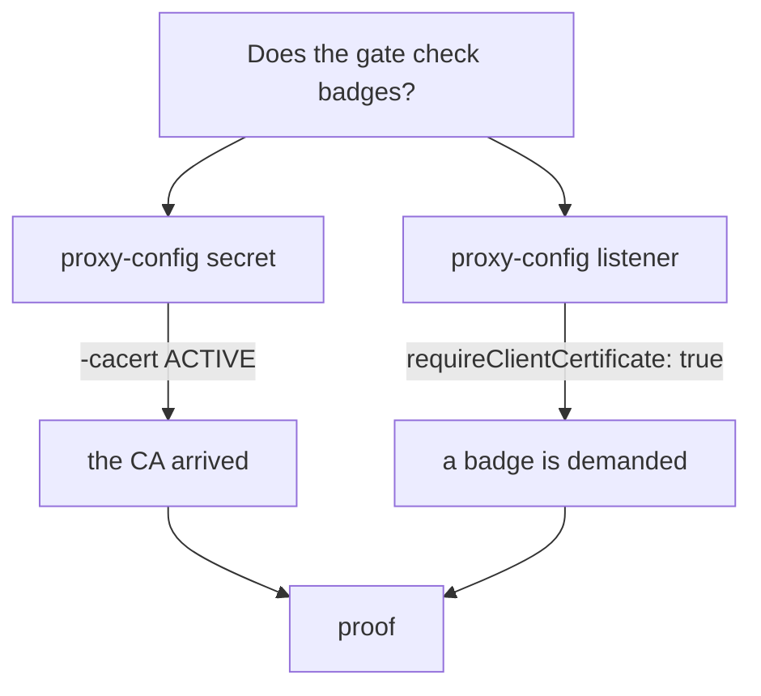

# Turn Away Strangers And Prove It

Astronaut, the gate asks for a badge, and a visitor without one is turned away. But having **a** badge is not enough. The badge must come from the office the gate trusts. In this part a stranger shows up with a badge from another office, and you watch the gate turn them away too.

Then you collect the proof. A signal that gets through shows that the gate let someone in. It does not show that the gate checks badges. The gateway's own proxy is where that proof lives.

The commands below need the `MUTUAL` `Gateway` `starfleet-gateway`, the `VirtualService` `bridge` and the secret `starfleet-credential-mutual` (with `tls.crt`, `tls.key` and `ca.crt`) in your playground, the files in `certs/`, and the `https_status` helper from the landing page.

## A badge from another office

A stranger has their own badge office, `other-ca`, and a badge it signed. The gate has never heard of that office.

<!-- astrona:playground:renew -->

### Make the stranger's badge

Make the other CA and the stranger's badge, in the same `certs/` folder:

```sh
openssl req -x509 -sha256 -nodes -days 365 -newkey rsa:2048 \
  -subj '/O=Other Inc./CN=other-ca' -keyout certs/other-ca.key -out certs/other-ca.crt
openssl req -out certs/other-client.csr -newkey rsa:2048 -nodes -keyout certs/other-client.key \
  -subj "/CN=other-client/O=other"
openssl x509 -req -sha256 -days 365 -CA certs/other-ca.crt -CAkey certs/other-ca.key -set_serial 2 \
  -in certs/other-client.csr -out certs/other-client.crt
```

After the progress dots for the two new keys, the signing step prints:

```text
Certificate request self-signature ok
subject=CN=other-client, O=other
```

### Knock with the stranger's badge

Knock with the trusted visitor's badge, then with the stranger's badge:

```sh
https_status --cert certs/client.example.com.crt --key certs/client.example.com.key
https_status --cert certs/other-client.crt --key certs/other-client.key
```

```text
200 exit=0
000 exit=56
```

The trusted visitor still gets `200`. The stranger gets `000` and exit code `56`, exactly like a visitor with no badge at all. The gate checked the badge against `ca.crt` from its secret, found that `other-ca` signed it, and hung up. The refused knock also restarts the port forward, so wait about ten seconds before the next one.

From the outside, "you showed no badge" and "you showed a badge I do not trust" look the same. That is on purpose: a turned-away visitor learns as little as possible. It also means you find out *why* on the gate's side, not the visitor's.

## Ask the gate why

The gate's flight log (access log) does not help here. It writes one line per HTTP request, and a visitor who was turned away in the handshake never sent one. We checked: the refused knocks leave no line at all, only the `200` signals do.

The gateway's proxy can tell you more if you ask it to. Envoy keeps a separate log level for each part of its work, and the part called `connection` writes a line for every failed handshake when it is set to `debug`. It is like asking the gate's communications officer to talk on the radio while they work.

### Turn up the gate's connection log

Set the `connection` logger of the gateway's proxy to `debug`:

```sh
istioctl proxy-config log deploy/istio-ingress -n istio-ingress --level connection:debug
```

```text
istio-ingress-5f768fb4b6-vtspv.istio-ingress:
active loggers:
  a2a: warning
  admin: warning
  alternate_protocols_cache: warning
...
  connection: debug
...
```

The command prints every logger and its level (shortened here). Only `connection` changed. The change takes effect at once, with no restart, and it is lost when the pod restarts.

### Knock twice and read the reasons

Knock without a badge, wait for the port forward, then knock with the stranger's badge:

```sh
https_status
sleep 10
https_status --cert certs/other-client.crt --key certs/other-client.key
```

```text
000 exit=56
000 exit=56
```

From the outside, both look the same. Wait a few seconds, then read the gate's log for TLS errors:

```sh
kubectl logs -n istio-ingress deploy/istio-ingress --since=1m | grep TLS_error
```

```text
2026-10-09T10:03:12.003750Z	debug	envoy connection external/envoy/source/common/tls/ssl_socket.cc:269	[Tags: "ConnectionId":"79"] remote address:127.0.0.1:53492,TLS_error:|268435648:SSL routines:OPENSSL_internal:PEER_DID_NOT_RETURN_A_CERTIFICATE:peer did not provide required client certificate:TLS_error_end	thread=28
2026-10-09T10:03:22.031178Z	debug	envoy connection external/envoy/source/common/tls/ssl_socket.cc:269	[Tags: "ConnectionId":"80"] remote address:127.0.0.1:43950,TLS_error:|268435581:SSL routines:OPENSSL_internal:CERTIFICATE_VERIFY_FAILED:verify cert failed: X509_verify_cert: certificate verification error at depth 0: unable to get local issuer certificate:TLS_error_end	thread=28
```

The gate tells the two apart. `PEER_DID_NOT_RETURN_A_CERTIFICATE` is the visitor with no badge. `CERTIFICATE_VERIFY_FAILED` with `unable to get local issuer certificate` is the stranger: the gate could not find the office that signed the badge among the CAs it trusts.

Set the logger back when you are done, so the gate's log stays readable:

```sh
istioctl proxy-config log deploy/istio-ingress -n istio-ingress --level connection:warning
```

> [!TIP]
> When a handshake fails and you cannot see why, turn the gateway's `connection` logger up to `debug`, repeat the signal, and grep the log for `TLS_error`. It works for every TLS failure at the gate, not only for badges.

## Prove that the gate checks badges

A `200` with a good badge proves the gate lets that badge in. It proves nothing about everyone else. Two readings from the gateway's proxy give the real proof: the CA arrived, and the listener was built to demand a badge.

### The CA arrived at the gate

Mission control (`istiod`) sends certificates to the gateway's proxy over **SDS** (Secret Discovery Service), the part of its orders that carries keys and certificates. List what the gate holds:

```sh
istioctl proxy-config secret deploy/istio-ingress -n istio-ingress
```

```text
RESOURCE NAME                                       TYPE           STATUS     VALID CERT     SERIAL NUMBER                               NOT AFTER                NOT BEFORE
default                                             Cert Chain     ACTIVE     true           ba75e5a0b0a479caf5a6eaaf48249518            2026-10-10T09:55:08Z     2026-10-09T09:53:08Z
kubernetes://starfleet-credential-mutual            Cert Chain     ACTIVE     true           00000000000000000000000000000000            2027-10-09T09:54:16Z     2026-10-09T09:54:16Z
kubernetes://starfleet-credential-mutual-cacert     CA             ACTIVE     true           3d422aafaca8b249728daca5d34e0ce4ec6c9ae     2027-10-09T09:54:16Z     2026-10-09T09:54:16Z
ROOTCA                                              CA             ACTIVE     true           0e0b3caaf3f7ef0a59ecc664c9e5718c            2036-10-06T09:54:55Z     2026-10-09T09:54:55Z
```

`default` and `ROOTCA` are the gate's own mesh identity from mission control. They are not part of your secret.

Two rows belong to your secret. `kubernetes://starfleet-credential-mutual` is the server badge and its key. `kubernetes://starfleet-credential-mutual-cacert` is the CA the gate checks visitors against. Istio always names that second item after the secret, plus `-cacert`, even when the CA sits in the same secret.

Both must be `ACTIVE`. `WARMING` means the gate asked for the item and never got it: the secret is missing, on the wrong planet, or has no CA in it. A gate that cannot load its badges turns every visitor away, the good ones too.

We tried it: a `MUTUAL` gate pointed at a secret made with `kubectl create secret tls` (no `ca.crt`). The `-cacert` row stayed `WARMING`, and every visitor got `000 exit=35`, even the one with a good badge. `istioctl analyze` reported no problem at all, so `proxy-config secret` is the place to look.

### The listener demands a badge

Read the gateway's listener on port `443` and look for one field:

```sh
istioctl proxy-config listener deploy/istio-ingress -n istio-ingress --port 443 -o json \
  | grep requireClientCertificate
```

```text
                        "requireClientCertificate": true
```

`requireClientCertificate: true` means the listener asks every visitor for a badge. Together with the `-cacert` row above, it is your proof: the gate asks for a badge, and it holds the CA to check it with.



Each reading alone can mislead you. The secret can be loaded while the `Gateway` still says `SIMPLE`, and the listener can demand a badge while the CA never arrived. Read both.

## Transport refused, or request refused?

The status code tells you which layer said no. This is worth learning as a rule, because it holds across the whole mesh:

| What the client sees | What refused it | Examples |
| --- | --- | --- |
| `000` and a curl error | something refused the **connection** | `MUTUAL` badge check, a wrong host name (SNI), mesh `STRICT` mTLS |
| `401` or `403` | something refused the **request** | `RequestAuthentication`, `AuthorizationPolicy` |
| `404` | nothing refused anything | the route or the app |

A `MUTUAL` gate is a connection-level check. It never produces a `403`.

## Common pitfalls

> [!WARNING]
> - **Thinking any badge will do.** The badge must be signed by the CA in `ca.crt`. A badge from another office is refused exactly like no badge.
> - **Reading the visitor's error to find the reason.** The visitor sees the same error for both cases. Turn up the gate's `connection` log and read its `TLS_error` lines instead.
> - **Looking for refused visitors in the access log.** It has no line for a handshake that failed. Only signals that got through are logged.
> - **Taking a `200` as proof.** It only shows that one good badge gets in. Prove the check with `proxy-config secret` and `requireClientCertificate`.
> - **Ignoring `WARMING`.** A `-cacert` row in `WARMING` means the gate has no CA, and it turns away every visitor, trusted or not. `istioctl analyze` does not warn about it.

> *A turned-away visitor learns nothing, and a welcomed one proves nothing: the proof is in the gateway's own proxy.*

## Your mission: Fix The Gate's Trusted Badge Office

You can now tell a trusted badge from a stranger's badge, and prove from the gateway's proxy which CA the gate checks against. Now prove it in a graded mission: the gate on the planet `starfleet` turns away the fleet's trusted partner, while a stranger's badge gets in, and you have to find out why and fix it.

The mission runs in its own training solar system, so first pause your playground. Nothing in it is lost:

```sh
astrona stop ats-015-playground-040-02
```

Then start the mission:

```sh
astrona run --git git@github.com:astrona-io/ATS015.git -c sections/section-040/module-02/labs/lab-02
```

Read the task in [`question.md`](./labs/lab-02/question.md) and solve it on your own first. When you think you are done, send it for grading:

```sh
astrona submit -c sections/section-040/module-02/labs/lab-02
```

When the mission is done, remove it and wake your playground up again:

```sh
astrona destroy ats-015-lab-040-02-02
astrona start ats-015-playground-040-02
```
