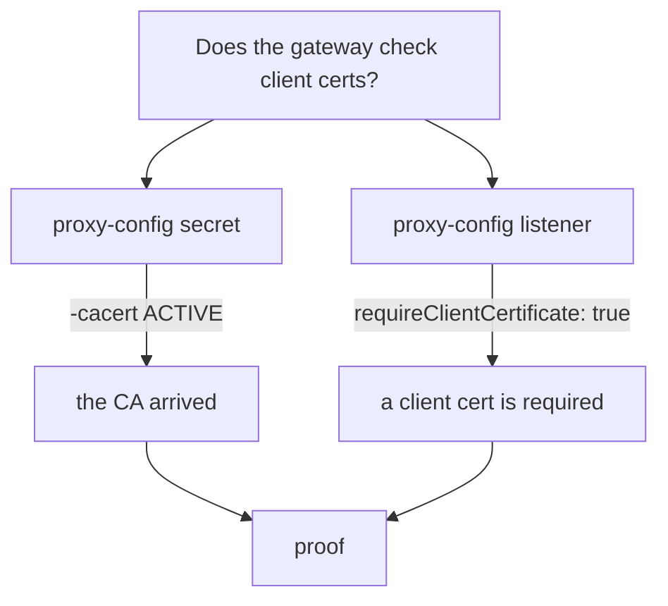

# Reject Untrusted Client Certificates And Prove It

The gateway now asks for a client certificate, and it refuses a client without one. But having **a** certificate is not enough. The certificate must come from the CA the gateway trusts. In this chapter a client sends a certificate from another CA, and you watch the gateway refuse it too.

Then you collect the proof. A request that gets through shows that the gateway accepted one client. It does not show that the gateway checks client certificates at all. That proof lives in the gateway's own proxy, and this chapter shows you where to read it.

The commands below need the `MUTUAL` `Gateway` `starfleet-gateway`, the `VirtualService` `bridge` and the secret `starfleet-credential-mutual` (with `tls.crt`, `tls.key` and `ca.crt`) in your playground. They also need the files in `certs/` and the `https_status` helper, which sends one HTTPS request through the gateway and prints the status code and curl's exit code.

## A client certificate from another CA

To test the check, you need a client the gateway should not trust. That client has its own CA, `other-ca`, and a certificate that CA signed. The gateway has never seen `other-ca`.

<!-- astrona:playground:renew -->

Make the other CA and the untrusted client certificate, in the same `certs/` folder:

```sh
openssl req -x509 -sha256 -nodes -days 365 -newkey rsa:2048 \
  -subj '/O=Other Inc./CN=other-ca' -keyout certs/other-ca.key -out certs/other-ca.crt
openssl req -out certs/other-client.csr -newkey rsa:2048 -nodes -keyout certs/other-client.key \
  -subj "/CN=other-client/O=other"
openssl x509 -req -sha256 -days 365 -CA certs/other-ca.crt -CAkey certs/other-ca.key -set_serial 2 \
  -in certs/other-client.csr -out certs/other-client.crt
```

After the progress dots for the two new keys, the signing step prints:

```text
Certificate request self-signature ok
subject=CN=other-client, O=other
```

Now send a request with the trusted client certificate, then one with the untrusted certificate:

```sh
https_status --cert certs/client.example.com.crt --key certs/client.example.com.key
https_status --cert certs/other-client.crt --key certs/other-client.key
```

```text
200 exit=0
000 exit=56
```

The trusted client still gets `200`. The untrusted client gets `000` and exit code `56`, exactly like a client with no certificate at all. The gateway checked the certificate against `ca.crt` from its secret, found that `other-ca` signed it, and closed the connection. The refused handshake also restarts the port forward, so wait about ten seconds before the next request.

From the outside, "you sent no certificate" and "you sent a certificate I do not trust" look the same. That is on purpose: a refused client learns as little as possible. It also means you find out *why* on the gateway's side, not the client's.

## Ask the gateway why

Your first idea might be the gateway's access log, but it does not help here. The access log writes one line per HTTP request, and a client that was refused in the handshake never sent one. In our tests, the refused connections left no line at all; only the `200` requests did.

The gateway's proxy can tell you more if you ask it to. Envoy keeps a separate log level for each part of its work, and the part called `connection` writes a line for every failed handshake when it is set to `debug`. Set that logger on the gateway's proxy:

```sh
istioctl proxy-config log deploy/istio-ingress -n istio-ingress --level connection:debug
```

```text
istio-ingress-5f768fb4b6-vtspv.istio-ingress:
active loggers:
  a2a: warning
  admin: warning
  alternate_protocols_cache: warning
...
  connection: debug
...
```

The command prints every logger and its level (shortened here). Only `connection` changed. The change takes effect at once, with no restart, and it is lost when the pod restarts.

With the logger up, send a request without a certificate, wait for the port forward, then send one with the untrusted certificate:

```sh
https_status
sleep 10
https_status --cert certs/other-client.crt --key certs/other-client.key
```

```text
000 exit=56
000 exit=56
```

From the outside, both still look the same. Wait a few seconds, then read the gateway's log for TLS errors:

```sh
kubectl logs -n istio-ingress deploy/istio-ingress --since=1m | grep TLS_error
```

```text
2026-10-09T10:03:12.003750Z	debug	envoy connection external/envoy/source/common/tls/ssl_socket.cc:269	[Tags: "ConnectionId":"79"] remote address:127.0.0.1:53492,TLS_error:|268435648:SSL routines:OPENSSL_internal:PEER_DID_NOT_RETURN_A_CERTIFICATE:peer did not provide required client certificate:TLS_error_end	thread=28
2026-10-09T10:03:22.031178Z	debug	envoy connection external/envoy/source/common/tls/ssl_socket.cc:269	[Tags: "ConnectionId":"80"] remote address:127.0.0.1:43950,TLS_error:|268435581:SSL routines:OPENSSL_internal:CERTIFICATE_VERIFY_FAILED:verify cert failed: X509_verify_cert: certificate verification error at depth 0: unable to get local issuer certificate:TLS_error_end	thread=28
```

The gateway's proxy tells the two apart. `PEER_DID_NOT_RETURN_A_CERTIFICATE` is the client with no certificate. `CERTIFICATE_VERIFY_FAILED` with `unable to get local issuer certificate` is the untrusted client: the proxy could not find the CA that signed the certificate among the CAs it trusts.

Set the logger back when you are done, so the gateway's log stays readable:

```sh
istioctl proxy-config log deploy/istio-ingress -n istio-ingress --level connection:warning
```

> [!TIP]
> When a handshake fails and you cannot see why, turn the gateway's `connection` logger up to `debug`, repeat the request, and grep the log for `TLS_error`. It works for every TLS failure at the gateway, not only for client certificates.

## Prove that the gateway checks client certificates

Knowing why one client was refused is useful, but it is still not proof that the check is on for everyone. A `200` with a good certificate proves the gateway accepts that certificate, and nothing about anyone else. Two readings from the gateway's proxy give the real proof: the CA arrived, and the listener was built to require a client certificate.

The first reading is about the CA. `istiod` sends certificates to the gateway's proxy over **SDS** (Secret Discovery Service), the part of its configuration protocol that carries keys and certificates. List what the gateway's proxy holds:

```sh
istioctl proxy-config secret deploy/istio-ingress -n istio-ingress
```

```text
RESOURCE NAME                                       TYPE           STATUS     VALID CERT     SERIAL NUMBER                               NOT AFTER                NOT BEFORE
default                                             Cert Chain     ACTIVE     true           ba75e5a0b0a479caf5a6eaaf48249518            2026-10-10T09:55:08Z     2026-10-09T09:53:08Z
kubernetes://starfleet-credential-mutual            Cert Chain     ACTIVE     true           00000000000000000000000000000000            2027-10-09T09:54:16Z     2026-10-09T09:54:16Z
kubernetes://starfleet-credential-mutual-cacert     CA             ACTIVE     true           3d422aafaca8b249728daca5d34e0ce4ec6c9ae     2027-10-09T09:54:16Z     2026-10-09T09:54:16Z
ROOTCA                                              CA             ACTIVE     true           0e0b3caaf3f7ef0a59ecc664c9e5718c            2036-10-06T09:54:55Z     2026-10-09T09:54:55Z
```

`default` and `ROOTCA` are the gateway's own mesh identity from `istiod`. They are not part of your secret.

Two rows belong to your secret. `kubernetes://starfleet-credential-mutual` is the server certificate and its key. `kubernetes://starfleet-credential-mutual-cacert` is the CA the gateway checks clients against. Istio always names that second item after the secret, plus `-cacert`, even when the CA sits in the same secret.

Both rows must be `ACTIVE`. `WARMING` means the proxy asked for the item and never got it: the secret is missing, in the wrong namespace, or has no CA in it. A gateway that cannot load its certificates refuses every client, the good ones too.

We tried this on purpose with a `MUTUAL` gateway pointed at a secret made with `kubectl create secret tls`, so with no `ca.crt`. The `-cacert` row stayed `WARMING`, and every client got `000 exit=35`, even the one with a good certificate. `istioctl analyze` reported no problem at all, so `proxy-config secret` is the place to look.

The second reading is about the listener. A listener is the part of Envoy that accepts connections on one port. Read the gateway's listener on port `443` and look for one field:

```sh
istioctl proxy-config listener deploy/istio-ingress -n istio-ingress --port 443 -o json \
  | grep requireClientCertificate
```

```text
                        "requireClientCertificate": true
```

`requireClientCertificate: true` means the listener asks every client for a certificate. Together with the `-cacert` row above, it is your proof: the gateway asks for a client certificate, and it holds the CA to check it with.



The diagram shows that the proof needs both readings. Each one alone can mislead you. The secret can be loaded while the `Gateway` still says `SIMPLE`, and the listener can require a client certificate while the CA never arrived.

## Transport refused, or request refused?

Everything in this chapter came back as `000`, never as an HTTP error. That is a general rule worth learning, because it holds across the whole mesh: the status code tells you which layer said no.

| What the client sees | What refused it | Examples |
| --- | --- | --- |
| `000` and a curl error | something refused the **connection** | `MUTUAL` client certificate check, a wrong host name (SNI), mesh `STRICT` mTLS |
| `401` or `403` | something refused the **request** | `RequestAuthentication`, `AuthorizationPolicy` |
| `404` | nothing refused anything | the route or the app |

A `MUTUAL` gateway is a connection-level check. It never produces a `403`.

You can now prove the client certificate check from both sides. From the client, a missing certificate and an untrusted one both end in `000`. From the gateway, the `connection` log names the reason, and `proxy-config secret` plus `requireClientCertificate` show that the check is really in place. One question is still open: where else the CA can live, and what a trusted certificate actually allows a client to do.

## Common pitfalls

> [!WARNING]
> - **Thinking any client certificate will do.** The certificate must be signed by the CA in `ca.crt`. A certificate from another CA is refused exactly like no certificate.
> - **Reading the client's error to find the reason.** The client sees the same error for both cases. Turn up the gateway's `connection` log and read its `TLS_error` lines instead.
> - **Looking for refused clients in the access log.** It has no line for a handshake that failed. Only requests that got through are logged.
> - **Taking a `200` as proof.** It only shows that one good certificate is accepted. Prove the check with `proxy-config secret` and `requireClientCertificate`.
> - **Ignoring `WARMING`.** A `-cacert` row in `WARMING` means the gateway has no CA, and it refuses every client, trusted or not. `istioctl analyze` does not warn about it.

## Your mission: Fix The Trusted CA In A MUTUAL Gateway

You can now tell a trusted client certificate from an untrusted one, and prove from the gateway's proxy which CA the gateway checks against. In the graded lab, the gateway for the `starfleet` namespace refuses the trusted partner, while a client with a certificate from another CA gets in, and you have to find out why and fix it.

The lab runs in its own cluster, so first pause your playground. Nothing in it is lost:

```sh
astrona stop ats-015-playground-040-02
```

Then start the lab:

```sh
astrona run --git git@github.com:astrona-io/ATS015.git -c sections/section-040/module-02/labs/lab-02
```

The task is on the next page. Solve it on your own first. When you think you are done, send it for grading:

```sh
astrona submit -c sections/section-040/module-02/labs/lab-02
```

When the lab is done, remove it and start your playground again:

```sh
astrona destroy ats-015-lab-040-02-02
astrona start ats-015-playground-040-02
```
