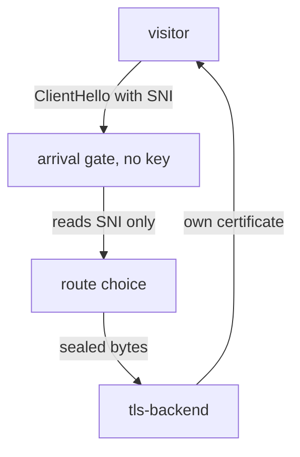

# What A Proxy Can See

Astronaut, every passthrough setting in this module follows from one question. A proxy in the middle has no key. How much of a sealed signal can it still read? The answer is: only the first message, and only parts of it. This part shows what that first message holds, and then meets the ship that keeps its own lock and key.

## The handshake, seen from the middle

A TLS connection starts with a short exchange called the **handshake**. The two ends agree on a secret key, and from then on everything is sealed. A proxy that sits in the middle without a key sees this exchange from the outside.

### The first message is open

The visitor speaks first. Its first message is called the **ClientHello**. It is sent before any key exists, so it cannot be sealed. Anyone on the path can read it.

The ClientHello carries a few fields in the open:

| Field | What it says | Readable without the key? |
| --- | --- | --- |
| TLS version and cipher list | which locks the visitor can use | yes |
| SNI (Server Name Indication) | the host name the visitor wants, for example `vault.starfleet.example.com` | yes |
| ALPN (Application-Layer Protocol Negotiation) | which protocol comes next, for example HTTP/2 or HTTP/1.1 | yes |
| Everything after the handshake | the method, the path, the headers, the body, the reply | **no** |

SNI is the address written on the outside of the sealed envelope. It is there for a simple reason. One server can host many sites, and it must pick the right certificate **before** it can show one. So the visitor names the host first, in the open.

### Why SNI is all a passthrough gate has

A gate with no key can read the address on the envelope, and nothing inside it. It sees no method, no path, no header and no status code.



The visitor's first message reaches the gate. The gate reads only the SNI name, picks a destination with it, and forwards the sealed bytes unchanged. The ship at the end, `tls-backend`, finishes the handshake with its own certificate, so the visitor and that ship share a key the gate never sees.

This gives the rule for the rest of the module: **passthrough routing matches on SNI, because SNI is the only thing there is.** In Envoy, the part that peeks at the ClientHello is a small listener filter called the **TLS inspector**. It reads SNI and ALPN, and it never decrypts anything.

ALPN is readable too. Istio uses it to tell HTTP/2 from HTTP/1.1, but a `VirtualService` cannot match on it. A newer TLS extension, Encrypted ClientHello, can hide the SNI name as well. Where a visitor uses it, routing on SNI stops working.

## The vault owns its certificate

In this module the certificate is not yours. The vault, `tls-backend`, makes its own when its pod starts, and serves HTTPS itself on port `8443`. Look at it before any gate setting exists. Later, when the same certificate comes back through the gate, you know nothing in between replaced it.

<!-- astrona:playground:renew -->

### See the vault in your playground

List the vault's pod and its Service:

```sh
kubectl get pods,svc -n starfleet -l app=tls-backend
```

```text
NAME                               READY   STATUS    RESTARTS   AGE
pod/tls-backend-6b5f6947bb-94smw   2/2     Running   0          51s

NAME                  TYPE        CLUSTER-IP      EXTERNAL-IP   PORT(S)    AGE
service/tls-backend   ClusterIP   10.96.174.179   <none>        8443/TCP   51s
```

The pod shows `2/2`: the nginx crew plus its communications officer (the sidecar). The Service port is named `tls`, so every proxy treats this radio channel as a sealed stream, not as HTTP.

### Read the certificate on the vault's own disk

Copy the certificate file out of the pod and let `openssl` on your machine read it:

```sh
kubectl exec -n starfleet deploy/tls-backend -c nginx -- cat /etc/nginx/certs/tls.crt \
  | openssl x509 -noout -subject -fingerprint -sha256
```

```text
subject=CN=vault.starfleet.example.com, O=vault
sha256 Fingerprint=8D:AA:16:3B:52:67:DB:24:B8:5B:4E:2E:AA:B1:76:CB:C3:40:76:49:68:C5:F9:3C:ED:C7:33:B6:1B:95:05:B4
```

Your fingerprint is different: the vault makes a new certificate every time its pod starts.

Write down the fingerprint. It is a checksum of this one certificate. A new certificate with the same name would still get a different fingerprint, so the fingerprint is the real proof of "same certificate".

### Send a signal straight to the vault

Now send one signal from the shuttle directly to the vault, with no gate on the path. The `-k` option tells `curl` not to check the certificate, because it is self-signed:

```sh
kubectl exec -n starfleet deploy/shuttle -- curl -sk https://tls-backend:8443/
```

```text
vault ended TLS itself
```

The reply comes from nginx, inside the vault. The shuttle's sidecar did not open the signal on the way: the channel is named `tls`, so it forwarded the sealed stream as it was.

## Common pitfalls

> [!WARNING]
> - **Expecting a passthrough gate to route on paths or headers.** It never decrypts, so the SNI name is the only thing it can read.
> - **Expecting the gate's certificate.** In passthrough the visitor gets the ship's own certificate, here the vault's.
> - **Comparing certificates by name only.** Two certificates can carry the same subject. Compare the fingerprint.
> - **Calling passthrough "more secure".** It moves the work of ending TLS, and the duty to do it well, from the gate to the ship.

> *The ClientHello is open and everything after it is sealed, so a gate without the key can route on SNI and on nothing else.*
