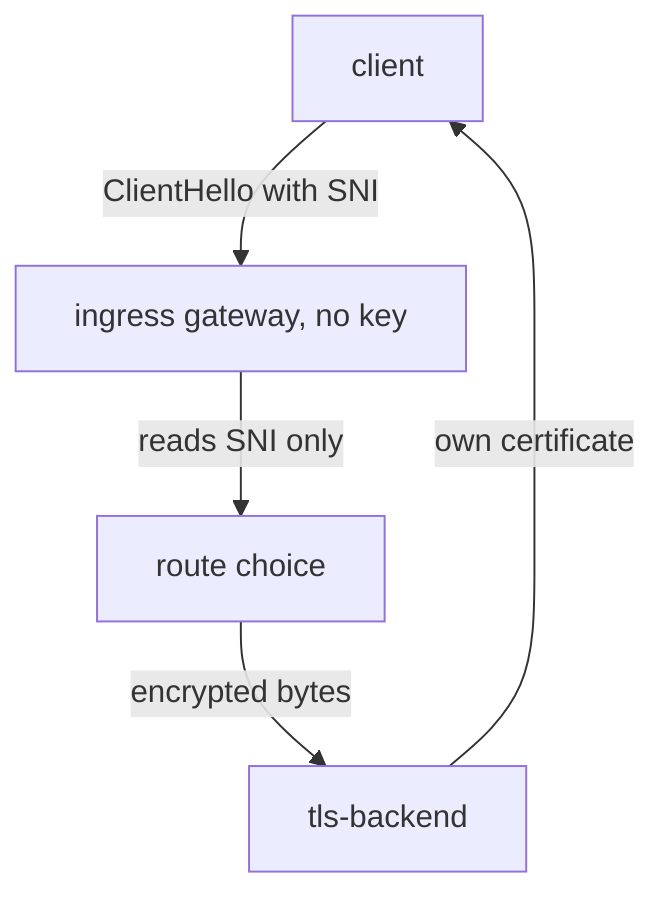

# What A Proxy Can See

A proxy in the middle of an encrypted connection has no key. How much of that connection can it still read? Every passthrough setting in this module follows from the answer: only the first message, and only parts of it.

This chapter looks at that first message and the one field in it that a gateway can route on. Then it turns to `tls-backend`, the workload that keeps its own certificate and key. You will read its certificate before any gateway setting exists, so that later you can recognise the same certificate when it comes back through the gateway.

## The handshake, seen from the middle

A TLS (Transport Layer Security) connection starts with a short exchange called the **handshake**. The two ends agree on a secret key, and from then on everything is encrypted. A proxy that sits in the middle without a key sees this exchange from the outside.

The client speaks first. Its first message is called the **ClientHello**. It is sent before any key exists, so it cannot be encrypted, and anyone on the path can read it. The ClientHello carries a few fields in the open:

| Field | What it says | Readable without the key? |
| --- | --- | --- |
| TLS version and cipher list | which encryption methods the client can use | yes |
| SNI (Server Name Indication) | the host name the client wants, for example `vault.starfleet.example.com` | yes |
| ALPN (Application-Layer Protocol Negotiation) | which protocol comes next, for example HTTP/2 or HTTP/1.1 | yes |
| Everything after the handshake | the method, the path, the headers, the body, the response | **no** |

SNI is the host name the client sends in clear text, before encryption starts. It is there for a simple reason. One server can host many sites, and it must pick the right certificate **before** it can show one. So the client names the host first, in the open.

## Why SNI is all a passthrough gateway has

That open host name is exactly what a passthrough gateway works with. A gateway with no key can read the SNI name, and nothing after the handshake. It sees no method, no path, no header and no status code.



The client's first message reaches the ingress gateway. The gateway reads only the SNI name, picks a destination with it, and forwards the encrypted bytes unchanged. The backend at the end, `tls-backend`, finishes the handshake with its own certificate, so the client and `tls-backend` share a key the gateway never sees.

This gives the rule for the rest of the module: **passthrough routing matches on SNI, because SNI is the only thing there is.** In Envoy, the part that reads the ClientHello is a small listener filter called the **TLS inspector**. It reads SNI and ALPN, and it never decrypts anything.

ALPN is readable too. Istio uses it to tell HTTP/2 from HTTP/1.1, but a `VirtualService` cannot match on it. A newer TLS extension, Encrypted ClientHello, can hide the SNI name as well. Where a client uses it, routing on SNI stops working.

## The backend owns its certificate

If the gateway never decrypts, someone else must show a certificate and finish the handshake. In this module that is `tls-backend`. It makes its own certificate when its pod starts, and serves HTTPS itself on port `8443`. Look at it now, before any gateway setting exists. Later, when the same certificate comes back through the gateway, you will know that nothing in between replaced it.

<!-- astrona:playground:renew -->

Start by listing the pod and the Service of `tls-backend`:

```sh
kubectl get pods,svc -n starfleet -l app=tls-backend
```

```text
NAME                               READY   STATUS    RESTARTS   AGE
pod/tls-backend-6b5f6947bb-94smw   2/2     Running   0          51s

NAME                  TYPE        CLUSTER-IP      EXTERNAL-IP   PORT(S)    AGE
service/tls-backend   ClusterIP   10.96.174.179   <none>        8443/TCP   51s
```

The pod shows `2/2`: the nginx container plus its sidecar proxy. The sidecar proxy is an Envoy container Istio adds to each pod, and all traffic in and out of the pod passes through it. The Service port is named `tls`, so every proxy treats this port as an encrypted stream, not as HTTP.

Next, read the certificate that nginx uses. Copy the file out of the pod and let `openssl` on your machine read it:

```sh
kubectl exec -n starfleet deploy/tls-backend -c nginx -- cat /etc/nginx/certs/tls.crt \
  | openssl x509 -noout -subject -fingerprint -sha256
```

```text
subject=CN=vault.starfleet.example.com, O=vault
sha256 Fingerprint=8D:AA:16:3B:52:67:DB:24:B8:5B:4E:2E:AA:B1:76:CB:C3:40:76:49:68:C5:F9:3C:ED:C7:33:B6:1B:95:05:B4
```

Your fingerprint is different, because `tls-backend` makes a new certificate every time its pod starts. Write it down. The fingerprint is a checksum of this one certificate. A new certificate with the same name would still get a different fingerprint, so the fingerprint is the real proof of "same certificate".

Finally, send one request from the `shuttle` pod directly to `tls-backend`, with no gateway on the path. The `-k` option tells `curl` not to check the certificate, because it is self-signed:

```sh
kubectl exec -n starfleet deploy/shuttle -- curl -sk https://tls-backend:8443/
```

```text
vault ended TLS itself
```

The response comes from nginx, inside `tls-backend`. The sidecar proxy of `shuttle` did not decrypt the request on the way: the port is named `tls`, so it forwarded the encrypted stream as it was.

You now know what a proxy without a key can see. The ClientHello is open and everything after it is encrypted, so a gateway without the key can route on the SNI name and on nothing else. You also have the fingerprint of the certificate that `tls-backend` owns. The open question is how to tell the ingress gateway to forward this stream instead of decrypting it.

## Common pitfalls

> [!WARNING]
> - **Expecting a passthrough gateway to route on paths or headers.** It never decrypts, so the SNI name is the only thing it can read.
> - **Expecting the gateway's certificate.** In passthrough the client gets the backend's own certificate, here the one from `tls-backend`.
> - **Comparing certificates by name only.** Two certificates can carry the same subject. Compare the fingerprint.
> - **Calling passthrough "more secure".** It moves the work of ending TLS, and the duty to do it well, from the gateway to the backend.
